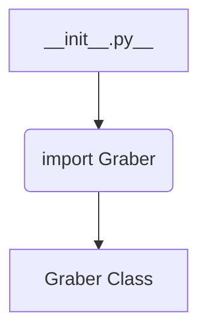
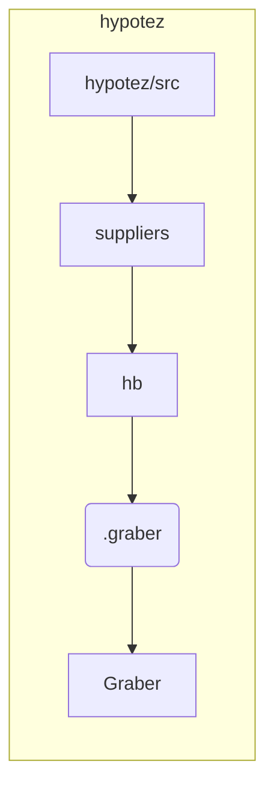

```MD
# Анализ кода hypotez/src/suppliers/hb/__init__.py

**1. <input code>**

```python
## \file hypotez/src/suppliers/hb/__init__.py
# -*- coding: utf-8 -*-\
#! venv/Scripts/python.exe
#! venv/bin/python/python3.12

"""
.. module: src.suppliers.hb 
	:platform: Windows, Unix
	:synopsis:

"""
MODE = 'dev'


from .graber import Graber
```

**2. <algorithm>**

Этот файл является инициализатором для модуля `hb` в пакете `suppliers` проекта `hypotez`.  Алгоритм работы очень прост – он только импортирует класс `Graber` из подпакета `graber`.  Блок-схема:



Пример:  Этот файл не выполняет никакой логики сам по себе, он просто подготавливает доступ к классу `Graber` для использования в других частях проекта.


**3. <mermaid>**



**Описание зависимостей:**

* `hypotez/src/suppliers/hb/__init__.py` импортирует `Graber` из `hypotez/src/suppliers/hb/graber.py`.


**4. <explanation>**

* **Импорты:** Файл `__init__.py` в пакете `hb` отвечает за инициализацию модуля. `from .graber import Graber` импортирует класс `Graber` из подпакета `graber` внутри того же пакета `hb`. Это типичное поведение для Python пакетов – `.` означает, что импорт идет из текущего пакета.

* **Классы:**  `Graber` – это класс, определенный в `graber.py`.  Без просмотра `graber.py` нам неизвестны его атрибуты и методы.  Однако, `__init__.py` подготавливает доступ к этому классу из других частей кода.

* **Функции:** Нет функций в данном файле.  Это чисто инициализирующий файл.

* **Переменные:** `MODE = 'dev'` –  глобальная переменная, вероятно, задаёт режим работы (в данном случае, "разработка").

* **Возможные ошибки и улучшения:**  
    * Неясно, что делает класс `Graber` и как он используется в проекте.  Для более полного анализа необходим код `graber.py`.
    * Отсутствие документации для класса `Graber` в `graber.py` затрудняет понимание его назначения.  PEP 257 (Python Enhancement Proposal) рекомендует использование docstrings для функций, классов и модулей.

* **Цепочка взаимосвязей:** `hb` (и `graber`) вероятно взаимодействует с другими частями проекта, использующими `Graber`. Например, другой модуль в `hypotez/src` может импортировать `Graber` из `hb/__init__.py` и использовать его методы. Без анализа других модулей и файлов проекта сложно проследить полную взаимосвязь.


**Заключение:**

Данный файл является простой инициализацией для подпакета `hb`. Он необходим для импорта класса `Graber`, но сам по себе не выполняет никакой значимой логики. Для полного понимания функциональности проекта требуется проанализировать `graber.py` и файлы, использующие `Graber`.