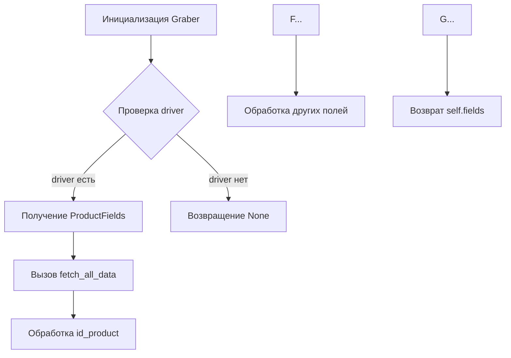
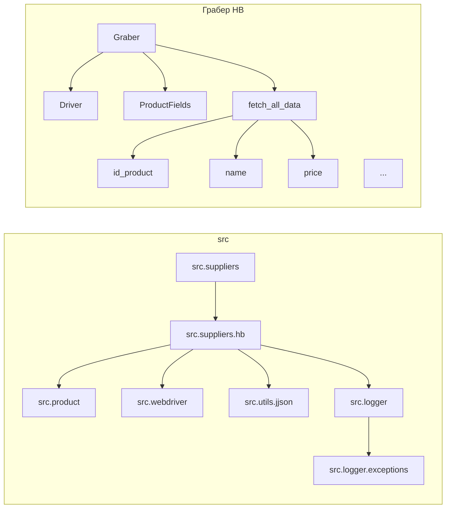

# <input code>

```python
## \file hypotez/src/suppliers/hb/graber.py
# -*- coding: utf-8 -*-\
#! venv/Scripts/python.exe
#! venv/bin/python/python3.12

"""
.. module: src.suppliers.hb 
	:platform: Windows, Unix
	:synopsis: Класс собирает значение полей на странице  товара `hb.co.il`. 
    Для каждого поля страницы товара сделана функция обработки поля в родительском классе.
    Если нужна нестандертная обработка, функция перегружается в этом классе.
    ------------------
    Перед отправкой запроса к вебдрайверу можно совершить предварительные действия через декоратор. 
    Декоратор по умолчанию находится в родительском классе. Для того, чтобы декоратор сработал надо передать значение 
    в `Context.locator`, Если надо реализовать свой декоратор - раскоментируйте строки с декоратором и переопределите его поведение

"""
MODE = 'dev'

import asyncio
from pathlib import Path
from types import SimpleNamespace
from typing import Any, Callable, Optional
from dataclasses import dataclass, field
from functools import wraps
from pydantic import BaseModel
from src import gs
from src.suppliers import Graber as Grbr, Context, close_pop_up
from src.product import ProductFields
from src.webdriver import Driver
from src.utils.jjson import j_loads_ns
from src.logger import logger
from src.logger.exceptions import ExecuteLocatorException

from dataclasses import dataclass, field
from types import SimpleNamespace
from typing import Any, Callable


# # Глобальные настройки через отдельный объект
# class Context:
#     """Класс для хранения глобальных настроек."""
#     driver: Driver = None
#     locator: SimpleNamespace = None

# # Определение декоратора для закрытия всплывающих окон
# # В каждом отдельном поставщике (`Supplier`) декоратор может использоваться в индивидуальных целях
# # Общее название декоратора `@close_pop_up` можно изменить 


# def close_pop_up(value: Any = None) -> Callable:
#     """Создает декоратор для закрытия всплывающих окон перед выполнением основной логики функции.

#     Args:
#         value (Any): Дополнительное значение для декоратора.

#     Returns:
#         Callable: Декоратор, оборачивающий функцию.
#     """
#     def decorator(func: Callable) -> Callable:
#         @wraps(func)
#         async def wrapper(*args, **kwargs):
#             try:
#                 # await Context.driver.execute_locator(Context.locator.close_pop_up)  # Await async pop-up close  
#                 ... 
#             except ExecuteLocatorException as e:
#                 logger.debug(f'Ошибка выполнения локатора: {e}')
#             return await func(*args, **kwargs)  # Await the main function
#         return wrapper
#     return decorator


class Graber(Grbr):
    """Класс для операций захвата Morlevi."""
    supplier_prefix: str

    def __init__(self, driver: Driver):
        """Инициализация класса сбора полей товара."""
        self.supplier_prefix = 'hb'
        super().__init__(supplier_prefix=self.supplier_prefix, driver=driver)
        # Устанавливаем глобальные настройки через Context
        
        Context.locator_for_decorator = None # <- если будет уастановлено значение - то оно выполнится в декораторе `@close_pop_up`


    async def grab_page(self, driver: Driver) -> ProductFields:
        """Asynchronous function to grab product fields.

        Args:
            driver (Driver): The driver instance to use for grabbing.

        Returns:
            ProductFields: The grabbed product fields.
        """
        global d
        d = self.d = driver  

        ...
        # Логика извлечения данных
        async def fetch_all_data(**kwards):

            # Call function to fetch specific data
            # await fetch_specific_data(**kwards)  

            # Uncomment the following lines to fetch specific data
            await self.id_product(kwards.get("id_product", ''))
            # ... (many more await calls) ...

        # Call the function to fetch all data
        await fetch_all_data()
        return self.fields
```

# <algorithm>



**Описание:**

1. **Инициализация `Graber`:** Создается экземпляр класса `Graber`, принимающий `driver` (веб-драйвер) и устанавливающий `supplier_prefix`.
2. **Получение `ProductFields`:** Функция `grab_page` получает данные о товаре.
3. **Вызов `fetch_all_data`:** Вызывается вспомогательная функция `fetch_all_data`, которая содержит вызовы к функциям для обработки отдельных полей.
4. **Обработка полей:**  Функция `fetch_all_data` последовательно вызывает методы `id_product`, `name`, `price`, и другие функции для получения данных из страницы товара.
5. **Возврат `self.fields`:** Функция `grab_page` возвращает собранные данные в формате `ProductFields`.

**Пример:**

Предположим, `driver` содержит данные о товаре на странице.  Функция `id_product` извлекает значение `id` продукта. Функция `name` - имя продукта. Эти значения собираются и возвращаются в `self.fields` формате, определенном в `ProductFields`.


# <mermaid>



**Описание диаграммы:**

* `src` - основной модуль.
* `src.suppliers` - модуль для работы с поставщиками данных.
* `src.suppliers.hb` - класс для работы с поставщиком `hb.co.il`.
* `src.product` - класс для работы с данными продукта.
* `src.webdriver` - класс для взаимодействия с веб-драйвером.
* `src.utils.jjson` - утилиты для работы с JSON.
* `src.logger` - система логирования.
* `src.logger.exceptions` - обработка исключений.
* `Graber` - класс, реализующий забор данных.
* `Driver` - объект веб-драйвера.
* `ProductFields` - объект содержащий данные продукта.
* `fetch_all_data` - вспомогательная функция для последовательного сбора данных.
* `id_product`, `name`, `price` - функции для извлечения определенных полей.


# <explanation>

**Импорты:**

* `asyncio`: для асинхронной работы.
* `pathlib`, `types`, `typing`, `dataclasses`, `functools`, `pydantic`: стандартные библиотеки Python.
* `src.gs`, `src.suppliers.Graber`, `src.suppliers.Context`, `src.suppliers.close_pop_up`, `src.product.ProductFields`, `src.webdriver.Driver`, `src.utils.jjson`, `src.logger`, `src.logger.exceptions`: импортируются компоненты из модуля `src`, организованные по функциональной принадлежности.

**Классы:**

* `Graber(Grbr)`: наследуется от базового класса `Graber` для работы с поставщиками, хранит `supplier_prefix` и `driver`, а также имеет метод `grab_page` для извлечения данных продукта.
* `Context`: (не реализован в данном коде, но его импортируют для использования декоратора, если таковой будет реализован).  Предназначен для хранения глобальных настроек, таких как `driver` и `locator`.

**Функции:**

* `grab_page`: асинхронная функция для извлечения данных продукта. Принимает `driver` и возвращает `ProductFields`.
* `fetch_all_data`: вспомогательная функция, содержащая вызовы к функциям обработки полей продукта, использует именованные аргументы из `**kwards` для гибкой передачи данных.

**Переменные:**

* `d`: глобальная переменная, используемая для хранения веб-драйвера внутри `grab_page` (не рекомендуется, лучше использовать `self.d`).

**Возможные ошибки и улучшения:**

* **Глобальные переменные:** Использование `global d` внутри `grab_page` не рекомендуется.  Лучше использовать `self.d` для хранения объекта `driver` в классе.
* **Обработка ошибок:** Не хватает обработки исключений в методах для извлечения данных. Например, `await self.id_product(...)` может вызвать исключение, если не удается найти элемент на странице. Необходимо добавить обработку этих исключений.
* **Передача данных:**  Передача данных через ключевые аргументы в `fetch_all_data` выглядит более гибко, но может привести к ошибкам, если отсутствуют необходимые ключи. Добавление проверки этих данных (например, `if kwards.get("id_product") is not None:`) уменьшит вероятность возникновения проблем.
* **Неполная реализация:** Код содержит много комментариев вида `# await ...`, что указывает на неполную реализацию методов для обработки полей. Необходимо реализовать эти методы.


**Взаимосвязь с другими частями проекта:**

`Graber` зависит от `ProductFields` для представления данных, `Driver` для взаимодействия с веб-драйвером, `src.suppliers` для базовых методов работы с поставщиками.