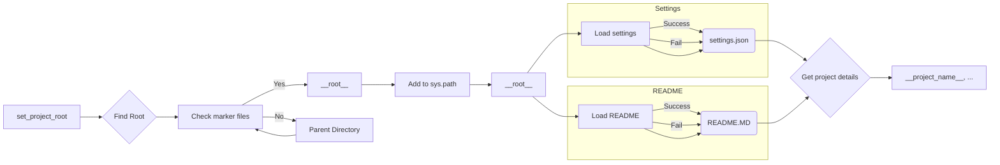

```MD
# Анализ кода hypotez/src/suppliers/hb/header.py

## <input code>

```python
## \file hypotez/src/suppliers/hb/header.py
# -*- coding: utf-8 -*-\
#! venv/Scripts/python.exe
#! venv/bin/python/python3.12

"""
.. module: src.suppliers.hb 
	:platform: Windows, Unix
	:synopsis:

"""
MODE = 'dev'

import sys
import json
from packaging.version import Version

from pathlib import Path
def set_project_root(marker_files=('pyproject.toml', 'requirements.txt', '.git')) -> Path:
    """
    Finds the root directory of the project starting from the current file's directory,
    searching upwards and stopping at the first directory containing any of the marker files.

    Args:
        marker_files (tuple): Filenames or directory names to identify the project root.
    
    Returns:
        Path: Path to the root directory if found, otherwise the directory where the script is located.
    """
    __root__:Path
    current_path:Path = Path(__file__).resolve().parent
    __root__ = current_path
    for parent in [current_path] + list(current_path.parents):
        if any((parent / marker).exists() for marker in marker_files):
            __root__ = parent
            break
    if __root__ not in sys.path:
        sys.path.insert(0, str(__root__))
    return __root__


# Get the root directory of the project
__root__ = set_project_root()
"""__root__ (Path): Path to the root directory of the project"""

from src import gs

settings:dict = None
try:
    with open(gs.path.root / 'src' /  'settings.json', 'r') as settings_file:
        settings = json.load(settings_file)
except (FileNotFoundError, json.JSONDecodeError):
    ...

doc_str:str = None
try:
    with open(gs.path.root / 'src' /  'README.MD', 'r') as settings_file:
        doc_str = settings_file.read()
except (FileNotFoundError, json.JSONDecodeError):
    ...


__project_name__ = settings.get("project_name", 'hypotez') if settings  else 'hypotez'
__version__: str = settings.get("version", '')  if settings  else ''
__doc__: str = doc_str if doc_str else ''
__details__: str = ''
__author__: str = settings.get("author", '')  if settings else ''
__copyright__: str = settings.get("copyrihgnt", '')  if settings else ''
__cofee__: str = settings.get("cofee", "Treat the developer to a cup of coffee for boosting enthusiasm in development: https://boosty.to/hypo69")  if settings else "Treat the developer to a cup of coffee for boosting enthusiasm in development: https://boosty.to/hypo69"
```

## <algorithm>

**Шаг 1**:  Функция `set_project_root` ищет корневую директорию проекта, начиная с текущего файла.

* **Вход**: Кортеж `marker_files` с именами файлов/папок, по которым определяется корень.

* **Логика**: Перебирает родительские директории текущего файла до тех пор, пока не найдена директория, содержащая хотя бы один из файлов/папок из `marker_files`. Если корень найден, добавляет его в `sys.path`  для последующего импорта.

* **Пример**: Если текущий файл находится в `hypotez/src/suppliers/hb/header.py`, и в родительской директории `hypotez/src/suppliers` существует `pyproject.toml`, то `__root__` будет равен `hypotez/src/suppliers`.

**Шаг 2**: Получение корневой директории проекта.

* **Вход**: Вызов `set_project_root()`.

* **Логика**:  Функция `set_project_root` возвращает путь к корню проекта.

* **Выход**: `__root__`, путь к корневому каталогу проекта.

**Шаг 3**: Чтение файла настроек (`settings.json`)

* **Вход**: Путь к файлу `gs.path.root / 'src' / 'settings.json'`.

* **Логика**: Если файл существует и содержит валидный JSON, его содержимое загружается в переменную `settings`. Иначе `settings` остается `None`.

* **Выход**: Словарь `settings` или `None`

**Шаг 4**: Чтение файла документации (`README.MD`)

* **Вход**: Путь к файлу `gs.path.root / 'src' / 'README.MD'`.

* **Логика**: Если файл существует, его содержимое читается в переменную `doc_str`. Иначе `doc_str` остается `None`.

* **Выход**: Строка `doc_str` или `None`


**Шаг 5**: Формирование метаданных проекта:

* **Вход**: Словарь `settings`, строка `doc_str`

* **Логика**: Используются методы `get` словаря `settings` для безопасного доступа к значениям, устанавливая значения по умолчанию, если ключ не найден.

* **Выход**: Переменные `__project_name__`, `__version__`, `__doc__`, `__details__`, `__author__`, `__copyright__`, `__cofee__` с информацией о проекте.

## <mermaid>



## <explanation>

**Импорты:**

* `sys`: Предоставляет доступ к системным переменным, в том числе `sys.path` для добавления путей поиска модулей.
* `json`: Используется для работы с JSON-файлами (чтения и парсинга).
* `packaging.version`: Используется для работы с версиями пакетов.
* `pathlib`: Предоставляет классы для работы с путями к файлам и каталогам, обеспечивая платформенно-независимый способ работы с файловой системой.

**Связи с пакетами src:**

* `from src import gs`: Импортирует модуль `gs` из пакета `src`.  Это указывает на зависимость от `gs` и предполагает, что `gs` содержит классы/функции, необходимые для работы с путями к файлам в проекте (`gs.path`).

**Классы:**

* `Path`: Класс из модуля `pathlib`, используется для представления пути к файлу или каталогу.

**Функции:**

* `set_project_root(marker_files)`: Находит корень проекта, исходя из текущего файла и списка файлов-маркеров (например, `pyproject.toml`).  Функция важна, так как позволяет коду работать независимо от того, где он запускается в иерархии проекта.  Возвращает `Path` к корню.

**Переменные:**

* `__root__`: Путь к корню проекта, используется для построения путей к файлам.
* `settings`: Словарь, содержащий настройки проекта из `settings.json`.
* `doc_str`: Содержимое файла `README.MD`.
* `__project_name__`, `__version__`, `__doc__`, `__details__`, `__author__`, `__copyright__`, `__cofee__`:  Метаданные проекта, извлекаемые из настроек.


**Возможные ошибки и улучшения:**

* **Обработка ошибок:**  Использование `try...except` для `FileNotFoundError` и `json.JSONDecodeError` при чтении файлов.  Важно, но можно было бы добавить более подробную информацию об ошибке для разработчика.
* **Проверка типов:** Используя аннотации типов, можно повысить надежность и читаемость кода.
* **Документация:**  Добавить более подробную документацию к функциям и классам, особенно `set_project_root` и импортируемому модулю `gs`.
* **Константы:** Использование констант, например, `SETTINGS_FILE`, `README_FILE`, для лучшей читаемости и понимания.


**Цепочка взаимосвязей:**

Код в `header.py` зависит от наличия и структуры файлов `settings.json` и `README.MD` в корне проекта, а также от `gs` модуля, который определяет способ поиска корневого каталога и путей к файлам.  Это указывает на зависимость от других компонентов проекта, которые должны быть корректно настроены.