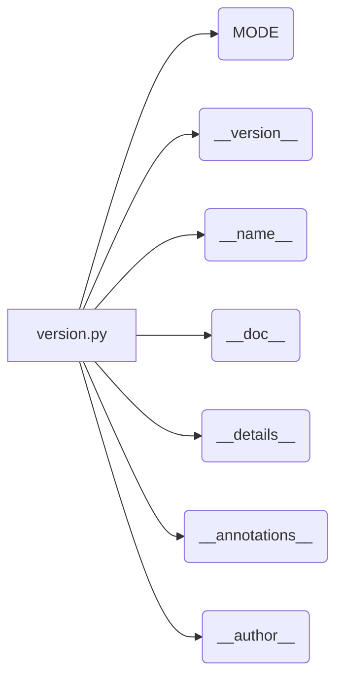

# Анализ кода файла hypotez/src/suppliers/hb/locators/version.py

## <input code>

```python
## \file hypotez/src/suppliers/hb/locators/version.py
# -*- coding: utf-8 -*-
#! venv/Scripts/python.exe
#! venv/bin/python/python3.12

"""
.. module: src.suppliers.hb.locators 
	:platform: Windows, Unix
	:synopsis:

"""
MODE = 'dev'

"""
	:platform: Windows, Unix
	:synopsis:

"""


"""
	:platform: Windows, Unix
	:synopsis:

"""


"""
  :platform: Windows, Unix

"""
"""
  :platform: Windows, Unix
  :platform: Windows, Unix
  :synopsis:
"""MODE = 'dev'
  
""" module: src.suppliers.hb.locators """


"""
- `__version__`: This variable holds the version of the module or package.
- `__name__`: Contains the name of the module. If the script is being run directly, the value will be `"__main__"`.
- `__doc__`: The module's documentation string.
- `__details__`: This variable likely contains additional details about the module, but the exact purpose depends on the specific module or package.
- `__annotations__`: Contains type annotations for variables and functions in the module.
- `__author__`: The name(s) of the author(s) of the module.
"""
__name__:str
__version__="3.12.0.0.0.4"
__doc__:str
__details__:str="Details about version for module or class"
__annotations__

__author__='hypotez '
```

## <algorithm>

В данном файле нет алгоритма в традиционном понимании, это скорее конфигурационный или метаданные.  Код просто определяет переменные, которые, вероятно, будут использоваться другими частями кодовой базы для понимания версии и других констант.  В файле заданы константы и метаданные модуля.

## <mermaid>



## <explanation>

**Импорты:** Нет импортируемых модулей. Это файл, который определяет метаданные самого себя и связанных с ним модулей.

**Классы:** Нет классов.  Все переменные являются глобальными константами.

**Функции:** Нет функций.  Код состоит исключительно из объявлений переменных.

**Переменные:**
- `MODE`: Строковая переменная, вероятно, определяющая режим работы (например, 'dev', 'prod').  Значение 'dev' задано явно.
- `__version__`: Строковая константа, определяющая версию модуля.
- `__name__`, `__doc__`, `__details__`, `__annotations__`, `__author__`:  Переменные, содержащие метаданные о модуле. Определены как строки, и вероятно, необходимы для различных инструментов сборки, тестирования или автоматизации, которые могут использовать эту информацию.

**Возможные ошибки/улучшения:**
- Отсутствие документирования внутри файла. Не указано назначение некоторых переменных (например, `__details__`).  Должны быть документированы цели и назначение этих переменных, особенно в контексте кода.

**Цепочка взаимосвязей:**
Файл `version.py` определяет метаданные, которые могут использоваться другими файлами в проекте (например, для определения версии при развертывании или в документации).  Нет прямых вызовов функций из других модулей.  Его можно рассматривать как вспомогательный файл, содержащий константы для других частей приложения.  Без дополнительных файлов кода сложно полностью оценить его место в проекте, но он, вероятно, входит в более обширный проект, связанный с управлением пакетами, версиями и конфигурацией.