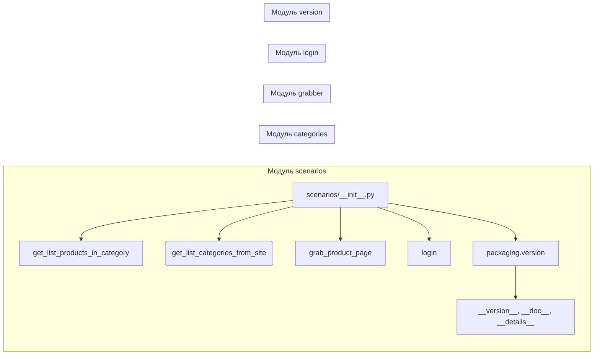

1. **<input code>**

```python
## \file hypotez/src/suppliers/hb/scenarios/__init__.py
# -*- coding: utf-8 -*-\
#! venv/Scripts/python.exe
#! venv/bin/python/python3.12

"""
.. module: src.suppliers.hb.scenarios 
	:platform: Windows, Unix
	:synopsis:

"""
MODE = 'dev'

"""
	:platform: Windows, Unix
	:synopsis:

"""


"""
	:platform: Windows, Unix
	:synopsis:

"""


"""
  :platform: Windows, Unix

"""
"""
  :platform: Windows, Unix
  :platform: Windows, Unix
  :synopsis:
"""MODE = 'dev'
  
""" module: src.suppliers.hb.scenarios """


"""  Поставщик <I>hb.co.il</I> """
...

from packaging.version import Version
from .version import __version__, __doc__, __details__  

from .categories import get_list_products_in_category, get_list_categories_from_site
from .grabber import grab_product_page
from .login import login
```

2. **<algorithm>**

Этот код представляет собой инициализацию модуля `src.suppliers.hb.scenarios`.  Он не содержит явного алгоритма, но импортирует функции и классы из подмодулей.  Пошаговая блок-схема не применима, так как нет циклов и сложной логики.

3. **<mermaid>**



**Описание диаграммы:**

* `scenarios/__init__.py` — главный модуль, который импортирует функции из других модулей.
* `categories`, `grabber`, `login` — подмодули, содержащие функции для работы с категориями товаров, парсингом страниц и авторизацией, соответственно.
* `packaging.version` — внешний модуль, предоставляющий инструменты для работы с версиями пакетов.
* `__version__`, `__doc__`, `__details__` — переменные, содержащие информацию о версии, документации и деталях из подмодуля `version`.

4. **<explanation>**

* **Импорты:**
    * `from packaging.version import Version`: Импортирует класс `Version` из модуля `packaging.version`, который, вероятно, используется для проверки или работы с версиями программного обеспечения или зависимостей. Он находится вне `src`-пакета.
    * `from .version import __version__, __doc__, __details__`: Импортирует переменные `__version__`, `__doc__` и `__details__` из модуля `version` внутри текущего пакета (`src.suppliers.hb.scenarios`). Эти переменные вероятно содержат метаданные о модуле (версия, документация).
    * `from .categories import get_list_products_in_category, get_list_categories_from_site`: Импортирует функции `get_list_products_in_category` и `get_list_categories_from_site` из модуля `categories` внутри текущего пакета. Вероятно, эти функции отвечают за получение списка товаров и категорий.
    * `from .grabber import grab_product_page`: Импортирует функцию `grab_product_page` из модуля `grabber`. Эта функция вероятно отвечает за извлечение данных с страницы продукта.
    * `from .login import login`: Импортирует функцию `login` из модуля `login`. Функция отвечает за логин.

* **Классы:**  Нет явных определений классов в данном фрагменте кода.

* **Функции:**
    * `get_list_products_in_category`, `get_list_categories_from_site`, `grab_product_page`, `login` — это функции, экспортируемые из соответствующих подмодулей.  Их конкретная функциональность не описана в представленном фрагменте, но по именам можно предположить их назначение.


* **Переменные:**
    * `MODE = 'dev'`: Глобальная переменная, скорее всего, контролирует режим работы (например, `dev` или `prod`).

* **Возможные ошибки/улучшения:**
    * Отсутствует документация к функциям и классам, что затрудняет понимание их назначения и параметров.
    * `...` указывает на отсутствие части кода, что затрудняет анализ.
    * Отсутствие обработки исключений, например, при запросах к сайту или проблемах с авторизацией.

**Цепочка взаимосвязей:**

Модуль `scenarios` использует функциональность из подмодулей `categories`, `grabber`, и `login` для сбора данных о продуктах с сайта `hb.co.il`.  Программное обеспечение, вероятно, основано на архитектуре, в которой данные извлекаются последовательно (в `scenarios` определяется порядок).

**Дополнительные замечания:**

Коментарии в коде описывают назначение модулей и, возможно, платформ, для которых он предназначен, однако для лучшего понимания нужны детальные пояснения функциональности функций и методов.