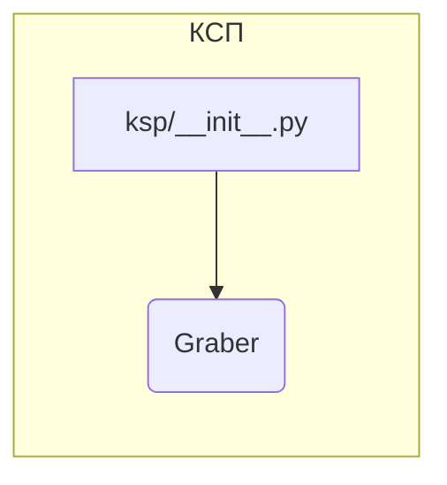

```MD
# Анализ кода hypotez/src/suppliers/ksp/__init__.py

## <input code>

```python
## \file hypotez/src/suppliers/ksp/__init__.py
# -*- coding: utf-8 -*-\
#! venv/Scripts/python.exe
#! venv/bin/python/python3.12

"""
.. module: src.suppliers.ksp 
	:platform: Windows, Unix
	:synopsis:

"""
MODE = 'dev'

from .graber import Graber
```

## <algorithm>

Алгоритм работы представленного кода состоит из единственного шага - импорта модуля `Graber`.  Блок-схема проста:


Пример:
Этот файл `__init__.py` просто импортирует модуль `Graber`, расположенный в подпапке `graber` текущей директории.  Это позволяет импортировать класс `Graber` из других частей проекта.

## <mermaid>



## <explanation>

**1. Импорты:**

Файл `__init__.py` в директории `ksp` служит для инициализации пакета `ksp`.  Строка `from .graber import Graber` импортирует класс `Graber` из модуля `graber`.  Символ `.` перед `graber` указывает на то, что модуль `graber` находится в той же директории, что и `__init__.py`.  Это типичная практика для организации Python-проектов.

**2. Классы:**

В представленном коде отсутствуют объявления классов.

**3. Функции:**

В файле отсутствуют функции.

**4. Переменные:**

Переменная `MODE = 'dev'` определяет режим работы (скорее всего, для разработки).  Её назначение можно предполагать только из контекста.

**5. Возможности для улучшения и ошибки:**

* **Документация:**  В `__init__.py` есть строка документации, но для понимания роли пакета `ksp` могло бы быть полезно более подробное описание.

* **Связь с другими частями проекта:**  Импорт `Graber` указывает на то, что этот модуль, скорее всего, содержит логику взаимодействия с внешними ресурсами (например, веб-API, база данных), или имеет критическую роль в определенном задаче в рамках проекта.  Для полного анализа необходимо изучить файл `graber.py` и другие связанные модули, чтобы понять, какие данные собирает и обрабатывает класс `Graber` и как он взаимодействует с другими частями приложения.

* **Контекст проекта:** Без дополнительных файлов трудно оценить роль этого файла в проекте и то, как он связан с другими частями.  Предположение, что это часть приложения, связанного с сбором данных.


**Цепочка взаимосвязей (предположительно):**

`hypotez/src/suppliers/ksp/__init__.py` импортирует `graber.py`.  Затем класс `Graber` (при наличии) взаимодействует с внешними системами или базами данных, обрабатывает данные, и результаты, возможно, передаются другим частям приложения.  Таким образом, этот файл является частью цепи для получения и обработки данных от внешних источников, предоставляемых поставщиком `ksp`.