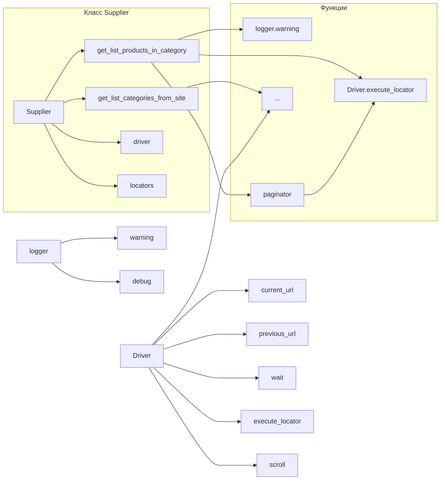

# <input code>

```python
## \file hypotez/src/suppliers/kualastyle/category.py
# -*- coding: utf-8 -*-\n#! venv/Scripts/python.exe\n#! venv/bin/python/python3.12\n\n"""
.. module: src.suppliers.kualastyle 
	:platform: Windows, Unix
	:synopsis:

"""
MODE = 'dev'

"""
	:platform: Windows, Unix
	:synopsis:

"""

"""
	:platform: Windows, Unix
	:synopsis:

"""


"""
  :platform: Windows, Unix

"""
"""
  :platform: Windows, Unix
  :platform: Windows, Unix
  :synopsis:
"""MODE = 'dev'
  
""" module: src.suppliers.kualastyle """


"""  Модуль сбора товаров со страницы категорий поставщика hb.co.il через вебдрайвер
У каждого поставщика свой сценарий обреботки категорий

-Модуль Собирает список категорий со страниц продавца . `get_list_categories_from_site()`
@todo Сделать проверку на изменение категорий на страницах продавца. 
Продавец может добавлять новые категории, переименовывать или удалять/прятать уже существующие. 
По большому счету надо держать таблицу категории `PrestaShop.categories <-> aliexpress.shop.categoies`
- Собирает список товаров со страницы категории `get_list_products_in_category()`
- Итерируясь по списку передает управление в `grab_product_page()` отсылая функции текущий url страницы  
`grab_product_page()` обрабатывает поля товара и передает управление классу `Product` 

"""
...

from typing import Dict, List
from pathlib import Path

from src import gs
from src.logger import logger
from src.webdriver import Driver
from src.suppliers import Supplier


def get_list_products_in_category (s: Supplier) -> list[str, str, None]:    
    """ Returns list of products urls from category page
    Если надо пролистстать - страницы категорий - листаю ??????

    Attrs:
        s - Supplier
    @returns
        list or one of products urls or None
    """
    ...
    d:Driver = s.driver
    l: dict = s.locators['category']
    ...
    d.wait(1)
    d.execute_locator (s.locators ['product']['close_banner'] )
    d.scroll()
    ...

    list_products_in_category: List = d.execute_locator(l['product_links'])

    if not list_products_in_category:
        logger.warning('Нет ссылок на товары. Так бывает')
        ...
        return
    ...
    while d.current_url != d.previous_url:
        if paginator(d,l,list_products_in_category):
            list_products_in_category.append(d.execute_locator(l['product_links']))
        else:
            break
        
    list_products_in_category = [list_products_in_category] if isinstance(list_products_in_category, str) else list_products_in_category

    logger.debug(f""" Found {len(list_products_in_category)} items in category {s.current_scenario['name']} """)
    
    return list_products_in_category

def paginator(d:Driver, locator: dict, list_products_in_category: list):
    """ Листалка """
    response = d.execute_locator(locator['pagination']['<-'])
    if not response or (isinstance(response, list) and len(response) == 0): 
        ...
        return
    return True

def get_list_categories_from_site(s):
    """ сборщик актуальных категорий с сайта """
    ...

```

# <algorithm>

**Алгоритм работы функции `get_list_products_in_category`:**

1. **Инициализация:** Получает драйвер `d` и локаторы `l` из объекта `s` (поставщик).
2. **Обработка баннера:** Выполняет действие `d.execute_locator` для закрытия баннера.
3. **Получение начального списка ссылок:** Получает список ссылок товаров с помощью `d.execute_locator(l['product_links'])`.
4. **Проверка на пустой список:** Если список пуст, выводится предупреждение в лог.
5. **Обработка страниц:** В цикле `while`:
   - Если функция `paginator` возвращает `True`, то добавляет ссылки товаров с текущей страницы к списку.
   - Иначе, цикл завершается.
6. **Обработка типа данных:** Приведение списка к однородному типу (список списков).
7. **Вывод информации в лог:** Выводит количество найденных товаров в лог.
8. **Возврат списка:** Возвращает список ссылок на товары.


**Алгоритм работы функции `paginator`:**

1. **Получение ответа:** Выполняет действие `d.execute_locator` для поиска кнопки перехода на следующую страницу.
2. **Проверка на существование и пустоту:** Проверяет, что полученный ответ не пуст и не пустой список.
3. **Возврат:** Если ответ корректный, возвращает `True`, иначе - `None`.

**Пример:**

Представьте, что `s.driver` — это объект webdriver, который взаимодействует с веб-страницей, а `s.locators['category']['product_links']` — это путь к списку ссылок на товары.  `d.execute_locator` возвращает список ссылок из найденных элементов. Функция `get_list_products_in_category` вызывает `d.current_url` для определения, была ли страница загружена полностью.


# <mermaid>



# <explanation>

**Импорты:**

- `from typing import Dict, List`: Импортирует типы данных `Dict` и `List` из модуля `typing` для лучшей типизации.
- `from pathlib import Path`: Импортирует класс `Path` из модуля `pathlib` для работы с путями к файлам. (В данном случае не используется)
- `from src import gs`: Импортирует модуль `gs` из пакета `src`.  Непонятно, что он делает, но подразумевается, что он используется для каких-то сервисов.
- `from src.logger import logger`: Импортирует объект логгера `logger` из модуля `logger` в пакете `src`. Используется для записи сообщений об ошибках, предупреждениях и отладочных данных.
- `from src.webdriver import Driver`: Импортирует класс `Driver` из модуля `webdriver` в пакете `src`. Этот класс, скорее всего, отвечает за взаимодействие с веб-драйвером (Selenium, Playwright и т.п.).
- `from src.suppliers import Supplier`: Импортирует базовый класс `Supplier` из модуля `suppliers` в пакете `src`.  Этот класс, вероятно, содержит общие методы и атрибуты для работы с разными поставщиками.

**Классы:**

- Нет определения класса `Supplier` в представленном коде.
- Класс `Driver` находится в модуле `src.webdriver` и, скорее всего, отвечает за взаимодействие с веб-драйвером.
- Нет определения класса `Product`.


**Функции:**

- `get_list_products_in_category(s: Supplier) -> list[str, str, None]`: Эта функция получает список ссылок на товары с страницы категории. Принимает на вход объект `Supplier` и возвращает список URL-адресов товаров или `None` при ошибке. Функция использует webdriver `d` и локаторы `l` из `s` для навигации по странице и поиска ссылок.  Ключевой момент – цикл `while` для обработки возможной пагинации. 
- `paginator(d: Driver, locator: dict, list_products_in_category: list)`: Эта вспомогательная функция обрабатывает пагинацию, если она есть на странице.

**Переменные:**

- `MODE = 'dev'`:  Глобальная переменная, предположительно, определяет режим работы (например, `dev`, `prod`).
- `list_products_in_category`: Список URL-адресов товаров.
- `d`: Объект класса `Driver` (веб-драйвер).
- `l`: Словарь локаторов (XPath, CSS-селекторы) для элементов на странице.
- `s`: Объект класса `Supplier`.


**Возможные ошибки и улучшения:**

- Отсутствует обработка исключений. Если какие-то запросы к веб-странице или выполнение действий веб-драйвера вызовут ошибку, код может упасть.
- Непонятно, как реализован `d.execute_locator`.  В коде предполагается, что есть метод в классе `Driver`, но он не определен в фрагменте.
- Некритично, но использование `...` в коде означает неполный фрагмент. Для анализа необходимо полное определение классов и функций, а также структура объекта `s`.
- Логика обработки пагинации (функция `paginator`) может нуждаться в уточнении. Неясно, как она реагирует на ситуации, когда пагинации нет или навигация по ней сложна.
- Необходимо добавить проверку на корректность URL-адресов, возвращаемых функцией.


**Взаимосвязь с другими частями проекта:**

Функции `get_list_products_in_category` и `get_list_categories_from_site` являются частью модуля `kualastyle` в рамках системы сбора данных (поставщики). Они взаимодействуют с классами `Supplier`, `Driver`, и модулем `logger`.  Неясно, как эти данные передаются в другие части проекта (например, для сохранения в базу данных).