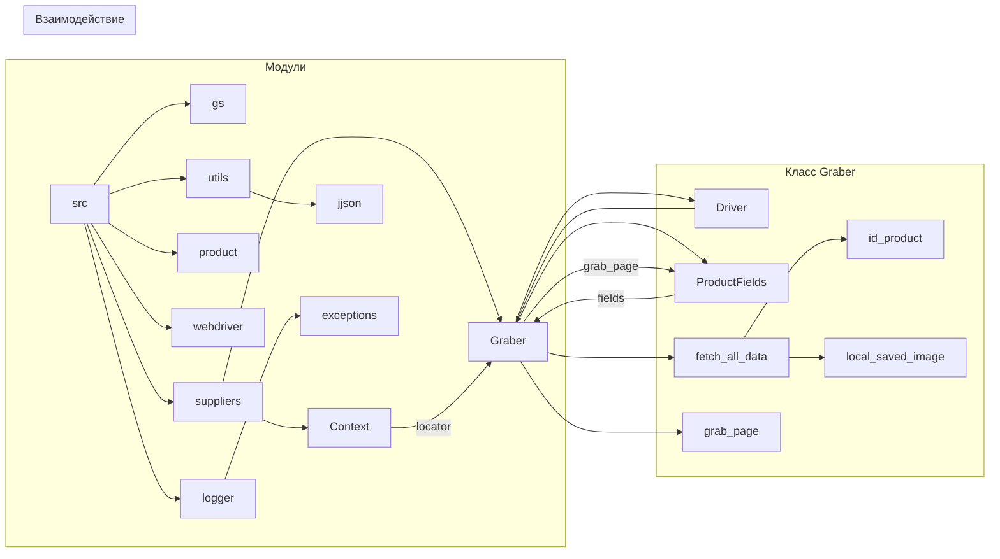

```MD
# <input code>

```python
## \file hypotez/src/suppliers/kualastyle/graber.py
# -*- coding: utf-8 -*-\
#! venv/Scripts/python.exe
#! venv/bin/python/python3.12

"""
.. module: src.suppliers.kualastyle 
	:platform: Windows, Unix
	:synopsis: Класс собирает значение полей на странице  товара `kualastyle.co.il`. 
    Для каждого поля страницы товара сделана функция обработки поля в родительском классе.
    Если нужна нестандертная обработка, функция перегружается в этом классе.
    ------------------
    Перед отправкой запроса к вебдрайверу можно совершить предварительные действия через декоратор. 
    Декоратор по умолчанию находится в родительском классе. Для того, чтобы декоратор сработал надо передать значение 
    в `Context.locator`, Если надо реализовать свой декоратор - раскоментируйте строки с декоратором и переопределите его поведение

"""
MODE = 'dev'


import asyncio
from pathlib import Path
from functools import wraps
from typing import Any, Callable, Optional
from pydantic import BaseModel
from dataclasses import dataclass, field
from types import SimpleNamespace
from src import gs
from src.suppliers import Graber as Grbr, Context, close_pop_up
from src.product import ProductFields
from src.webdriver import Driver
from src.utils.jjson import j_loads_ns
from src.logger import logger
from src.logger.exceptions import ExecuteLocatorException


# # Глобальные настройки через отдельный объект
# class Context:
#     """Класс для хранения глобальных настроек."""
#     driver: Driver = None
#     locator: SimpleNamespace = None

# # Определение декоратора для закрытия всплывающих окон
# # В каждом отдельном поставщике (`Supplier`) декоратор может использоваться в индивидуальных целях
# # Общее название декоратора `@close_pop_up` можно изменить 


# def close_pop_up(value: Any = None) -> Callable:
#     """Создает декоратор для закрытия всплывающих окон перед выполнением основной логики функции.

#     Args:
#         value (Any): Дополнительное значение для декоратора.

#     Returns:
#         Callable: Декоратор, оборачивающий функцию.
#     """
#     def decorator(func: Callable) -> Callable:
#         @wraps(func)
#         async def wrapper(*args, **kwargs):
#             try:
#                 # await Context.driver.execute_locator(Context.locator.close_pop_up)  # Await async pop-up close  
#                 ... 
#             except ExecuteLocatorException as e:
#                 logger.debug(f'Ошибка выполнения локатора: {e}')
#             return await func(*args, **kwargs)  # Await the main function
#         return wrapper
#     return decorator


class Graber(Grbr):
    """Класс для операций захвата Morlevi."""
    supplier_prefix: str

    def __init__(self, driver: Driver):
        """Инициализация класса сбора полей товара."""
        self.supplier_prefix = 'kualastyle'
        super().__init__(supplier_prefix=self.supplier_prefix, driver=driver)
        # Устанавливаем глобальные настройки через Context
        
        Context.locator_for_decorator = None # <- если будет уастановлено значение - то оно выполнится в декораторе `@close_pop_up`


    async def grab_page(self, driver: Driver) -> ProductFields:
        """Асинхронная функция для извлечения данных о товаре.

        Args:
            driver (Driver): Экземпляр драйвера для извлечения данных.

        Returns:
            ProductFields: Извлеченные поля товара.
        """
        global d
        d = self.d = driver  
        ...
        # Логика извлечения данных
        async def fetch_all_data(**kwards):
        
            # Call function to fetch specific data
            # await fetch_specific_data(**kwards)  

            # Uncomment the following lines to fetch specific data
            await self.id_product(kwards.get("id_product", ''))
            # ... (many more await calls)
            await self.local_saved_image(kwards.get("local_saved_image", ''))


        # Call the function to fetch all data
        await fetch_all_data()
        return self.fields
```

# <algorithm>

**Блок-схема:**

1. **Инициализация:**  `Graber` получает экземпляр `Driver`. `self.supplier_prefix` устанавливается. Звонок в конструктор родительского класса `Grbr` для инициализации общих свойств.
2. **`grab_page`:**  Функция принимает `driver`.
   - Внутри `fetch_all_data`  вызываются функции для извлечения данных для каждого поля товара (`id_product`, `local_saved_image` и др.).  Эти функции вызываются с помощью `await`.
   - После выполнения всех `await` возвращает `self.fields`.
3. **`fetch_all_data`:** Циклический вызов функций-методов для извлечения данных по каждому полю. Функции извлекают данные с помощью веб-драйвера и сохраняют их в `self.fields`.

**Примеры данных:**

- Входные данные: `id_product` из `kwards`
- Выходные данные: заполненное поле `id_product` в `self.fields`


# <mermaid>




# <explanation>

**Импорты:**

- `asyncio`:  Для асинхронного программирования, особенно важно для работы с веб-драйвером.
- `pathlib`:  Для работы с файловыми путями.
- `functools`:  Для декораторов.
- `typing`:  Для типов данных.
- `pydantic`:  Для определения схем данных, вероятно для работы с `ProductFields`.
- `dataclasses`: Для использования dataclasses.
- `types`: Для использования `SimpleNamespace`.
- `src.gs`, `src.suppliers.*`, `src.product`, `src.webdriver`, `src.utils.jjson`, `src.logger`, `src.logger.exceptions`:  Импорты из собственных модулей проекта `src`, что указывает на структурированную архитектуру проекта.  Связи с другими модулями показаны на диаграмме.  Например, `ProductFields` из `src.product` используется для представления данных товара.

**Классы:**

- `Graber`: Класс, наследуемый от `Grbr` (из `src.suppliers`).  Он предназначен для сбора данных с веб-страницы ( `kualastyle.co.il`).  Метод `grab_page` отвечает за основной поток сбора.  Атрибут `supplier_prefix` определяет префикс поставщика.
- `Context`: (Неиспользуемый в текущем коде, но есть в исходном файле).  Класс, вероятно, служит для хранения глобальных конфигураций или настроек для работы с веб-драйвером.
- `Grbr`: Родительский класс, предоставляющий общие функциональности для работы с различными источниками данных. В данном случае вероятно содержит методы для инициализации и работы с вебдрайвером.

**Функции:**

- `grab_page`:  Основная асинхронная функция для сбора данных.  Возвращает `ProductFields`.
- `fetch_all_data`: Асинхронная вспомогательная функция, которая вызывает методы `self.<field_name>`, чтобы получить данные из веб-драйвера.

**Переменные:**

- `MODE`:  Глобальная переменная, вероятно, для управления режимом (например, «dev» или «prod»).
- `d`:  Глобальная переменная, используемая для хранения ссылки на веб-драйвер.


**Возможные ошибки и улучшения:**

- Отсутствие обработки ошибок:  Функции `self.<field_name>` не обрабатывают потенциальные исключения (например, если элемент на странице не найден).  Это может привести к ошибкам во время выполнения.  Нужны `try...except` блоки.
- Недокументированные методы: Многие методы `self.<field_name>` не документированы, что затрудняет понимание их функциональности и ожидаемых входных данных.
- Неясно, как обрабатываются ошибки: `fetch_all_data` не обрабатывает ошибки.
- `Context` неиспользуемый, но его наличие в коде указывает на возможный (но не реализованный) механизм хранения глобальных настроек. 
- Чрезмерный объем кода: Большая часть функций для `fetch_all_data` не используется.

**Цепочка взаимосвязей:**

`Graber` использует `Driver` для взаимодействия с веб-драйвером.  `ProductFields` используется для хранения и представления данных, полученных с сайта.  `Graber` взаимодействует с другими классами (например, `Context`) для получения или использования дополнительных данных.  Функции `self.<field_name>` взаимодействуют с методами драйвера `Driver` для поиска и получения элементов со страницы. Все эти взаимодействия представлены на блок-схеме.


**Общие замечания:**

Код является примером асинхронного сбора данных с веб-страницы.  Однако, для практического использования, его необходимо доработать, включив обработку ошибок, улучшенную документацию и более эффективную организацию кода.