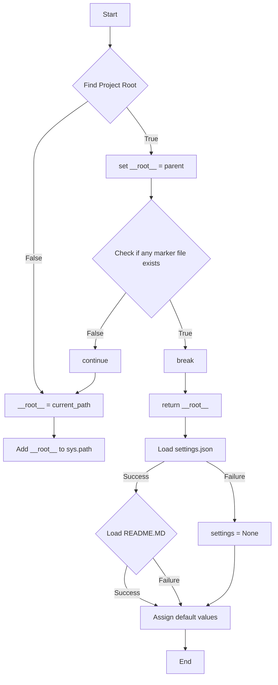
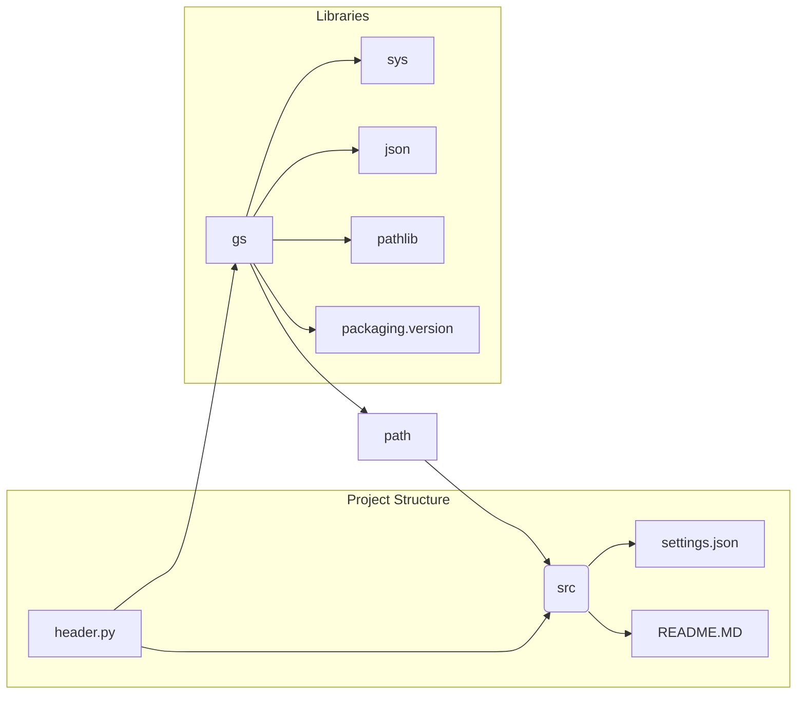

# <input code>

```python
## \file hypotez/src/suppliers/kualastyle/header.py
# -*- coding: utf-8 -*-\
#! venv/Scripts/python.exe
#! venv/bin/python/python3.12

"""
.. module: src.suppliers.kualastyle 
	:platform: Windows, Unix
	:synopsis:

"""
MODE = 'dev'


import sys
import json
from packaging.version import Version

from pathlib import Path
def set_project_root(marker_files=('pyproject.toml', 'requirements.txt', '.git')) -> Path:
    """
    Finds the root directory of the project starting from the current file's directory,
    searching upwards and stopping at the first directory containing any of the marker files.

    Args:
        marker_files (tuple): Filenames or directory names to identify the project root.
    
    Returns:
        Path: Path to the root directory if found, otherwise the directory where the script is located.
    """
    __root__:Path
    current_path:Path = Path(__file__).resolve().parent
    __root__ = current_path
    for parent in [current_path] + list(current_path.parents):
        if any((parent / marker).exists() for marker in marker_files):
            __root__ = parent
            break
    if __root__ not in sys.path:
        sys.path.insert(0, str(__root__))
    return __root__


# Get the root directory of the project
__root__ = set_project_root()
"""__root__ (Path): Path to the root directory of the project"""

from src import gs

settings:dict = None
try:
    with open(gs.path.root / 'src' /  'settings.json', 'r') as settings_file:
        settings = json.load(settings_file)
except (FileNotFoundError, json.JSONDecodeError):
    ...

doc_str:str = None
try:
    with open(gs.path.root / 'src' /  'README.MD', 'r') as settings_file:
        doc_str = settings_file.read()
except (FileNotFoundError, json.JSONDecodeError):
    ...


__project_name__ = settings.get("project_name", 'hypotez') if settings  else 'hypotez'
__version__: str = settings.get("version", '')  if settings  else ''
__doc__: str = doc_str if doc_str else ''
__details__: str = ''
__author__: str = settings.get("author", '')  if settings else ''
__copyright__: str = settings.get("copyrihgnt", '')  if settings else ''
__cofee__: str = settings.get("cofee", "Treat the developer to a cup of coffee for boosting enthusiasm in development: https://boosty.to/hypo69")  if settings else "Treat the developer to a cup of coffee for boosting enthusiasm in development: https://boosty.to/hypo69"
```

# <algorithm>



**Пример:**

Если `__file__` указывает на файл в `hypotez/src/suppliers/kualastyle/header.py`, то `set_project_root` будет искать директории `hypotez/src`, `hypotez`, и т.д., проверяя наличие `pyproject.toml`, `requirements.txt` или `.git`. Если `pyproject.toml` найден в директории `hypotez`, то `__root__` получит значение `hypotez`, и `sys.path` будет обновлен.


# <mermaid>



**Объяснение:**

*   `header.py` взаимодействует с файлами `settings.json` и `README.MD` в корне проекта, используя модуль `gs` для получения пути.
*   `gs` скорее всего модуль, определённый в другом месте проекта, который содержит полезные функции для работы с путями.
*   `sys`, `json`, `pathlib`, и `packaging.version` – это стандартные библиотеки Python.


# <explanation>

* **Импорты:**
    * `sys`: Обеспечивает доступ к системным параметрам, в частности, к пути поиска модулей (`sys.path`).
    * `json`: Используется для сериализации и десериализации данных в формате JSON.
    * `packaging.version`:  Обеспечивает работу с версиями пакетов.
    * `pathlib`: Предоставляет удобный способ работы с путями к файлам и директориям.
    * `src import gs`:  Модуль `gs` вероятно содержит функциональность, связанную с навигацией по структуре проекта (например, получение пути к корневому каталогу).  Это типичная структура для организации проекта с использованием модулей, объединённых в общую область (`src`) в проекте `hypotez`.


* **Классы:** Нет явных классов в этом коде.


* **Функции:**
    * `set_project_root(marker_files)`: Ищет корень проекта, начиная с текущего файла, поднимаясь по иерархии директорий, и проверяя наличие указанных файлов/папок (например, `pyproject.toml`, `requirements.txt`, `.git`).
        * Аргументы: `marker_files` — кортеж имен файлов или папок, по которым определяется корень проекта.
        * Возвращаемое значение: `Path` объект, представляющий путь к корню проекта. Если корень не найден, возвращает путь к текущей директории.
    

* **Переменные:**
    * `__root__`: `Path` объект, содержащий путь к корню проекта.
    * `settings`: Словарь, содержащий данные из `settings.json`.
    * `doc_str`: Строка, содержащая содержимое файла `README.MD`.
    * `__project_name__`, `__version__`, `__doc__`, `__details__`, `__author__`, `__copyright__`, `__cofee__`:  Константы, содержащие информацию о проекте, считанную из `settings.json`, с использованием `settings.get()`.


* **Возможные ошибки и улучшения:**
    * Обработка исключений `FileNotFoundError` и `json.JSONDecodeError` важна. Однако, логика обработки может быть более конкретной и, возможно, возвращать более информативные сообщения об ошибках.
    * Можно было бы использовать `pathlib.Path.rglob` для поиска файлов или папок, что, возможно, было бы более гибким в ситуациях, когда нужные файлы не всегда находятся в корне проекта.
    *  Неопределённая переменная `MODE` внутри кода, которую можно устранить, используя её значение.
    * Добавьте `if __name__ == "__main__":` блок, чтобы функции не выполнялись при импорте.


* **Взаимосвязи с другими частями проекта:**
    * Модуль `gs` вероятно содержит функции для работы с файловой системой, и он устанавливает корректный путь к файлам проекта.
    * Файлы `settings.json` и `README.MD` содержат важную информацию о проекте.
    *  Использование этих данных в других частях проекта, скорее всего, позволит использовать конфигурацию проекта из различных мест.


В целом код хорошо написан и читаем, однако, для повышения надёжности, следует добавить более подробную обработку ошибок и, возможно, использовать более гибкие методы поиска файлов.