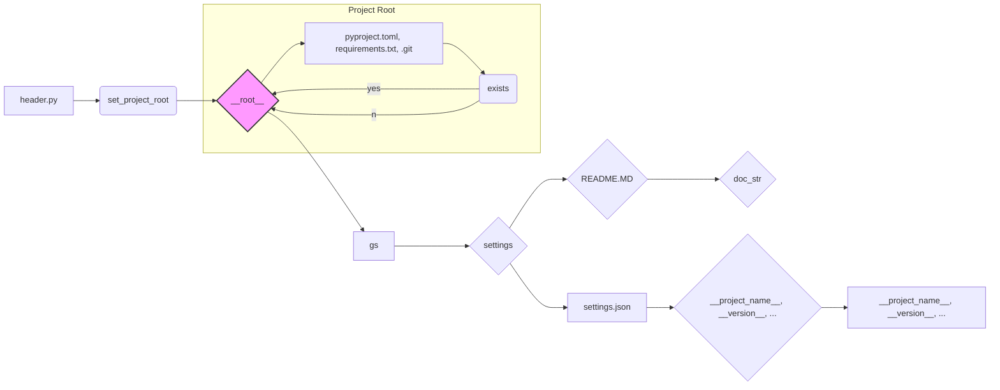

# <input code>

```python
## \file hypotez/src/suppliers/visualdg/header.py
# -*- coding: utf-8 -*-\
#! venv/Scripts/python.exe
#! venv/bin/python/python3.12

"""
.. module: src.suppliers.visualdg 
	:platform: Windows, Unix
	:synopsis:

"""
MODE = 'dev'

import sys
import json
from packaging.version import Version

from pathlib import Path
def set_project_root(marker_files=('pyproject.toml', 'requirements.txt', '.git')) -> Path:
    """
    Finds the root directory of the project starting from the current file's directory,
    searching upwards and stopping at the first directory containing any of the marker files.

    Args:
        marker_files (tuple): Filenames or directory names to identify the project root.
    
    Returns:
        Path: Path to the root directory if found, otherwise the directory where the script is located.
    """
    __root__:Path
    current_path:Path = Path(__file__).resolve().parent
    __root__ = current_path
    for parent in [current_path] + list(current_path.parents):
        if any((parent / marker).exists() for marker in marker_files):
            __root__ = parent
            break
    if __root__ not in sys.path:
        sys.path.insert(0, str(__root__))
    return __root__


# Get the root directory of the project
__root__ = set_project_root()
"""__root__ (Path): Path to the root directory of the project"""

from src import gs

settings:dict = None
try:
    with open(gs.path.root / 'src' /  'settings.json', 'r') as settings_file:
        settings = json.load(settings_file)
except (FileNotFoundError, json.JSONDecodeError):
    ...

doc_str:str = None
try:
    with open(gs.path.root / 'src' /  'README.MD', 'r') as settings_file:
        doc_str = settings_file.read()
except (FileNotFoundError, json.JSONDecodeError):
    ...


__project_name__ = settings.get("project_name", 'hypotez') if settings  else 'hypotez'
__version__: str = settings.get("version", '')  if settings  else ''
__doc__: str = doc_str if doc_str else ''
__details__: str = ''
__author__: str = settings.get("author", '')  if settings  else ''
__copyright__: str = settings.get("copyrihgnt", '')  if settings  else ''
__cofee__: str = settings.get("cofee", "Treat the developer to a cup of coffee for boosting enthusiasm in development: https://boosty.to/hypo69")  if settings  else "Treat the developer to a cup of coffee for boosting enthusiasm in development: https://boosty.to/hypo69"
```

# <algorithm>

**Алгоритм работы:**

1. **Инициализация:** Импортируются необходимые модули (sys, json, Path, Version, gs). Объявляется константа `MODE`.
2. **Определение корневой директории проекта (`set_project_root`)**:
   - Получает текущую директорию (`current_path`).
   - Итерируется по родительским директориям, начиная с текущей.
   - Проверяет существование файлов маркеров (pyproject.toml, requirements.txt, .git) в каждой родительской директории.
   - Если найден маркер, сохраняет родительскую директорию в `__root__` и прерывает цикл.
   - Если корень не найден, `__root__` остаётся текущей директорией.
   - Добавляет корневую директорию в `sys.path` (для импорта модулей из корня).
   - Возвращает `__root__`.
3. **Получение настроек проекта (`settings`)**:
   - Получает корень проекта (`__root__`).
   - Читает файл `settings.json` из корня проекта.
   - Обрабатывает возможные исключения (FileNotFoundError, json.JSONDecodeError).
   - Сохраняет загруженные данные в `settings`.
4. **Получение описания проекта (`doc_str`)**:
   - Читает файл `README.MD` из корня проекта.
   - Обрабатывает возможные исключения (FileNotFoundError, json.JSONDecodeError).
   - Сохраняет прочитанный текст в `doc_str`.
5. **Получение метаданных проекта:**
   - Извлекает значения из настроек (`settings`), устанавливая значения по умолчанию, если ключ отсутствует или `settings` не существует.  Например, `__project_name__ = settings.get("project_name", 'hypotez') if settings else 'hypotez'`.

**Пример:**

Если файл `settings.json` находится в директории выше `header.py`, содержащей `pyproject.toml`, то код найдёт `__root__`, загрузит `settings` и заполнит переменные метаданных.


# <mermaid>



# <explanation>

**Импорты:**

- `sys`: Предоставляет доступ к системным переменным и функциям Python, в том числе `sys.path` для управления путями поиска модулей.
- `json`: Модуль для работы с JSON-данными. Используется для чтения файла настроек `settings.json`.
- `packaging.version`: Модуль для работы с версиями пакетов. Используется (хотя и не демонстрируется прямо в коде) для обработки версий.
- `pathlib`: Предоставляет удобный интерфейс для работы с файлами и каталогами. Здесь используется для работы с путями.
- `gs`:  Этот импорт предполагает, что `gs` определен в другом модуле, вероятно, в `src`. В коде используются функции или переменные из `gs`, например `gs.path.root`. Подробнее о нём можно судить по структуре проекта и коду в `src`.  Наличие `gs` предполагает некоторую структуру модулей, связанную с управлением путями и ресурсами проекта.


**Классы:**

В коде нет объявленных классов.

**Функции:**

- `set_project_root(marker_files)`: Функция находит корневую директорию проекта, начиная с текущего файла.
    - Аргументы: `marker_files` (кортеж строк).
    - Возвращает: `Path` к корневой директории.
    - Алгоритм: ищет в родительских каталогах файлы и директории.
    - Важно: добавляет корень в `sys.path`, что критично для корректного импорта других модулей.

**Переменные:**

- `MODE`, `__root__`, `settings`, `doc_str`:  Переменные, хранящие значения. `__root__` — ключевой элемент, определяющий доступ к ресурсам проекта. `settings` содержит настройки проекта. `doc_str` содержит текст README.
- Переменные, начинающиеся с `__`: обычно представляют атрибуты класса, используемые для получения информации о проекте или его структуре (метаданные).

**Возможные ошибки и улучшения:**

- **Обработка исключений:** Использование `try...except` для обработки `FileNotFoundError` и `json.JSONDecodeError` — хорошая практика. Но стоит добавить более подробные сообщения об ошибках, чтобы помочь при отладке.
- **Ясность имён:** Использование переменных `__root__`, `settings`, `doc_str` — хорошо, но потенциально может вызывать путаницу, если не понятно, что эти переменные содержат.


**Связь с другими частями проекта:**

Функция `set_project_root` жизненно важна для нахождения корня проекта и добавления пути к `sys.path`.  `gs` указывает на необходимость существования модуля, отвечающего за управление ресурсами проекта, вероятно, включающего в себя пути и данные. Файлы `settings.json` и `README.MD` содержат ключевую информацию о проекте.  Все эти элементы формируют единую структуру проекта, обеспечивая его работу и функционирование.