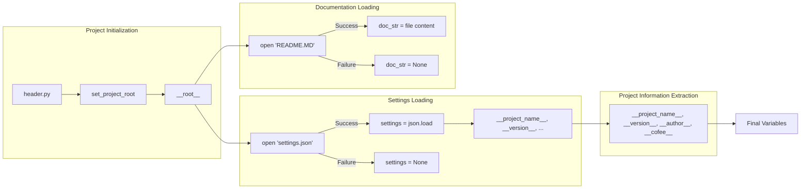

```MD
# <input code>

```python
## \file hypotez/src/suppliers/wallashop/header.py
# -*- coding: utf-8 -*-
#! venv/Scripts/python.exe
#! venv/bin/python/python3.12

"""
.. module: src.suppliers.wallashop 
	:platform: Windows, Unix
	:synopsis:

"""
MODE = 'dev'

import sys
import json
from packaging.version import Version

from pathlib import Path
def set_project_root(marker_files=('pyproject.toml', 'requirements.txt', '.git')) -> Path:
    """
    Finds the root directory of the project starting from the current file's directory,
    searching upwards and stopping at the first directory containing any of the marker files.

    Args:
        marker_files (tuple): Filenames or directory names to identify the project root.
    
    Returns:
        Path: Path to the root directory if found, otherwise the directory where the script is located.
    """
    __root__:Path
    current_path:Path = Path(__file__).resolve().parent
    __root__ = current_path
    for parent in [current_path] + list(current_path.parents):
        if any((parent / marker).exists() for marker in marker_files):
            __root__ = parent
            break
    if __root__ not in sys.path:
        sys.path.insert(0, str(__root__))
    return __root__


# Get the root directory of the project
__root__ = set_project_root()
"""__root__ (Path): Path to the root directory of the project"""

from src import gs

settings:dict = None
try:
    with open(gs.path.root / 'src' /  'settings.json', 'r') as settings_file:
        settings = json.load(settings_file)
except (FileNotFoundError, json.JSONDecodeError):
    ...

doc_str:str = None
try:
    with open(gs.path.root / 'src' /  'README.MD', 'r') as settings_file:
        doc_str = settings_file.read()
except (FileNotFoundError, json.JSONDecodeError):
    ...


__project_name__ = settings.get("project_name", 'hypotez') if settings  else 'hypotez'
__version__: str = settings.get("version", '')  if settings  else ''
__doc__: str = doc_str if doc_str else ''
__details__: str = ''
__author__: str = settings.get("author", '')  if settings else ''
__copyright__: str = settings.get("copyrihgnt", '')  if settings else ''
__cofee__: str = settings.get("cofee", "Treat the developer to a cup of coffee for boosting enthusiasm in development: https://boosty.to/hypo69")  if settings else "Treat the developer to a cup of coffee for boosting enthusiasm in development: https://boosty.to/hypo69"
```

# <algorithm>

1. **`set_project_root` Function:**
   - Takes a tuple of marker files as input.
   - Starts from the directory of the current file (`__file__`).
   - Iterates through parent directories until it finds a directory containing at least one of the marker files.
   - If found, sets `__root__` to that directory.
   - Adds the root directory to `sys.path` if it's not already present.
   - Returns the found root directory (`__root__`).

   ```mermaid
   graph TD
   A[Current File] --> B{Find Marker Files};
   B -- Yes --> C[__root__ = Parent Dir];
   B -- No --> D[__root__ = Current Dir];
   C --> E[Add to sys.path];
   D --> E;
   E --> F[Return __root__];
   ```

2. **Initialization:**
   - Calls `set_project_root()` to get the project root directory and stores it in `__root__`.


3. **`settings` Loading:**
   - Tries to open `src/settings.json` in the project root.
   - Loads the JSON data into the `settings` dictionary.
   - Handles potential `FileNotFoundError` or `json.JSONDecodeError`.


4. **`doc_str` Loading:**
   - Tries to open `src/README.MD` in the project root.
   - Reads the file contents into `doc_str`.
   - Handles potential `FileNotFoundError` or `json.JSONDecodeError`.


5. **Project Information Extraction:**
   - Extracts project name, version, author, copyright, and coffee link from the `settings` dictionary (if available) or defaults to provided values.


# <mermaid>




# <explanation>

- **Imports:**
    - `sys`: Used to manipulate the Python path.
    - `json`: For working with JSON files.
    - `packaging.version`: For handling versions. (Important for version compatibility)
    - `pathlib`: For handling paths in a platform-independent way, crucial for cross-platform compatibility.


- **`set_project_root` function:** This function is crucial for locating the project root directory regardless of where the script is executed from.  It searches up the file system for the directory containing marker files like `pyproject.toml` or `requirements.txt`, which are common in Python projects.  This is good practice for robustness, preventing errors if the project is moved or the script is called from a different location.


- **`gs` module:** The `gs` module is assumed to be part of the project's own modules. It contains the `path` attribute that provides access to project-level paths, making the code modular and easier to maintain.


- **`settings` loading:** This code handles the possibility that `settings.json` may not be present or have invalid JSON, which can cause the program to crash.  It gracefully handles these exceptions with the `try...except` block.


- **`doc_str` loading:** Similar to settings loading, this code handles errors in the case that the `README.MD` file is not found.


- **Variables:** The variables `__project_name__`, `__version__`, etc. are created to store project-level information, typically used for documentation, version control, or other metadata.


- **Error Handling:** The `try...except` blocks are good for robustness.  You could potentially add more specific exception handling (e.g., different types of JSON decoding errors).


- **Possible Improvements:**
    - **Explicit Error Messages:** Instead of `...`, provide more specific error messages in the `except` blocks.
    - **`__root__` Validation:** Add a check to ensure `__root__` is not `None` before using it.


- **Relationships with Other Parts of the Project:** The code depends on the `gs` module, and, most likely, on the `settings.json` and `README.MD` files within the project's structure. The presence of `pyproject.toml` and `requirements.txt` implies this code is likely part of a larger Python project using package management and a structured configuration.