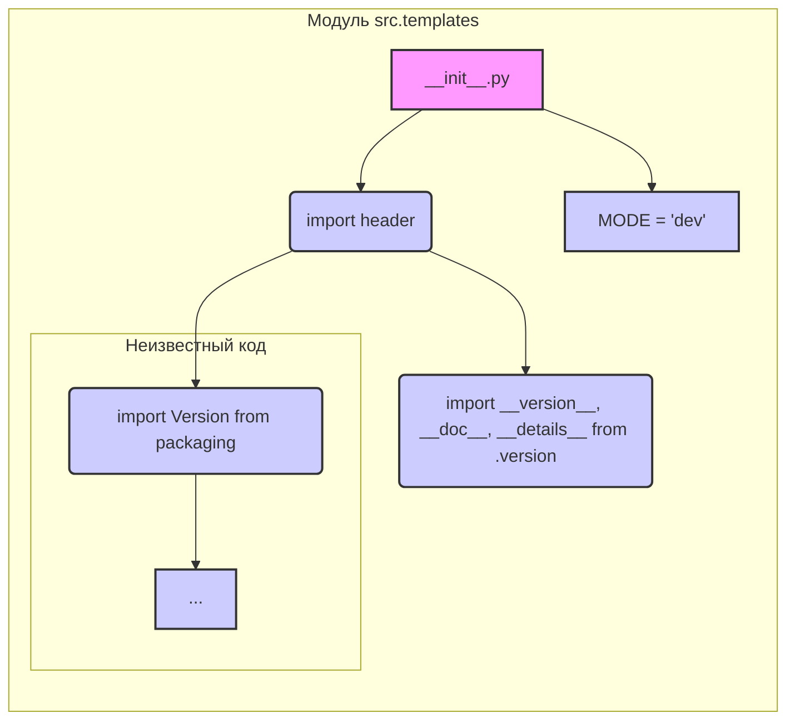

# <input code>

```python
## \file hypotez/src/templates/__init__.py
# -*- coding: utf-8 -*-
#! venv/Scripts/python.exe
#! venv/bin/python/python3.12

"""
.. module: src.templates 
	:platform: Windows, Unix
	:synopsis:

"""
MODE = 'dev'

"""
	:platform: Windows, Unix
	:synopsis:

"""


"""
	:platform: Windows, Unix
	:synopsis:

"""


"""
  :platform: Windows, Unix

"""
"""
  :platform: Windows, Unix
  :platform: Windows, Unix
  :synopsis:
"""MODE = 'dev'
  
""" module: src.templates """


""" HERE SHOULD BE A DESCRIPTION OF THE MODULE OPERATION ! """

import header 
...

from packaging.version import Version
from .version import __version__, __doc__, __details__ 
```

# <algorithm>

Этот код представляет собой начальную точку входа для модуля `src.templates`.  Алгоритм работы, на данный момент, не определен, так как основная часть кода отсутствует.  Однако, код импортирует другие модули и устанавливает переменную `MODE`.  

Пошаговая блок-схема (в упрощенном виде, без реализации функции `...`):

1. **Импорт:** Модуль `header` и необходимые компоненты из `packaging.version` и `src.templates.version` импортируются.

2. **Инициализация:** Переменная `MODE` устанавливается в значение 'dev'.

3. **Возможная обработка:** Отсутствующий код `...` может содержать инициализацию других переменных, вызов функций и т.д.


# <mermaid>



**Объяснение диаграммы:**

Диаграмма показывает, как модуль `__init__.py` импортирует необходимые компоненты (`header`, `packaging.version` и  `src.templates.version`).  В данном случае `...` представляет собой недоступную часть кода.

# <explanation>

**Импорты:**

- `import header`: Импортирует модуль `header`, который, вероятно, содержит общие функции или константы для этого пакета. Необходимо определить местонахождение и назначение этого файла для полной оценки.
- `from packaging.version import Version`: Импортирует класс `Version` из библиотеки `packaging`, используемой для работы с версиями.  Это указывает на то, что проект likely связан с управлением версиями.
- `from .version import __version__, __doc__, __details__`: Импортирует переменные `__version__`, `__doc__`, `__details__`, скорее всего, содержащие метаданные (версия, описание, дополнительные данные) о самом модуле `src.templates`.  Важная часть реализации для проекта.

**Переменные:**

- `MODE = 'dev'`: Глобальная переменная, вероятно, определяющая режим работы.  Значение `'dev'` указывает на режим разработки.


**Возможные ошибки и улучшения:**

- **Отсутствующий код (`...`):**  Необходимо заполнить пропущенные части кода.  Это ключевой недостаток для анализа функциональности.
- **Документация:** Недостаточно документированы `header`,  `...`, и `src.templates.version`.  Для поддержки кода важна хорошая документация.
- **Уточнение импорта `header`:**  Требуется дополнительная информация о файле `header`. Где он находится, и что он делает?


**Цепочка взаимосвязей:**

Модуль `src.templates` скорее всего входит в более крупный проект. Он зависит от `header`, и, судя по импорту `__version__`, `__doc__`, `__details__` -  от модуля `src.templates.version`, который вероятно содержит информацию о версии самого пакета.  Наличие зависимости `header` указывает на то, что `src.templates` не является самостоятельным модулем, а скорее частью более крупной системы.