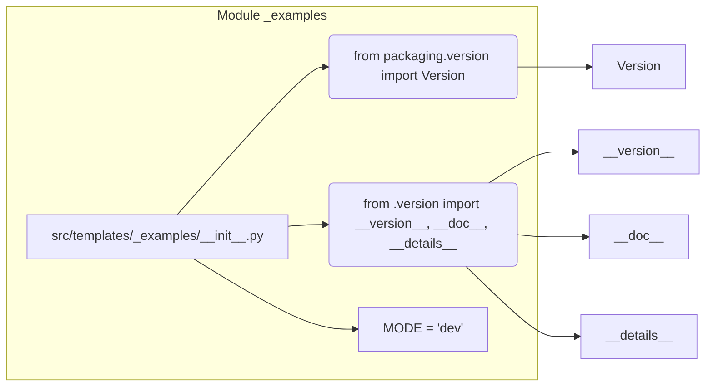

# <input code>

```python
## \file hypotez/src/templates/_examples/__init__.py
# -*- coding: utf-8 -*-\
#! venv/Scripts/python.exe
#! venv/bin/python/python3.12

"""
.. module: src.templates._examples 
	:platform: Windows, Unix
	:synopsis:

"""
MODE = 'dev'

"""
	:platform: Windows, Unix
	:synopsis:

"""


"""
	:platform: Windows, Unix
	:synopsis:

"""


"""
  :platform: Windows, Unix

"""
"""
  :platform: Windows, Unix
  :platform: Windows, Unix
  :synopsis:
"""MODE = 'dev'
  
""" module: src.templates._examples """


from packaging.version import Version
from .version import __version__, __doc__, __details__
```

# <algorithm>

Этот код представляет собой инициализационную часть модуля `src.templates._examples`. Алгоритм состоит из следующих шагов:

1. **Импорты:** Модуль импортирует класс `Version` из пакета `packaging`.  Из подмодуля `version` в текущем каталоге импортируются переменные `__version__`, `__doc__` и `__details__`.

2. **Константы:**  Определяется константа `MODE` со значением `'dev'`.  Замечание:  Есть несколько повторяющихся комментариев и  строк, не имеющих явного назначения.  Возможно, они остатки от прежней версии кода.

3. **Импорты (продолжение):**  Происходит импорт.

Взаимодействие с другими частями проекта происходит через импорты. Модуль `packaging.version` используется для работы с версиями пакетов. Модуль `.version` предоставляет метаданные о версии текущего модуля, что указывает на взаимосвязь между текущим файлом и модулем `version`.


# <mermaid>



# <explanation>

**Импорты:**

* `from packaging.version import Version`: Импортирует класс `Version` из пакета `packaging`.  Этот пакет используется для работы с версиями программного обеспечения.  Данный импорт необходим для корректной обработки версий в проекте, но не используется в этом конкретном файле.
* `from .version import __version__, __doc__, __details__`: Импортирует переменные `__version__`, `__doc__`, и `__details__` из модуля `version`, который находится в том же каталоге (`./version.py`).  Эти переменные, скорее всего, содержат метаданные (версия, описание, детали) о модуле, что является стандартной практикой в Python.  Они используются для информации о модуле при его использовании.

**Классы:**

В данном файле нет определений классов.

**Функции:**

В файле нет определений функций.

**Переменные:**

* `MODE = 'dev'`: Переменная глобального уровня, вероятно, определяет режим работы модуля (например, 'dev', 'prod'). Повторяющиеся определения этой переменной и комментарии указывают на проблему с качеством кода. 

**Возможные ошибки и улучшения:**

* **Повторяющиеся определения:** Несколько раз определена переменная `MODE` и много пустых строк с комментариями, которые не добавляют смысла и должны быть удалены.  Это затрудняет понимание кода и указывает на плохую структуру. 
* **Неиспользованные импорты:**  Класс `Version` импортируется, но явно не используется.  Если он не нужен, его следует удалить.
* **Неясные комментарии:** Некоторые комментарии неточны или неинформативны.

**Взаимосвязь с другими частями проекта:**

Импорт из файла `.version.py` указывает на то, что есть модуль `version` (предположительно `hypotez/src/templates/_examples/version.py`), который содержит метаданные о версии.  Этот модуль необходим для работы с текущим модулем, что создает зависимость.  Необходимо проверить другие файлы, чтобы убедиться, что они корректно используют импортированные значения.