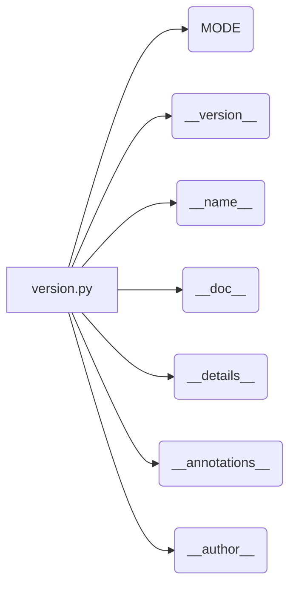

# <input code>

```python
## \file hypotez/src/templates/_examples/version.py
# -*- coding: utf-8 -*-
#! venv/Scripts/python.exe
#! venv/bin/python/python3.12

"""
.. module: src.templates._examples 
	:platform: Windows, Unix
	:synopsis:

"""
MODE = 'dev'

"""
	:platform: Windows, Unix
	:synopsis:

"""


"""
	:platform: Windows, Unix
	:synopsis:

"""


"""
  :platform: Windows, Unix

"""
"""
  :platform: Windows, Unix
  :platform: Windows, Unix
  :synopsis:
"""MODE = 'dev'
  
""" module: src.templates._examples """


"""
- `__version__`: This variable holds the version of the module or package.
- `__name__`: Contains the name of the module. If the script is being run directly, the value will be `"__main__"`.
- `__doc__`: The module's documentation string.
- `__details__`: This variable likely contains additional details about the module, but the exact purpose depends on the specific module or package.
- `__annotations__`: Contains type annotations for variables and functions in the module.
- `__author__`: The name(s) of the author(s) of the module.
"""
__name__:str
__version__="3.12.0.0.0.4"
__doc__:str
__details__:str="Details about version for module or class"
__annotations__

__author__='hypotez '
```

# <algorithm>

Этот код не содержит алгоритма в традиционном понимании. Он представляет собой определение констант и метаданных модуля (например, версия, автор, описание). Алгоритмической логики нет.


# <mermaid>



# <explanation>

Этот Python-файл определяет переменные, используемые для метаданных модуля `hypotez/src/templates/_examples/version.py`.

**Импорты:**

Нет импортов. Файл содержит собственные переменные.

**Классы:**

Нет классов.

**Функции:**

Нет функций.

**Переменные:**

* `MODE`: Строковая константа, вероятно, задаёт режим работы, но без контекста сложно судить. Значение 'dev' предполагает что это режим разработки.
* `__version__`: Строковая переменная, хранящая версию модуля.
* `__name__`: Строковая переменная, содержащая имя текущего модуля. Она будет `"__main__"` если скрипт запущен напрямую, и имя файла в противном случае.
* `__doc__`: Строковая переменная, содержащая строку документации для модуля.
* `__details__`: Строковая переменная, содержащая дополнительные детали о модуле.
* `__annotations__`:  Пустая переменная; обычно используется для добавления аннотаций типов к переменным и функциям, но в данном случае пуста.
* `__author__`: Строковая переменная, содержащая имя автора или авторов модуля.

**Возможные ошибки и улучшения:**

* **Недостаток контекста:** Без понимания того, как этот файл используется в рамках проекта, сложно судить о его полноте и корректности.  Присутствуют многократные строки документации `"""..."""`, большинство из которых не используются.  Необходимо понять, какая система документирования используется.
* **Отсутствие логики:** Файл не содержит никакой логики. Он просто определяет переменные.  Не ясно, как эти переменные будут использоваться.


**Взаимосвязи с другими частями проекта:**

Вероятно, этот файл используется для определения метаданных, которые потом используются другими частями приложения (`hypotez`) для вывода информации о версии.  Для этого потребуется больше контекста.