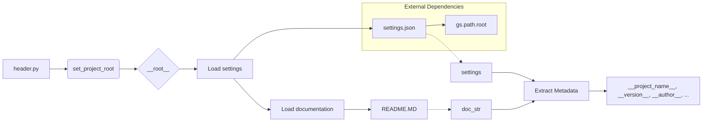

# <input code>

```python
## \file hypotez/src/translators/header.py
# -*- coding: utf-8 -*-\
#! venv/Scripts/python.exe
#! venv/bin/python/python3.12

"""
.. module: src.translators 
	:platform: Windows, Unix
	:synopsis:

"""
MODE = 'dev'

"""
	:platform: Windows, Unix
	:synopsis:

"""


"""
	:platform: Windows, Unix
	:synopsis:

"""


"""
  :platform: Windows, Unix

"""
"""
  :platform: Windows, Unix
  :platform: Windows, Unix
  :synopsis:
"""MODE = 'dev'
  
""" module: src.translators """

import sys
import json
from packaging.version import Version

from pathlib import Path
def set_project_root(marker_files=('pyproject.toml', 'requirements.txt', '.git')) -> Path:
    """
    Finds the root directory of the project starting from the current file's directory,
    searching upwards and stopping at the first directory containing any of the marker files.

    Args:
        marker_files (tuple): Filenames or directory names to identify the project root.
    
    Returns:
        Path: Path to the root directory if found, otherwise the directory where the script is located.
    """
    __root__:Path
    current_path:Path = Path(__file__).resolve().parent
    __root__ = current_path
    for parent in [current_path] + list(current_path.parents):
        if any((parent / marker).exists() for marker in marker_files):
            __root__ = parent
            break
    if __root__ not in sys.path:
        sys.path.insert(0, str(__root__))
    return __root__


# Get the root directory of the project
__root__ = set_project_root()
"""__root__ (Path): Path to the root directory of the project"""

from src import gs

settings:dict = None
try:
    with open(gs.path.root / 'src' /  'settings.json', 'r') as settings_file:
        settings = json.load(settings_file)
except (FileNotFoundError, json.JSONDecodeError):
    ...

doc_str:str = None
try:
    with open(gs.path.root / 'src' /  'README.MD', 'r') as settings_file:
        doc_str = settings_file.read()
except (FileNotFoundError, json.JSONDecodeError):
    ...


__project_name__ = settings.get("project_name", 'hypotez') if settings  else 'hypotez'
__version__: str = settings.get("version", '')  if settings  else ''
__doc__: str = doc_str if doc_str else ''
__details__: str = ''
__author__: str = settings.get("author", '')  if settings else ''
__copyright__: str = settings.get("copyrihgnt", '')  if settings else ''
__cofee__: str = settings.get("cofee", "Treat the developer to a cup of coffee for boosting enthusiasm in development: https://boosty.to/hypo69")  if settings else "Treat the developer to a cup of coffee for boosting enthusiasm in development: https://boosty.to/hypo69"
```

# <algorithm>

1. **`set_project_root` Function:**
   - Takes a tuple of marker file names (`marker_files`) as input.
   - Starts from the current file's directory (`__file__`).
   - Iterates through parent directories until it finds a directory containing any of the marker files.
   - If a root directory is found, it adds it to `sys.path`.
   - Returns the found `Path` object representing the root directory.

   *Example:*
   If the current file is in `/home/user/project/hypotez/src/translators/header.py`, the function will search for `pyproject.toml`, `requirements.txt`, or `.git` in `/home/user/project/hypotez`, `/home/user/project`, and so on.

2. **Initialization:**
   - Calls `set_project_root` to determine the project root directory.
   - Initializes `settings` to `None`.

3. **Loading settings:**
   - Attempts to load settings from `gs.path.root / 'src' / 'settings.json'`.
   - Handles potential `FileNotFoundError` and `json.JSONDecodeError` during file reading.  
   - If settings load successfully, `settings` variable is populated.

4. **Loading documentation:**
   - Attempts to load documentation from `gs.path.root / 'src' / 'README.MD'`.
   - Handles potential `FileNotFoundError` and `json.JSONDecodeError` during file reading.
   - If documentation loads successfully, `doc_str` variable is populated.


5. **Extracting project metadata:**
   - Extracts `project_name`, `version`, `doc`, `author`, `copyright`, and `coffee` from `settings` (defaults to values if not found or `settings` is `None`).
   - All these metadata are stored in variables starting with `__`.

   *Example:* If `settings` contains `{"project_name": "MyProject", "version": "1.0.0"}`, then `__project_name__` will be `"MyProject"` and `__version__` will be `"1.0.0"`.


# <mermaid>




# <explanation>

**Импорты**:

- `sys`: Предоставляет доступ к системным переменным, в том числе `sys.path`, который используется для импорта модулей.
- `json`: Для работы с JSON-файлами.
- `packaging.version`: Для работы с версиями пакетов.
- `pathlib`: Для удобной работы с файлами и путями. `Path` позволяет создавать и обрабатывать пути к файлам независимо от операционной системы.
- `src.gs`: Этот импорт предполагает, что существует модуль `gs` в каталоге `src`, вероятно, содержащий функции и переменные для работы с файлами проекта (например, определение пути к корневой директории).

**Классы**:

Нет классов в данном коде.

**Функции**:

- `set_project_root(marker_files)`: Эта функция находит корневую директорию проекта, начиная от текущего файла и поднимаясь по дереву директорий до тех пор, пока не найдёт директорию, содержащую файлы-маркеры (например, `pyproject.toml`). Важно, что она модифицирует глобальную переменную `sys.path` (добавляя найденный корень в начало списка путей поиска).


**Переменные**:

- `MODE`: Строковая константа, вероятно, для выбора режима работы.
- `__root__`: Путь к корневой директории проекта, получаемый с помощью `set_project_root`.
- `settings`: Словарь, содержащий настройки проекта, загруженный из `settings.json`.
- `doc_str`: Строка с текстом документации (README.MD).
- `__project_name__`, `__version__`, `__doc__`, `__details__`, `__author__`, `__copyright__`, `__cofee__`: Переменные, содержащие метаданные проекта, полученные из `settings`.


**Возможные ошибки или области для улучшений**:

- **Обработка ошибок**: Обработка `FileNotFoundError` и `json.JSONDecodeError` при чтении файлов `settings.json` и `README.MD` правильная, но можно добавить более подробные сообщения об ошибках.
- **Типизация**: Используя объявленную типизацию (`-> Path` для `set_project_root`) можно улучшить читаемость кода.
- **`gs.path.root`**: Непонятно, откуда `gs.path.root` берёт путь к корню проекта. Необходимо добавить более подробное описание модуля `gs`.
- **`MODE`**: Не используется в коде, его назначение неясно.
- **`__cofee__`**: Странное название переменной, лучше переименовать.
- **`copyrihgnt`**: Ошибка в имени переменной, должно быть `copyright`.

**Взаимосвязи с другими частями проекта**:

Модуль `header.py` напрямую зависит от модуля `gs` (используя его переменную `gs.path.root`), а также предполагает существование файлов `settings.json` и `README.MD` в корне проекта. Эти файлы, скорее всего, содержат конфигурационные данные и документацию, необходимые для запуска других компонентов приложения.