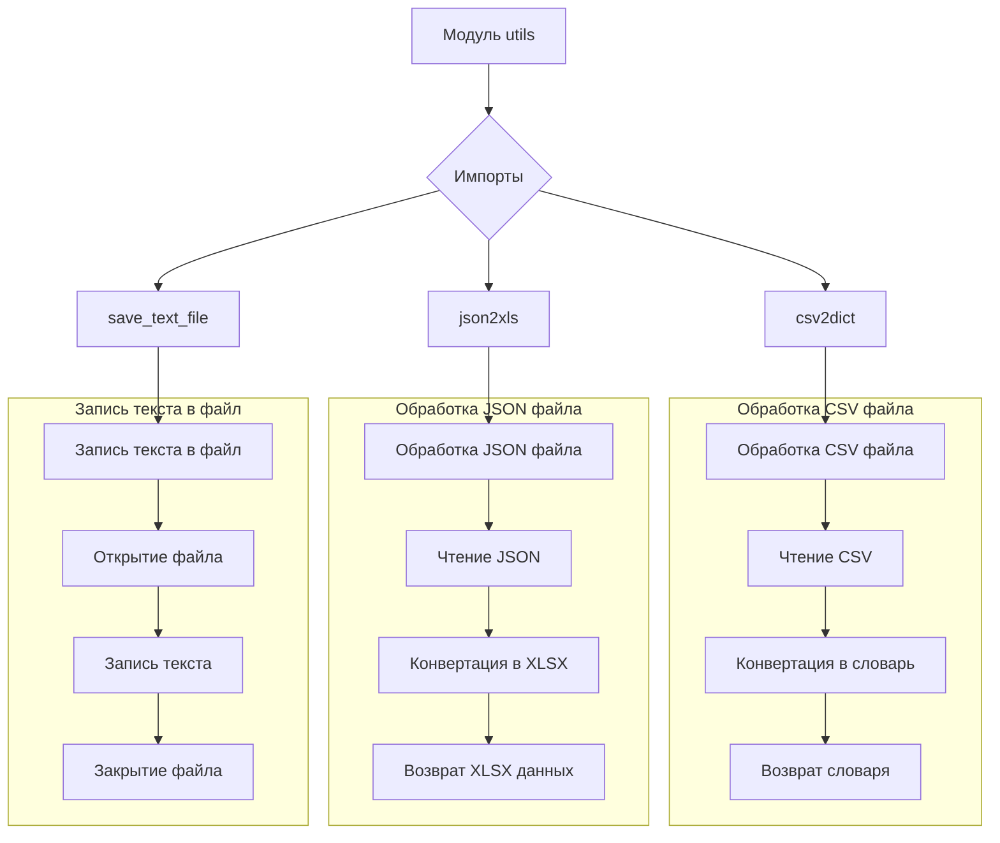
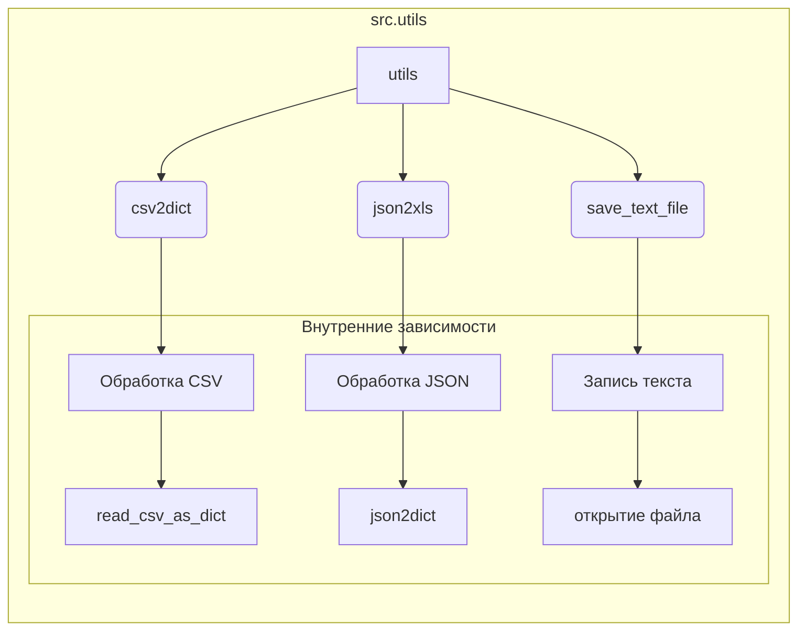

# <input code>

```python
# -*- coding: utf-8 -*-
#! venv/Scripts/python.exe
#! venv/bin/python/python3.12

"""
Модуль для работы с утилитами
=========================================================================================

Этот модуль содержит набор небольших, полезных утилит, предназначенных для упрощения 
повседневных задач программирования. Модуль включает инструменты для конвертации данных, 
работы с файлами и формата вывода. Это позволяет ускорить разработку, предоставляя 
простые и переиспользуемые функции.

Пример использования
--------------------

Пример использования функций модуля `src.utils`:

.. code-block:: python

    from src.utils import csv2dict, json2xls, save_text_file

    # Конвертация CSV в словарь
    csv_data = csv2dict('data.csv')

    # Конвертация JSON в XLSX
    json_data = json2xls('data.json')

    # Сохранение текста в файл
    save_text_file('output.txt', 'Hello, World!')
"""

MODE = 'dev'

""" 
Коллекция небольших утилит, предназначенных для упрощения часто выполняемых задач программирования.
Включает инструменты для конвертации данных, работы с файлами и форматированного вывода.
"""


# Импорты утилит в алфавитном порядке
from .convertors import (
    TextToImageGenerator,
    base64_to_tmpfile,
    base64encode,
    csv2dict,
    csv2ns,
    decode_unicode_escape,
    dict2csv,
    dict2html,
    dict2ns,
    dict2xls,
    dict2xml,
    dot2png,
    escape2html,
    html2dict,
    html2escape,
    html2ns,
    html2text,
    html2text_file,
    json2csv,
    json2ns,
    json2xls,
    json2xml,
    md2dict,
    ns2csv,
    ns2dict,
    ns2json,
    ns2xls,
    ns2xml,
    speech_recognizer,
    text2speech,
    webp2png,
    xls2dict
)

from .csv import (
    read_csv_as_dict,
    read_csv_as_ns,
    read_csv_file,
    save_csv_file
)

from .date_time import (
    TimeoutCheck
)

from .file import (
    get_directory_names,
    get_filenames,
    read_text_file,
    recursively_get_file_path,
    recursively_read_text_files,
    recursively_yield_file_path,  
    remove_bom,
    save_text_file
)

from .image import (
    save_png,
    save_png_from_url
)

from .jjson import (
    j_dumps,
    j_loads,
    j_loads_ns,
    replace_key_in_json
)

from .pdf import (
    PDFUtils
)

from .printer import (
    pprint
)

from .string import (
    ProductFieldsValidator,
    StringFormatter,
    StringNormalizer
)

from .url import (
    extract_url_params, 
    is_url
)

from .video import (
    save_video_from_url
)

from .path import get_relative_path
```

# <algorithm>



Пример:
`csv2dict('data.csv')`  - Функция `csv2dict` получает имя файла ('data.csv') и читает данные из файла. Далее выполняется конвертация данных в словарь, и полученный словарь возвращается.


# <mermaid>



**Описание зависимостей (на примере `csv2dict`):**
`csv2dict` в `src.utils` использует внутренние функции `read_csv_as_dict` для чтения CSV файла.
`read_csv_as_dict` – функция из подпапки `csv` внутри папки `utils`.


# <explanation>

**Импорты:**

Модуль `src.utils` импортирует функции и классы из других подмодулей, таких как `convertors`, `csv`, `file`, `image`, `jjson`, `pdf`, `printer`, `string`, `url`, `video`, `path`. Это позволяет структурировать код и повторно использовать функции из других частей проекта. Например, `csv2dict` использует функции из папки `.csv`, которые отвечают за чтение CSV файлов.

**Классы:**

- `TextToImageGenerator`: Предположительно, класс для генерации изображений из текста.
- `PDFUtils`:  Класс для работы с PDF-файлами (чтение, запись, преобразования).
- `TimeoutCheck`:  Класс для контроля таймаутов в операциях.
- Внутри `src.utils` нет сложных классов, большинство функций — это простые утилиты.


**Функции:**

- `csv2dict`: Конвертирует данные из CSV-файла в словарь Python.
- `json2xls`: Конвертирует данные из JSON в формат XLSX.
- `save_text_file`: Сохраняет текст в текстовый файл.
-  Все остальные функции  представляют собой вспомогательные инструменты для обработки различных форматов данных (JSON, CSV, XML, HTML), работы с файлами (чтение, запись, преобразование форматов), строками и URL.

**Переменные:**

- `MODE`:  Переменная для хранения режима работы (например, 'dev' или 'prod').


**Возможные ошибки и улучшения:**

- Недостаток проверки входных данных: функции могут не проверять валидность входных данных (например, корректность формата файла, наличие необходимых данных). Добавление проверок на корректность ввода (типы данных, наличие файлов) значительно улучшит устойчивость и надежность кода.
- Отсутствие документирования: У некоторых функций может отсутствовать подробная документация, что затрудняет использование. Документирование всех функций, классов и методов очень важно для удобства поддержки и использования кода.
- Отсутствие обработки исключений:  Нет явной обработки исключений (например, исключения при работе с файлами). Обработка исключений важна, чтобы код продолжал работу даже при возникновении проблем, например, если файл не существует.


**Взаимосвязь с другими частями проекта:**

Этот модуль `utils` предоставляет набор инструментов для обработки данных, часто используемых в других частях проекта (`src`). Например, функции для работы с CSV и JSON используются в других скриптах для загрузки, обработки и сохранения данных.  Без дополнительной информации о проекте сложно сказать, какие именно части проекта используют `utils`.