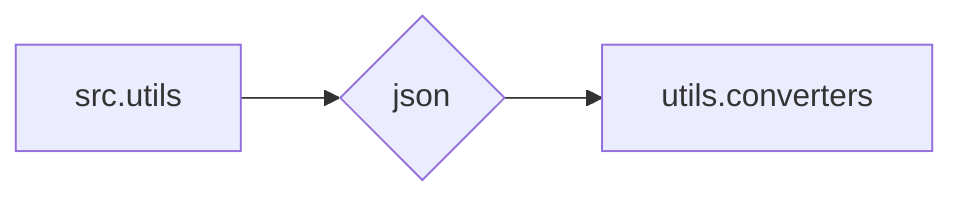

```MD
# Анализ кода

## <input code>

```
# src/utils

## Модуль: src.utils

**Instruction**
1. Модули `src.utils` и `src.utils.converters` — служебные утилиты проекта. Они спроектированы так, чтобы по минимуму использовать внутренние утилиты.  
2. В этих модулях **НЕ используется** `j_loads`, `j_loads_ns` и `j_dumps`.  
3. Используйте стандартную библиотеку `import json`.

**End of instruction**
```

## <algorithm>

Алгоритм работы в данном случае не определен, так как предоставленный код представляет собой инструкцию, а не функциональный код.  Инструкция описывает правила, которые должны соблюдаться при реализации модулей `src.utils` и `src.utils.converters`.


## <mermaid>



**Описание диаграммы:**

Диаграмма показывает, что модуль `src.utils` и его подмодуль `src.utils.converters` используют стандартный модуль `json` для работы с JSON-данными.  Зависимость между `src.utils` и `src.utils.converters`  имеет вид импорта `json` в `utils` и `converters`.


## <explanation>

**Импорты:**

Код не содержит импорта, а представляет собой инструкцию.  В реальной реализации, для работы с JSON, нужно будет импортировать модуль `json`:

```python
import json
```


**Классы, функции, переменные:**

Инструкция описывает правила для проектирования классов и функций, но не содержит конкретного кода для их реализации.

**Возможные ошибки и улучшения:**

Инструкция не содержит кода, поэтому нельзя выявить конкретные ошибки.  Однако, нужно учесть, что отсутствие кода затрудняет понимание логики и структуры модулей.  При реализации необходимо предоставить код.


**Связь с другими частями проекта:**

Инструкция подразумевает, что модули `src.utils` и `src.utils.converters` будут использоваться другими частями проекта для работы с данными в формате JSON.  Это может быть, например, обработка входных данных, запись данных в файлы или передача данных между компонентами приложения.  Без кода невозможно точно сказать, как эти модули используются.