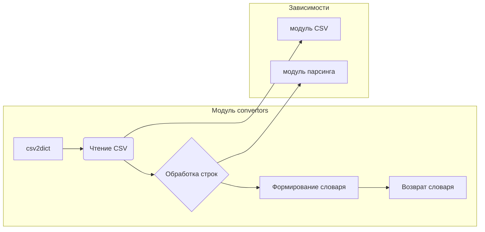

```MD
# <input code>

```python
## \file hypotez/src/utils/convertors/__init__.py
# -*- coding: utf-8 -*-
#! venv/Scripts/python.exe
#! venv/bin/python/python3.12

"""
.. module: src.utils.convertors 
    :platform: Windows, Unix
    :synopsis:


    
Модуль для конвертации различных форматов данных
=========================================================================================

Этот модуль содержит функции для конвертации между различными форматами данных, такими как
CSV, JSON, XML, HTML, MD, Base64, а также для работы с изображениями и текстом. Он предоставляет
утилиты для преобразования данных в словари, списки, форматы для работы с таблицами и т.д.

Пример использования
--------------------

Пример использования функций модуля `src.utils.convertors`:

.. code-block:: python

    from src.utils.convertors import csv2dict, json2xls

    # Преобразование CSV в словарь
    csv_data = csv2dict('data.csv')

    # Преобразование JSON в XLSX
    json_data = json2xls('data.json')

Функции модуля охватывают широкий спектр конвертаций, включая работу с изображениями (например,
сгенерировать PNG изображение из текста), работу с аудио (речь в текст и наоборот), а также конвертацию
между различными кодировками и форматами, такими как Base64.

Доступные функции
-----------------
- Работа с CSV: конвертация из CSV в словарь или в пространство имен.
- Работа с JSON: конвертация из JSON в другие форматы (CSV, XLSX, XML).
- Работа с HTML: преобразование HTML в текст, создание словаря из HTML.
- Работа с Base64: кодирование и декодирование данных в формат Base64.
- Работа с изображениями: генерация изображений, конвертация PNG в WebP.
- Работа с текстом: преобразование текста в речь и наоборот.

Включенные форматы
-------------------
- CSV
- JSON
- XML
- HTML
- Markdown
- Base64
- PNG
- WebP


"""
MODE = 'dev'


import json
import os
import sys
import warnings
from pathlib import Path

from .base64 import (
                    base64_to_tmpfile,
                    base64encode,
                    )

from .csv import (
                    csv2dict, 
                    csv2ns,
                    )

from .dict import ( dict2ns, 
                    dict2csv,
                    dict2html,
                    dict2xls, 
                    dict2xml,
                    )

from .dot import dot2png

from .html import (
                    html2escape, 
                    html2ns, 
                    html2dict, 
                    escape2html,
                    ) 

from .html2text import (
                    html2text,
                    html2text_file,
                    google_fixed_width_font,
                    google_has_height,
                    google_list_style,
                    google_nest_count,
                    google_text_emphasis,
                    dumb_css_parser,
                    dumb_property_dict,
                    )

from .json import (
                    json2csv, 
                    json2ns, 
                    json2xls, 
                    json2xml
                    )

from .md2dict import (
                    md2dict, 
                    )

from .ns import (
                    ns2csv, 
                    ns2dict, 
                    ns2json, 
                    ns2xls, 
                    ns2xml
                    )

from .png import (TextToImageGenerator, 
                  webp2png, 
                    )

from .tts import (
                    speech_recognizer, 
                    text2speech,
                )

from .unicode import decode_unicode_escape

from .xml2dict import xml2dict  
from .xls import xls2dict
```

# <algorithm>

Этот модуль `convertors` предоставляет набор функций для преобразования различных типов данных.  Алгоритм работы функций зависит от конкретной задачи.  Например, преобразование CSV в словарь включает чтение файла CSV, парсинг данных и создание словаря.  Преобразование JSON в XLSX включает чтение файла JSON, парсинг данных, их подготовку для экспорта в XLSX и запись в файл XLSX.

Пример пошаговой блок-схемы для `csv2dict`:

1. **Ввод:** Путь к файлу CSV.
2. **Открытие файла:** Файл CSV открывается для чтения.
3. **Чтение данных:** Данные из файла CSV считываются построчно.
4. **Парсинг данных:** Каждая строка обрабатывается, данные разделяются по разделителям (например, запятым) и создается запись в словаре.
5. **Возврат:** Возвращается словарь, содержащий данные из CSV.


# <mermaid>



**Объяснение диаграммы:**

Модуль `convertors` (вершина A) содержит функцию `csv2dict` (A), которая вызывает функции чтения данных из CSV (B) и обработки строк (C).  Зависимости от других модулей, таких как модуль CSV и модуль парсинга (F и G), показаны стрелками.  В итоге, возвращается словарь, содержащий данные из CSV (E).  Другие функции из модуля (json2xls, html2text и т.д.) аналогично вызывают соответствующие функции для обработки данных.


# <explanation>

**Импорты:**

Модуль `convertors` импортирует различные библиотеки Python для работы с файлами (например, `os`, `json`), обработкой данных (например, `pathlib`), преобразованием форматов (например, `csv`, `json`), и др. Важно, что импорты структурированы по подмодулям (`.base64`, `.csv`, `.dict`, и т.д.), что улучшает организацию кода и облегчает навигацию.


**Классы:**

В коде присутствуют классы, связанные с обработкой изображений (`TextToImageGenerator`, `webp2png`).  Эти классы, вероятно, содержат методы для обработки и преобразования изображений, таких как создание PNG-изображения из текста или конвертация WebP в PNG.


**Функции:**

Код содержит множество функций, каждая из которых предназначена для конкретного преобразования формата. Например, `csv2dict` преобразует CSV-файл в словарь, `json2xls` преобразует JSON в XLSX-файл.  Функции принимают аргументы (путь к файлу, данные), выполняют обработку и, как правило, возвращают результат (преобразованные данные, словарь, etc.).  Примеры использования функций приведены в документации.


**Переменные:**

Переменная `MODE` содержит строку 'dev'. Скорее всего, она используется для выбора режимов работы (например, для включения/отключения отладки).

**Возможные ошибки/улучшения:**

* **Обработка ошибок:** Код может быть улучшен добавлением обработки ошибок (например, исключений), чтобы справиться с потенциальными проблемами, такими как отсутствие файла, некорректный формат данных и т. д.
* **Типизация:** Используя аннотации типов, можно улучшить читабельность и надежность кода.
* **Документация:**  Комментарии в стиле Sphinx (`.. module`, `.. code-block`) являются хорошим началом, но для полноценной документации рекомендуется использовать инструменты типа Sphinx для генерации документации из этих комментариев.
* **Модульная организация:** Подмодули (.base64, .csv и т.д.)  улучшают структурирование, но можно ещё больше декомпозировать на более мелкие функции.

**Взаимосвязи с другими частями проекта:**

Этот модуль `src.utils.convertors` является утилитарным и, вероятно, используется в других частях проекта для обработки данных. Например, функция `csv2dict` может использоваться в скриптах для обработки данных из CSV-файлов. Цепочка взаимосвязей будет зависеть от конкретной архитектуры проекта.