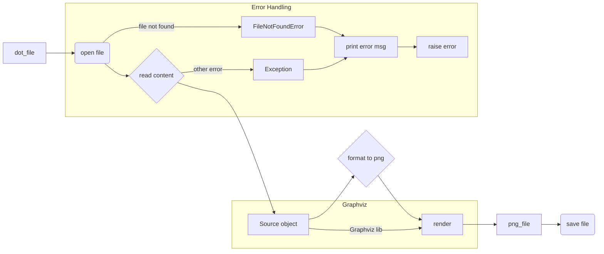

# <input code>

```python
## \file hypotez/src/utils/convertors/dot.py
# -*- coding: utf-8 -*-\
#! venv/Scripts/python.exe
#! venv/bin/python/python3.12

"""
.. module: src.utils.convertors.dot 
	:platform: Windows, Unix
	:synopsis: converts DOT files into PNG images using the Graphviz library

"""
MODE = 'dev'

import sys
from graphviz import Source

def dot2png(dot_file: str, png_file: str) -> None:
    """ Converts a DOT file to a PNG image.

    Args:
        dot_file (str): The path to the input DOT file.
        png_file (str): The path where the output PNG file will be saved.

    Raises:
        FileNotFoundError: If the DOT file does not exist.
        Exception: For other errors during conversion.

    Example:
        >>> dot2png('example.dot', 'output.png')
        
        This converts the DOT file 'example.dot' into a PNG image named 'output.png'.
        
        Sample DOT content for 'example.dot':
        
        ```dot
        digraph G {
            A -> B;
            B -> C;
            C -> A;
        }
        ```
        
        To run the script from the command line:
        
        ```bash
        python dot2png.py example.dot output.png
        ```

        This command will create a PNG file named 'output.png' from the graph defined in 'example.dot'.
    """
    try:
        # Read the DOT file
        with open(dot_file, 'r') as f:
            dot_content = f.read()

        # Create a Source object from the DOT content
        source = Source(dot_content)

        # Render the source to a PNG file
        source.format = 'png'
        source.render(png_file, cleanup=True)
    except FileNotFoundError as e:
        print(f"Error: The file '{dot_file}' was not found.")
        raise e
    except Exception as e:
        print(f"An error occurred during the conversion: {e}")
        raise e


if __name__ == "__main__":
    if len(sys.argv) != 3:
        print("Usage: python dot2png.py <input_dot_file> <output_png_file>")
        sys.exit(1)

    input_dot_file = sys.argv[1]
    output_png_file = sys.argv[2]

    dot2png(input_dot_file, output_png_file)
```

# <algorithm>

1. **Input:** The script takes two command-line arguments: the input DOT file path and the output PNG file path.

2. **Error Handling (try-except):** The `dot2png` function attempts to read the DOT file.  If the file is not found, a `FileNotFoundError` is raised, and an error message is printed.  Any other exception during the conversion process is caught and handled similarly.

3. **File Reading:** The script reads the contents of the DOT file into the `dot_content` variable.

4. **Graphviz Processing:** A `graphviz.Source` object is created from the `dot_content`.  This object represents the graph in memory.

5. **Output Conversion:** The `source.format` attribute is set to 'png' to specify the output format. The `source.render` method generates the PNG image.  The `cleanup=True` argument ensures that the temporary files created by Graphviz are deleted after the conversion.

6. **Command-line Arguments:** The `if __name__ == "__main__":` block handles the script execution. It checks for the correct number of command-line arguments.

7. **Function Call:** The `dot2png` function is called with the provided file paths.


# <mermaid>



# <explanation>

* **Imports:**
    * `import sys`: Imports the `sys` module, providing access to system-specific parameters and functions, including command-line arguments (`sys.argv`). Crucial for taking input file names from the command line.
    * `from graphviz import Source`: Imports the `Source` class from the `graphviz` library.  This library is responsible for handling DOT language files and generating images.  It's an external dependency.

* **Classes:**
    * `Source`: (from `graphviz`) This class handles the DOT content to generate images.  Its `format` attribute and `render` method are used directly for conversion.  This class is an external dependency; its functionality is not implemented in this Python module.

* **Functions:**
    * `dot2png(dot_file: str, png_file: str) -> None`: This function takes the paths to the input DOT file and the output PNG file as arguments. It attempts to read the DOT file, create a `graphviz.Source` object, set the output format to 'png', and render the image. The `try...except` block handles potential errors during these operations. Critically, it handles `FileNotFoundError` and other exceptions, preventing crashes and providing informative error messages.
    * `if __name__ == "__main__":`: This special block is executed only when the script is run directly, not imported as a module. It parses command-line arguments, calls `dot2png`, and handles potential errors during the main execution flow.

* **Variables:**
    * `dot_file`, `png_file`: String variables holding the paths to the input and output files, respectively.
    * `dot_content`: String variable storing the contents of the DOT file.
    * `source`: Object of `graphviz.Source` type holding the processed DOT content.

* **Possible Errors/Improvements:**
    * **Error Handling:** The `try...except` blocks are a good practice.  More specific exception handling (e.g., `IOError`) might be preferable.
    * **Input Validation:** Adding input validation to check if the provided file paths are valid would improve robustness.  Checking if the input file actually contains a valid DOT graph is also a good idea, but requires parsing the DOT format, potentially introducing further complexity.
    * **Logging:** Using a logging library could improve debugging.

**Relationship to Other Parts of the Project:**

This file (`hypotez/src/utils/convertors/dot.py`) is part of a larger project (`hypotez`) that likely involves graph analysis or visualization.  It's a utility function used to convert DOT files, likely serving as a building block for other functionalities in the project that might create or manipulate DOT descriptions.