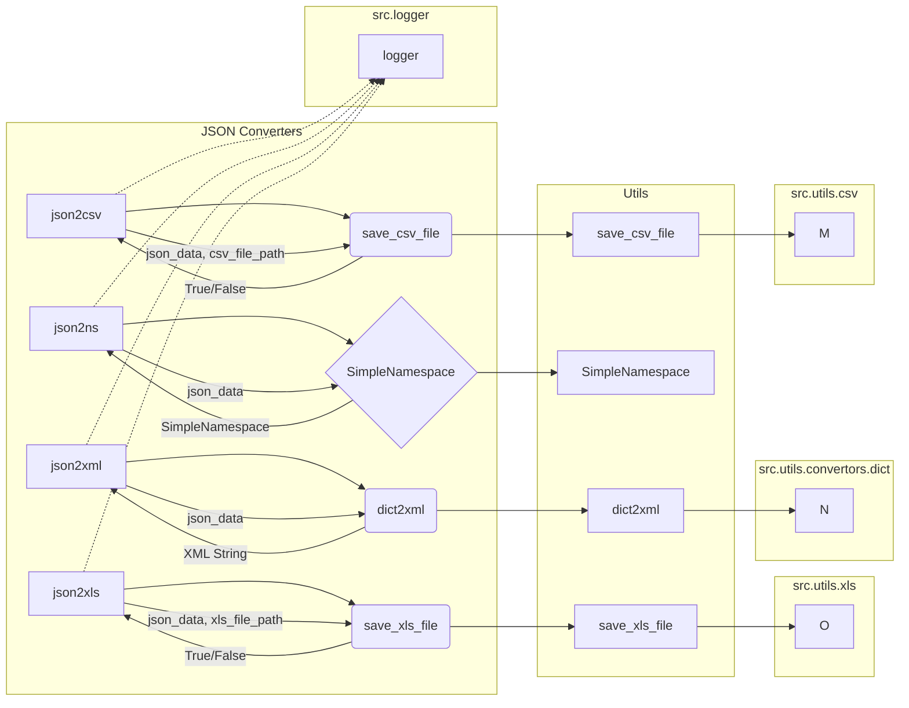

```MD
# <input code>

```python
## \file hypotez/src/utils/convertors/json.py
# -*- coding: utf-8 -*-\
#! venv/Scripts/python.exe
#! venv/bin/python/python3.12

"""
.. module: src.utils.convertors.json 
	:platform: Windows, Unix
	:synopsis: convert JSON data into various formats: CSV, SimpleNamespace, XML, and XLS

Functions:
    - `json2csv`: Convert JSON data to CSV format.
    - `json2ns`: Convert JSON data to SimpleNamespace object.
    - `json2xml`: Convert JSON data to XML format.
    - `json2xls`: Convert JSON data to XLS format.
"""
MODE = 'dev'
import json
import csv
from types import SimpleNamespace
from pathlib import Path
from typing import List, Dict

from src.utils.csv import save_csv_file
from src.utils.jjson import j_dumps
from src.utils.xls import save_xls_file
from src.utils.convertors.dict import dict2xml
from src.logger import logger

def json2csv(json_data: str | list | dict | Path, csv_file_path: str | Path) -> bool:
    """
    Convert JSON data or JSON file to CSV format with a comma delimiter.

    Args:
        json_data (str | list | dict | Path): JSON data as a string, list of dictionaries, or file path to a JSON file.
        csv_file_path (str | Path): Path to the CSV file to write.

    Returns:
        bool: True if successful, False otherwise.

    Raises:
        ValueError: If unsupported type for json_data.
        Exception: If unable to parse JSON or write CSV.
    """
    try:
        # Load JSON data
        if isinstance(json_data, dict):
            data = [json_data]
        elif isinstance(json_data, str):
            data = json.loads(json_data)
        elif isinstance(json_data, list):
            data = json_data
        elif isinstance(json_data, Path):
            with open(json_data, 'r', encoding='utf-8') as json_file:
                data = json.load(json_file)
        else:
            raise ValueError("Unsupported type for json_data")

        save_csv_file(data, csv_file_path)
        return True
    except Exception as ex:
        logger.error(f"json2csv failed", ex, True)
        ...

def json2ns(json_data: str | dict | Path) -> SimpleNamespace:
    """
    Convert JSON data or JSON file to SimpleNamespace object.

    Args:
        json_data (str | dict | Path): JSON data as a string, dictionary, or file path to a JSON file.

    Returns:
        SimpleNamespace: Parsed JSON data as a SimpleNamespace object.
    
    Raises:
        ValueError: If unsupported type for json_data.
        Exception: If unable to parse JSON.
    """
    try:
        if isinstance(json_data, dict):
            data = json_data
        elif isinstance(json_data, str):
            data = json.loads(json_data)
        elif isinstance(json_data, Path):
            with open(json_data, 'r', encoding='utf-8') as json_file:
                data = json.load(json_file)
        else:
            raise ValueError("Unsupported type for json_data")
        
        return SimpleNamespace(**data)
    except Exception as ex:
        logger.error(f"json2ns failed", ex, True)

def json2xml(json_data: str | dict | Path, root_tag: str = "root") -> str:
    """
    Convert JSON data or JSON file to XML format.

    Args:
        json_data (str | dict | Path): JSON data as a string, dictionary, or file path to a JSON file.
        root_tag (str): The root element tag for the XML.

    Returns:
        str: The resulting XML string.

    Raises:
        ValueError: If unsupported type for json_data.
        Exception: If unable to parse JSON or convert to XML.
    """
    return dict2xml(json_data)

def json2xls(json_data: str | list | dict | Path, xls_file_path: str | Path) -> bool:
    """
    Convert JSON data or JSON file to XLS format.

    Args:
        json_data (str | list | dict | Path): JSON data as a string, list of dictionaries, or file path to a JSON file.
        xls_file_path (str | Path): Path to the XLS file to write.

    Returns:
        bool: True if successful, False otherwise.

    Raises:
        ValueError: If unsupported type for json_data.
        Exception: If unable to parse JSON or write XLS.
    """
    return save_xls_file(json_data, file_path)
```

# <algorithm>

**Описание алгоритма:**

Файл `json.py` содержит функции для конвертации JSON-данных в разные форматы (CSV, SimpleNamespace, XML, XLS). Алгоритм работы каждой функции следующий:

1. **`json2csv`:**
   - Принимает JSON-данные (строка, список словарей, словарь или путь к файлу).
   - Обрабатывает различные типы входных данных, загружая JSON из файла или строки.
   - Использует функцию `save_csv_file` из модуля `src.utils.csv` для сохранения данных в CSV-файл с запятой в качестве разделителя.
   - Возвращает `True` при успешной конвертации, иначе `False`.

2. **`json2ns`:**
   - Принимает JSON-данные (строка, словарь или путь к файлу).
   - Обрабатывает различные типы входных данных, загружая JSON из файла или строки.
   - Использует конструктор `SimpleNamespace` для создания объекта `SimpleNamespace` из загруженных данных.
   - Возвращает объект `SimpleNamespace`.

3. **`json2xml`:**
   - Принимает JSON-данные (строка, словарь или путь к файлу).
   - Обрабатывает различные типы входных данных, загружая JSON из файла или строки.
   - Использует функцию `dict2xml` из модуля `src.utils.convertors.dict` для конвертации данных в XML.
   - Возвращает XML-строку.

4. **`json2xls`:**
   - Принимает JSON-данные (строка, список словарей, словарь или путь к файлу).
   - Обрабатывает различные типы входных данных, загружая JSON из файла или строки.
   - Использует функцию `save_xls_file` из модуля `src.utils.xls` для сохранения данных в XLS-файл.
   - Возвращает `True` при успешной конвертации, иначе `False`.

**Пример (json2csv):**

Вход: `json_data` = `{"name": "John", "age": 30}`, `csv_file_path` = "output.csv"
Выход: Создается файл "output.csv" с содержимым:
```
name,age
John,30
```


# <mermaid>



**Объяснение диаграммы:**

Диаграмма показывает зависимости между функциями и модулями.  Ключевые модули (`src.utils.csv`, `src.utils.convertors.dict`, `src.utils.xls`, `src.logger`) и классы (`SimpleNamespace`) взаимодействуют с функциями конвертации (`json2csv`, `json2ns`, `json2xml`, `json2xls`). Стрелки показывают потоки данных. Обратите внимание, что `logger` логирует ошибки из конвертирующих функций.


# <explanation>

**Импорты:**

- `json`, `csv`, `SimpleNamespace`, `Path`, `List`, `Dict`: Стандартные библиотеки Python, необходимые для работы с JSON, CSV, созданием объектов `SimpleNamespace`, путями к файлам и типизацией.
- `save_csv_file`: Модуль из пакета `src.utils.csv`, который отвечает за сохранение данных в CSV-файл.
- `j_dumps`: Модуль из пакета `src.utils.jjson`, который, вероятно, используется для работы с JSON (возможно, для форматирования).
- `save_xls_file`: Модуль из пакета `src.utils.xls`, который отвечает за сохранение данных в XLS-файл.
- `dict2xml`: Модуль из пакета `src.utils.convertors.dict`, который отвечает за конвертацию словарей в XML.
- `logger`: Модуль из пакета `src.logger`, предназначенный для логирования.  Это важный компонент для отслеживания ошибок и состояния во время выполнения.

**Классы:**

- `SimpleNamespace`: Стандартный класс из `types`, позволяющий создавать объекты, похожие на словари, но доступ к полям происходит через `.` (например, `obj.name`).  Это удобный способ представлять структурированные данные.

**Функции:**

- `json2csv`: Конвертирует JSON в CSV-формат, сохраняя результат в указанном файле.  Обрабатывает различные типы входных JSON-данных (строка, список словарей, словарь, путь).  Возвращает булево значение (True/False) в зависимости от результата.
- `json2ns`: Конвертирует JSON в объект `SimpleNamespace`.  Обрабатывает различные типы входных JSON-данных (строка, словарь, путь).
- `json2xml`: Конвертирует JSON в XML-строку.  Удобная функция, которая не требует сохранения на диск.
- `json2xls`: Конвертирует JSON в XLS-формат, сохраняя результат в указанном файле. Обрабатывает различные типы входных JSON-данных (строка, список словарей, словарь, путь).  Возвращает булево значение (True/False) в зависимости от результата.

**Переменные:**

- `MODE`: Строковая переменная, хранящая режим работы (например, `'dev'`).

**Возможные ошибки и улучшения:**

- **Обработка исключений:** Обработка исключений в каждой функции является хорошей практикой, но в `json2csv` и `json2xls` можно добавить более подробные сообщения об ошибках, чтобы помочь пользователю определить, где произошла ошибка.
- **Типизация:** Типизация аргументов и возвращаемых значений в целом хорошо реализована.
- **Детализация ошибок:** В функциях есть `logger.error`, но можно добавить более подробную информацию об ошибке (например, тип данных, которые не удалось обработать) в лог.
- **Обработка пустого JSON:** Нет обработки случая с пустым или невалидным JSON-входом.
- **`json2xls`:**  Неясно, как `xls_file_path` передаётся в `save_xls_file`. Возможно, есть `file_path` (неправильное имя?) в коде. Нужно убедиться в правильности вызова.


**Взаимосвязи с другими частями проекта:**

Функции этого модуля (`hypotez/src/utils/convertors/json.py`) взаимодействуют с другими модулями (например, `src.utils.csv`, `src.utils.convertors.dict`, `src.utils.xls`, `src.logger`), которые, вероятно, находятся в проекте `hypotez`.  Эти зависимости обеспечивают функциональность конвертации и логирования.