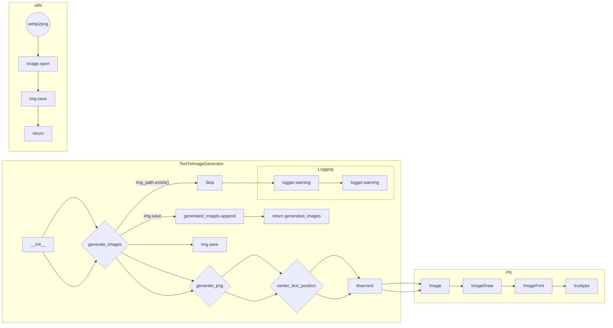
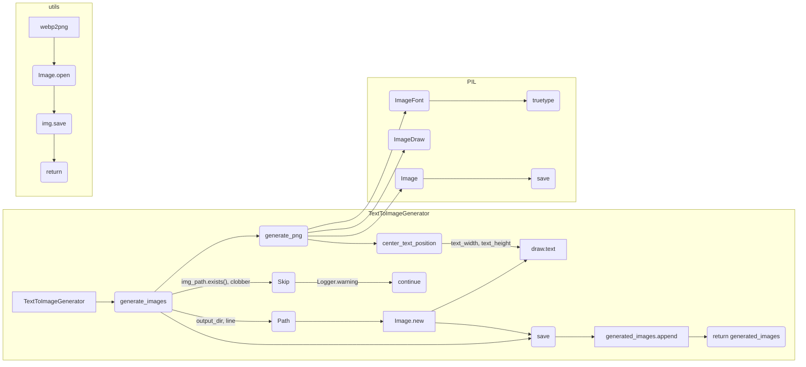

```markdown
# <input code>

```python
## \file hypotez/src/utils/convertors/png.py
# -*- coding: utf-8 -*-\
#! venv/Scripts/python.exe
#! venv/bin/python/python3.12

"""
.. module: src.utils.convertors.png 
	:platform: Windows, Unix
	:synopsis: png convertors 
Module reads text from a file, generates PNG images for each line of text using Pillow,
and saves them to an output directory with customizable options for image appearance.
"""
MODE = 'dev'
from pathlib import Path
from typing import List, Tuple
from PIL import Image, ImageDraw, ImageFont
from src.logger import logger  # Logging
# ... (rest of the code)
```

# <algorithm>

**Шаг 1: Инициализация (TextToImageGenerator.__init__)**:

  * Устанавливает значения по умолчанию для атрибутов:
      * `default_output_dir`: Путь к выходному каталогу.
      * `default_canvas_size`: Размер изображения (ширина, высота).
      * `default_padding`: Отступ от края изображения.
      * `default_background`, `default_text_color`: цвета фона и текста.
      * `default_log_level`: уровень логирования.

**Шаг 2: Обработка входных данных (generate_images)**:

 * Принимает данные: текстовые строки, опции для изображения, путь к выходному каталогу.
 * Устанавливает выходной каталог по умолчанию, если он не задан.
 * Настраивает логирование.
 * Проверяет размер изображения, устанавливая по умолчанию, если не указан.
 * Проверяет padding, устанавливая по умолчанию, если не указан.
 * Создает пустой список для хранения путей сгенерированных изображений.

**Шаг 3: Генерация изображения (generate_images)**:

 * Для каждой строки текста:
     * Формирует путь к выходному изображению.
     * Если изображение с таким именем уже существует и clobber не включен, пропускает эту строку с предупреждением.
     * Вызывает функцию `generate_png` для создания изображения.
     * Сохраняет сгенерированное изображение в файл.
     * Добавляет путь к изображению в список.
 * Возвращает список путей к созданным изображениям.

**Шаг 4: Генерация изображения (generate_png)**:

 * Создает новое изображение с заданными размерами и цветом фона.
 * Создает объект для рисования на изображении.
 * Определяет размер шрифта, основанный на размере изображения и отступе.
 * Определяет положение текста для центрирования.
 * Рисует текст на изображении с заданными цветом и шрифтом.
 * Возвращает созданное изображение.


**Шаг 5: Расчет положения текста (center_text_position)**:

 * Вычисляет ширину и высоту текста.
 * Возвращает координаты для центрирования текста на изображении.

**Шаг 6: Конвертация WEBP в PNG (webp2png)**:

 * Открывает изображение WEBP.
 * Конвертирует его в PNG и сохраняет в указанный файл.
 * Возвращает True в случае успеха, иначе None.

# <mermaid>




# <explanation>

**Импорты:**

* `from pathlib import Path`: Импортирует класс `Path` для работы с путями к файлам, что полезно для работы с файловой системой.
* `from typing import List, Tuple`: Импортирует типы данных `List` и `Tuple` для более явного указания типов переменных.
* `from PIL import Image, ImageDraw, ImageFont`: Импортирует модули из библиотеки Pillow для работы с изображениями (создание, обработка и сохранение).
* `from src.logger import logger`: Импортирует модуль `logger` из подпапки `logger` пакета `src`. Это указывает на то, что `logger` - это система логирования, вероятно, использующая какой-то сторонний модуль (например, `logging`).


**Классы:**

* `TextToImageGenerator`: Класс, который отвечает за генерацию изображений из текста.
    * `__init__`: Инициализирует класс с настройками по умолчанию.
    * `generate_images`: Метод для генерации изображений из списка строк. Принимает на вход данные для настройки изображения, а также опцию `clobber`, позволяющую перезаписывать уже существующие файлы.
    * `generate_png`: Создает PNG изображение с заданными параметрами.
    * `center_text_position`: Расчитывает координаты для центрирования текста.


**Функции:**

* `generate_images`: Возвращает список путей к сгенерированным изображениям.
* `generate_png`: Возвращает объект `Image` с созданным изображением.
* `center_text_position`: Возвращает координаты для центрирования текста.
* `webp2png`: Преобразует WEBP изображение в PNG формат.


**Переменные:**

* `MODE`: Строковая константа, скорее всего, для обозначения режима работы программы (например, 'dev' или 'prod').
* `default_output_dir`, `default_canvas_size`, `default_padding`, `default_background`, `default_text_color`, `default_log_level`: Переменные, хранящие значения по умолчанию для настроек генерации изображений.
* `lines`: Список строк текста.
* `output_dir`: Путь к выходному каталогу.


**Возможные ошибки или улучшения:**

* **Обработка исключений:** Функция `webp2png` содержит блок `try...except`, но `generate_images` нет. Добавление обработки исключений (например, `FileNotFoundError`) в `generate_images` улучшит устойчивость к ошибкам.
* **Проверка валидности входных данных:** Код не содержит проверки валидности входных данных (например, проверка пустоты `lines` в `generate_images`). Добавление таких проверок сделает код более надежным.
* **Переиспользование кода:** Функция `generate_png` используется внутри `generate_images`. Можно вынести ее в отдельную функцию или метод.
* **Документирование:** Добавлены комментарии и docstrings, но их можно дополнить.


**Взаимосвязи с другими частями проекта:**

Код зависит от `src.logger`, что предполагает наличие модуля логирования, который предоставляет функции для записи сообщений в лог.  Так же код использует библиотеку Pillow.

**Общее:**

Код написан с использованием принципов ООП.  Обработка ошибок в `webp2png` улучшает устойчивость кода.  Добавление обработки ошибок и валидации в `generate_images` повысит надежность и удобство использования.  Можно вынести некоторые повторяющиеся функции в отдельные вспомогательные функции для повышения читаемости и DRY принципа.