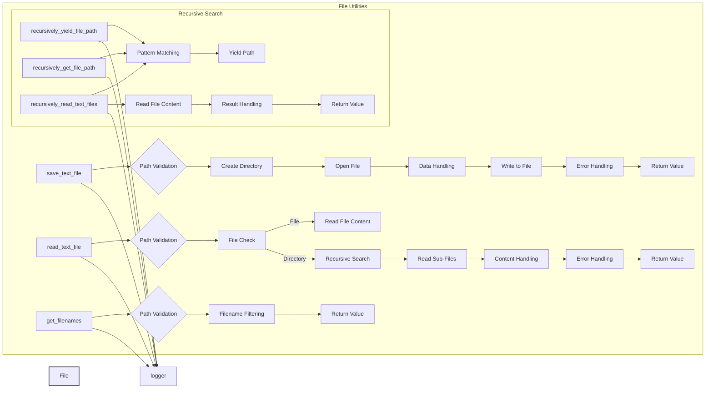

# <input code>

```python
## \file hypotez/src/utils/file.py
# -*- coding: utf-8 -*-\n#! venv/Scripts/python.exe\n#! venv/bin/python/python3.12\n\n"""
.. module: src.utils 
	:platform: Windows, Unix
	:synopsis:  Module for file operations

"""
MODE = 'dev'


import os
import json
import fnmatch
from pathlib import Path
from typing import List, Optional, Union, Generator
from src.logger import logger

def save_text_file(
    data: str | list[str] | dict,
    file_path: Union[str, Path],
    mode: str = "w",
    exc_info: bool = True,
) -> bool:
    """
    Save data to a text file.

    Args:
        data (str | list[str] | dict): Data to write (can be string, list of strings, or dictionary).
        file_path (str | Path): Path where the file will be saved.
        mode (str, optional): Write mode (`w` for write, `a` for append). Defaults to 'w'.
        exc_info (bool, optional): If True, logs traceback on error. Defaults to True.

    Returns:
        bool: True if the file was successfully saved, False otherwise.
    """
    try:
        file_path = Path(file_path)
        file_path.parent.mkdir(parents=True, exist_ok=True)

        with file_path.open(mode, encoding="utf-8") as file:
            if isinstance(data, list):
                file.writelines(f"{line}\\n" for line in data)
            elif isinstance(data, dict):
                json.dump(data, file, ensure_ascii=False, indent=4)
            else:
                file.write(data)
        return True
    except Exception as ex:
        logger.error(f"Failed to save file {file_path}.", ex, exc_info=exc_info)
        return False

def read_text_file(
    file_path: Union[str, Path],
    as_list: bool = False,
    extensions: Optional[list[str]] = None,
    exc_info: bool = True,
) -> Union[str, list[str], None]:
    # ... (rest of the code)
```

# <algorithm>

**Функция `save_text_file`**:

1. Принимает данные `data`, путь `file_path`, режим `mode` и флаг `exc_info`.
2. Преобразует `file_path` к типу `Path`.
3. Создает все необходимые родительские директории, если они не существуют.
4. Открывает файл в указанном режиме `mode`.
5. В зависимости от типа данных `data` (строка, список строк или словарь):
   - Для списка записывает каждую строку с новой строкой.
   - Для словаря использует `json.dump` для записи в формате JSON.
   - Для строки записывает саму строку.
6. Возвращает `True`, если сохранение прошло успешно, иначе `False`.  Возникающие исключения ловит и пишет в лог.


**Функция `read_text_file`**:

1. Принимает путь к файлу или директории `file_path`, флаги `as_list` (считывать в список строк или нет) и `extensions` (массив расширений) и `exc_info`.
2. Преобразует `file_path` к типу `Path`.
3. Если `file_path` - файл:
   - Читает файл в строковый формат или список строк (`readlines()` / `read()`).
4. Если `file_path` - директория:
   - Рекурсивно находит все файлы в директории, которые соответствуют указанным расширениям (если есть).
   - Вызывает `read_text_file` для каждого найденного файла.
   - Возвращает объединенный результат в виде списка строк или одной строки.
5. Если `file_path` не файл и не директория:
   - Выводит предупреждение в лог.
6. Возвращает результат чтения или `None` при ошибке.


**Функция `get_filenames`**:

1. Получает путь к директории `directory` и опционально список расширений `extensions`.
2. Преобразует путь к типу `Path`.
3. Проверяет, является ли `extensions` строкой, если да, преобразует в список.
4. Преобразует `extensions` в список с префиксом `.`.
5. Возвращает список имен файлов, соответствующих указанным расширениям.

**Функция `recursively_yield_file_path`, `recursively_get_file_path`, `recursively_read_text_files`**:

Эти функции реализуют рекурсивный поиск файлов, соответствующих заданным паттернам в указанной директории.  Они отличаются по способу возвращения результата: `recursively_yield_file_path` возвращает генератор, `recursively_get_file_path` — список путей к файлам,  `recursively_read_text_files` — список содержимого файлов.  Логика рекурсивного обхода директорий, фильтрации по шаблонам и обработки ошибок похожа.


# <mermaid>



# <explanation>

**Импорты**:

- `os`: предоставляет функции для работы с операционной системой (например, создание директорий).
- `json`: используется для сериализации и десериализации данных в формате JSON.
- `fnmatch`: для сравнения имен файлов с шаблонами.
- `pathlib`: предоставляет класс `Path` для работы с путями к файлам и директориям, который более удобен и безопасен, чем обычные строки.
- `typing`:  для типов данных, позволяет указывать типы аргументов и возвращаемых значений функций, что повышает читаемость и позволяет IDE делать статическую проверку.
- `src.logger`: собственный модуль для логирования, вероятно определенный в другом файле (например, `src/logger.py`).  Это позволяет централизовать логирование и настраивать его параметры.


**Классы**:

В этом коде нет пользовательских классов. Все функциональность реализована через функции.


**Функции**:

- `save_text_file`: сохраняет данные в файл.  Ключевыми улучшениями являются: проверка типа данных и обработка ошибок, а также удобство работы с путями (`Path`).
- `read_text_file`: читает содержимое файла или директории.  Реализует рекурсивное чтение файлов в директории. Ошибка, если путь не указывает на файл или папку, ловится и выводится в лог.
- `get_filenames`:  возвращает список имен файлов в директории по заданным расширениям.
- `recursively_yield_file_path`:  возвращает генератор, который рекурсивно перебирает все файлы, подходящие под шаблон в директории.
- `recursively_get_file_path`: аналогичная функция, но возвращает список `Path` объектов.
- `recursively_read_text_files`:  рекурсивно читает содержимое всех файлов, подходящих под шаблоны, в заданной директории, обрабатывая их как строки или списки строк.  Это полезная функция для обработки больших массивов текстовых файлов.
- `get_directory_names`: возвращает имена поддиректорий.
- `read_files_content`: читает содержимое файлов, найденных в заданном каталоге и соответствующих шаблону.

**Переменные**:

- `MODE`: строковая константа, вероятно, для настройки режима работы программы.
- `data`: данные, которые нужно сохранить (строка, список строк или словарь).
- `file_path`: путь к файлу.
- `mode`: режим открытия файла (`w` или `a`).
- `exc_info`: флаг для включения отладочной информации об ошибках в лог.
- `as_list`: флаг, определяющий, нужно ли возвращать содержимое файла в виде списка строк.


**Возможные ошибки или области для улучшений**:

- **Обработка ошибок**: код обрабатывает исключения, но полезно было бы добавить более подробные сообщения об ошибках или использовать более подходящие типы исключений для более ясной диагностики.
- **Удобство использования**: можно было бы добавить опции для сжатия/декомпрессии файлов.
- **Типизация**:  использование  `typing` улучшает читаемость и позволяет компилятору проводить более точную проверку типов.


**Взаимосвязи с другими частями проекта**:

Модуль `src.utils.file` взаимодействует с модулем `src.logger` для логирования операций с файлами.  Он, скорее всего, используется в других частях приложения (например, для чтения конфигурационных файлов или сохранения результатов).


**Дополнительные замечания**:

Использование `Path` значительно улучшает код, делая его более устойчивым к ошибкам и понятнее.  Рекурсивное чтение файлов — мощный прием, позволяющий обрабатывать структурированные данные.

**Оптимизация**:

- При чтении директорий, где количество файлов очень велико, стоит рассмотреть использование потоков или асинхронности, чтобы ускорить чтение.