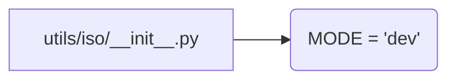

# <input code>

```python
## \file hypotez/src/utils/iso/__init__.py
# -*- coding: utf-8 -*-\
#! venv/Scripts/python.exe
#! venv/bin/python/python3.12

"""
.. module: src.utils.iso 
	:platform: Windows, Unix
	:synopsis:

"""
MODE = 'dev'
```

# <algorithm>

Этот файл `__init__.py` служит файлом инициализации пакета `src.utils.iso`.  Он не содержит функций или классов, но определяет константу `MODE` с значением `'dev'`.  В данном случае логика крайне простая:  задается значение переменной `MODE` на этапе инициализации пакета.  Данные никак не перемещаются между функциями или классами, так как их нет.


# <mermaid>



# <explanation>

* **Импорты**:  В этом файле нет импортов, поскольку он является файлом инициализации пакета.  Он не зависит от других модулей.

* **Классы**: Нет определенных классов.

* **Функции**: Нет определенных функций.

* **Переменные**:
    * `MODE`:  Строковая константа, которая, вероятно, используется для определения режима работы (например, 'dev' - для разработки, 'prod' - для производства) в других частях кодовой базы.  Её значение `'dev'` устанавливается в этом файле инициализации и может быть использовано другими модулями пакета `utils.iso` или даже за его пределами.

* **Возможные ошибки или области для улучшений**:
    *  Нет явных ошибок, но константа `MODE` могла бы быть  более информативно названа (например, `DEVELOPMENT_MODE`).
    * Отсутствие документации внутри кода (docstrings) усложняет понимание назначения `MODE`.

**Цепочка взаимосвязей с другими частями проекта:**

Файл `__init__.py` в папке `src.utils.iso` играет роль инициализатора для данного подпакета. Другие файлы внутри `src.utils.iso` (если они есть) будут импортироваться из него.  Значение `MODE` будет доступно этим файлам и, возможно, используется в них.  Например, если в `src.utils.iso` находится модуль для обработки данных, то режим `MODE` может повлиять на поведение этого модуля.  Возможно, в `'dev'` режиме включены дополнительные проверочные механизмы, которые отключаются в `'prod'` режиме.  Также `MODE` может использоваться другими модулями в иерархии пакета `src` (например, в `src.main`).