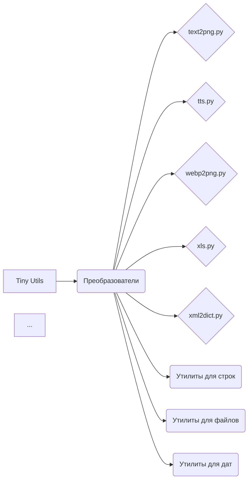

# Tiny Utils

## <code_description>

```
# Tiny Utils

## Обзор

**Tiny Utils** — это библиотека утилит, предоставляющая набор лёгких вспомогательных функций для различных общих задач. Библиотека включает в себя утилиты для преобразования форматов данных, обработки текста и файлов, строковых операций, форматирования дат и времени, обработки изображений и др. Она организована в несколько модулей для удобного доступа к конкретным функциональным возможностям.


## Оглавление

- [Tiny Utils](#tiny-utils)
  - [Оглавление](#оглавление)
  - [Установка](#установка)
  - [Обзор модулей](#обзор-модулей)
  - [Описание модулей](#описание-модулей)
    - [Преобразователи](#преобразователи)
      - [Файлы:](#файлы)
    - [Утилиты для строк](#утилиты-для-строк)
    - [Утилиты для работы с файлами](#утилиты-для-работы-с-файлами)
    - [Утилиты для работы с датами и временем](#утилиты-для-работы-с-датами-и-временем)
    - [Утилиты для работы с FTP](#утилиты-для-работы-с-ftp)
    - [Утилиты для работы с изображениями](#утилиты-для-работы-с-изображениями)
    - [Утилиты для работы с PDF](#утилиты-для-работы-с-pdf)
    - [Утилиты для работы с принтером](#утилиты-для-работы-с-принтером)
  - [Примеры использования](#примеры-использования)
    - [Преобразование текста в изображение PNG](#преобразование-текста-в-изображение-png)
    - [Преобразование XML в словарь](#преобразование-xml-в-словарь)
    - [Парсинг и манипуляции с JSON](#парсинг-и-манипуляции-с-json)
  - [Участие в разработке](#участие-в-разработке)
  - [Лицензия](#лицензия)


## Установка

Для использования **Tiny Utils** клонируйте репозиторий и установите необходимые зависимости, как указано в файле `requirements.txt`.

```bash
git clone https://github.com/hypo69/tiny-utils.git
cd tiny_utils
pip install -r requirements.txt
```


## Обзор модулей

Библиотека содержит несколько подмодулей, каждый из которых обрабатывает определённую задачу:

- **Преобразователи**: Модули для преобразования форматов данных, таких как текст в изображение, WebP в PNG, JSON, XML, кодирование Base64 и др.
- **Утилиты для строк**: Инструменты для продвинутой работы со строками.
- **Утилиты для работы с файлами**: Функции для обработки и манипулирования файлами.
- **Утилиты для работы с датами и временем**: Инструменты для форматирования дат и времени.
- **Утилиты для работы с FTP**: Функции для работы с FTP-серверами.
- **Утилиты для работы с изображениями**: Базовые функции обработки изображений.
- **Утилиты для работы с PDF**: Утилиты для обработки и преобразования файлов PDF.
- **Утилиты для работы с принтером**: Функции для отправки данных на принтер.


## Описание модулей

### Преобразователи

Модуль `convertors` содержит утилиты для преобразования данных между форматами. Эти модули могут обрабатывать различные типы данных, от CSV до JSON и текста до изображений.

#### Файлы:

- `text2png.py`: Преобразует данные текста в изображение PNG.
- `tts.py`: Преобразует текст в речь и сохраняет его в виде аудиофайла.
- `webp2png.py`: Преобразует изображения из формата WebP в PNG.
- `xls.py`: Обрабатывает преобразования и манипуляции с файлами XLS.
- `xml2dict.py`: Преобразует данные XML в словарь Python.
- `base64.py`: Кодирует или декодирует данные с использованием кодирования Base64.
- `csv.py`: Предоставляет инструменты для парсинга и манипулирования CSV.
- `dict.py`: Утилиты для обработки словарей Python.
- `html.py`: Преобразует контент HTML в различные форматы.
- `json.py`: Утилиты для парсинга и манипулирования JSON.
- `md2dict.py`: Преобразует контент Markdown в словарь.
- `ns.py`: Специализированные утилиты для преобразования имён пространств.
```

## <algorithm>

(Блок-схема отсутствует, так как код представляет собой описание, а не функциональный код.)

## <mermaid>



## <explanation>

Этот код представляет собой **README.md файл** для библиотеки `Tiny Utils`. Он описывает структуру, функциональность и использование библиотеки, а не её реализацию.

* **Импорты:** В данном случае импорты отсутствуют, так как это файл README.  Файл `requirements.txt` описывает зависимости, которые необходимо установить для работы с библиотекой, но сам код не содержит импортов.
* **Классы:** В файле README нет определённых классов, он описывает утилиты и модули.
* **Функции:** Также нет определённых функций в этом файле.
* **Переменные:** Отсутствуют.
* **Возможные ошибки/улучшения:**  README.md файл нуждается в уточнении.  Не хватает детальных описаний функций/классов, что затруднит понимание.  Описание должно быть более структурировано и содержать примеры использования. Отсутствие кода затрудняет проверку работоспособности.  Желательно добавить секцию с примерами использования функций из каждого модуля, а также схему зависимостей.

**Взаимосвязи с другими частями проекта:**  Файл `requirements.txt` указывает на внешние зависимости, необходимые для работы Tiny Utils.  Зависимости определяют функциональность, которую Tiny Utils подключает к своему интерфейсу, что предполагает наличие кода в других модулях.