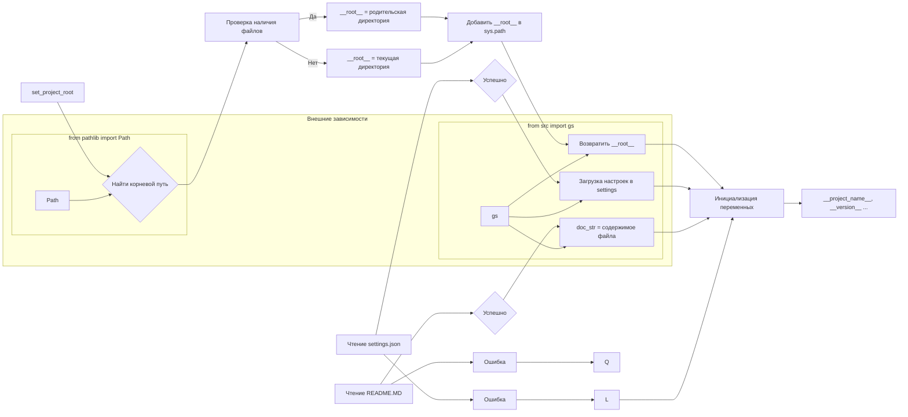

# Анализ кода из файла hypotez/src/logger/header.py

## <input code>

```python
## \file hypotez/src/logger/header.py
# -*- coding: utf-8 -*-\
#! venv/Scripts/python.exe
#! venv/bin/python/python3.12

"""
module: src.logger 
	:platform: Windows, Unix
	:synopsis: Модуль определяющий корневой путь к проекту. Все импорты строятся относительно этого пути.
    :TODO: В дальнейшем перенести в системную переменную"""
MODE = 'dev'

import sys
import json
from packaging.version import Version

from pathlib import Path
def set_project_root(marker_files=('pyproject.toml', 'requirements.txt', '.git')) -> Path:
    """
    Finds the root directory of the project starting from the current file's directory,
    searching upwards and stopping at the first directory containing any of the marker files.

    Args:
        marker_files (tuple): Filenames or directory names to identify the project root.
    
    Returns:
        Path: Path to the root directory if found, otherwise the directory where the script is located.
    """
    __root__:Path
    current_path:Path = Path(__file__).resolve().parent
    __root__ = current_path
    for parent in [current_path] + list(current_path.parents):
        if any((parent / marker).exists() for marker in marker_files):
            __root__ = parent
            break
    if __root__ not in sys.path:
        sys.path.insert(0, str(__root__))
    return __root__


# Get the root directory of the project
__root__ = set_project_root()
"""__root__ (Path): Path to the root directory of the project"""

from src import gs

settings:dict = None
try:
    with open(gs.path.root / 'src' / 'settings.json', 'r') as settings_file:
        settings = json.load(settings_file)
except (FileNotFoundError, json.JSONDecodeError):
    ...

doc_str:str = None
try:
    with open(gs.path.root / 'src' / 'README.MD', 'r') as settings_file:
        doc_str = settings_file.read()
except (FileNotFoundError, json.JSONDecodeError):
    ...


__project_name__ = settings.get("project_name", 'hypotez') if settings  else 'hypotez'
__version__: str = settings.get("version", '')  if settings  else ''
__doc__: str = doc_str if doc_str else ''
__details__: str = ''
__author__: str = settings.get("author", '')  if settings  else ''
__copyright__: str = settings.get("copyrihgnt", '')  if settings  else ''
__cofee__: str = settings.get("cofee", "Treat the developer to a cup of coffee for boosting enthusiasm in development: https://boosty.to/hypo69")  if settings  else "Treat the developer to a cup of coffee for boosting enthusiasm in development: https://boosty.to/hypo69"
```

## <algorithm>

1. **`set_project_root()`:**  Функция ищет корневой каталог проекта, начиная с текущей директории.
   - Она перебирает родительские директории, проверяя наличие файлов/папок (`marker_files`).
   - Если найдена директория, содержащая один из этих маркеров, функция возвращает её путь.
   - Иначе возвращает путь текущей директории.
   - Добавляет найденный корневой путь в `sys.path`, чтобы импорты работали корректно.
   - **Пример:** Если `__file__` указывает на `hypotez/src/logger/header.py`, функция будет искать `pyproject.toml`, `requirements.txt` и `.git` в `hypotez/src/logger`, `hypotez/src`, `hypotez` и т.д.
2. **Получение настроек (`settings`)**: Читает файл `settings.json` в каталоге `src`. Обрабатывает исключения `FileNotFoundError` и `json.JSONDecodeError`.
3. **Получение документации (`doc_str`)**: Читает файл `README.MD` в каталоге `src`. Обрабатывает исключения.
4. **Инициализация переменных**:  Задает значения переменным `__project_name__`, `__version__`, `__doc__`, `__details__`, `__author__`, `__copyright__`, `__coffee__` на основе данных из `settings.json` или устанавливает значения по умолчанию.

## <mermaid>



## <explanation>

**Импорты:**

- `sys`: Для работы с системными переменными, в частности, для добавления корневого пути проекта в `sys.path`.
- `json`: Для работы с JSON-файлами (чтения/записи настроек).
- `packaging.version`: Для работы с версиями пакетов. (не используется напрямую в данном коде, но импортирован)
- `pathlib`: Для работы с путями к файлам.
- `gs`:  Предполагается, что `gs` это собственный модуль или класс из проекта, который предоставляет методы для работы с путями и, возможно, другими ресурсами проекта (необходим `gs.path.root`).  Это важная зависимость, показывающая взаимосвязь с другими частями проекта.

**Классы:**

- Нет определённых классов в данном фрагменте.

**Функции:**

- `set_project_root(marker_files) -> Path`: Находит корневую директорию проекта, проверяя наличие `marker_files` (например, `pyproject.toml`, `requirements.txt`, `.git`).  Функция возвращает `Path` объекта к корневой директории.  Аргументы позволяют настраивать критерии поиска.

**Переменные:**

- `MODE`: Строковая переменная, хранит текущий режим (например, 'dev', 'prod').
- `__root__`: `Path` объект, содержащий путь к корневой директории проекта.
- `settings`: Словарь (dict), содержащий настройки из файла `settings.json` (используется `json.load`).
- `doc_str`: Строка, содержащая содержимое файла `README.MD` или `None`, если файл не найден.
- `__project_name__`, `__version__`, `__doc__`, `__details__`, `__author__`, `__copyright__`, `__cofee__`: Строковые переменные, содержащие данные из настроек проекта или значения по умолчанию.

**Возможные ошибки/улучшения:**

- **Обработка ошибок:** Обработка ошибок ( `try...except` блоки) для файлов `settings.json` и `README.MD` – хорошо, но можно добавить более информативные сообщения об ошибках.
- **Типы:** Проверка типов аргументов в `set_project_root` (например, `marker_files` - кортеж строк).
- **Рефакторинг:** Убрать магические строки (`'src'`, `'settings.json'`, `'README.MD'`). Использовать константы.
- **`sys.path`:** Неявный вывод `sys.path` в лог не очень хороший подход, возможны неожиданные последствия для проекта.

**Взаимосвязь с другими частями проекта:**

Модуль `logger` явно зависит от `gs` (возможно, это класс или модуль, который предоставляет методы для работы с путями к ресурсам).  Также существует зависимость от настроек в `settings.json` и документации `README.MD`, которые находятся в корне проекта.  Этот код предоставляет общую структуру импорта для других модулей.

**Итог:** Код надежно определяет корень проекта, что важно для правильной работы импортов. Обработка ошибок и использование `pathlib` улучшает его надёжность. Тем не менее, некоторые потенциальные улучшения повысят читаемость и масштабируемость кода.