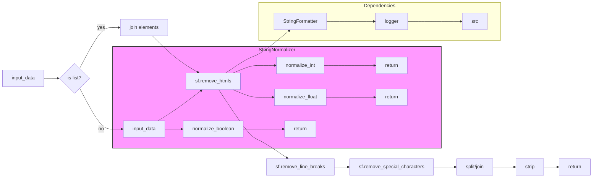

# <input code>

```python
## \file hypotez/src/utils/string/normalizer.py
# -*- coding: utf-8 -*-\
#! venv/Scripts/python.exe
#! venv/bin/python/python3.12

"""
.. module: src.utils.string 
	:platform: Windows, Unix
	:synopsis: Module for normalizing product fields and handling various data types

"""
MODE = 'dev'


from decimal import Decimal, InvalidOperation
from typing import Any, List, Union
from .formatter import StringFormatter as sf
from src.logger import logger
 
class StringNormalizer:
    """Class for normalizing product fields."""

    @staticmethod
    def normalize_boolean(input_data: Any) -> bool:
        """Normalize data into a boolean.

        Args:
            input_data (Any): Data that can represent a boolean (e.g., bool, string, integer).

        Returns:
            bool: Boolean representation of the input.

        Example:
            >>> StringNormalizer.normalize_boolean('yes')
            True
        """
        if isinstance(input_data, bool):
            return input_data

        try:
            input_str = str(input_data).strip().lower()
            if input_str in ('true', '1', 'yes', 'y', 'on', True, 1):
                return True
            elif input_str in ('false', '0', 'no', 'n', 'off', False, 0):
                return False
        except Exception as e:
            logger.error(f"Error in normalize_boolean: {e}")

        logger.debug(f"Unexpected boolean input: {input_data}")
        return False

    @staticmethod
    def normalize_string(input_data: Union[str, List[str]]) -> str:
        """Normalize a string or a list of strings.

        Args:
            input_data (str | List[str]): Input data that can be either a string or a list of strings.

        Returns:
            str: Cleaned and normalized string.

        Example:
            >>> StringNormalizer.normalize_string(['Hello', '  World!  '])
            'Hello World!'
        """
        if isinstance(input_data, list):
            input_data = ' '.join(map(str, input_data))

        try:
            cleaned_str = sf.remove_htmls(input_data)
            cleaned_str = sf.remove_line_breaks(cleaned_str)
            cleaned_str = sf.remove_special_characters(cleaned_str)
            normalized_str = ' '.join(cleaned_str.split())
            return normalized_str.strip()
        except Exception as e:
            logger.error(f"Error in normalize_string: {e}")
            return ''

    @staticmethod
    def normalize_int(input_data: Union[str, int, float, Decimal]) -> int:
        """Normalize data into an integer.

        Args:
            input_data (str | int | float | Decimal): Input data that can be a number or its string representation.

        Returns:
            int: Integer representation of the input.

        Example:
            >>> StringNormalizer.normalize_int('42')
            42
        """
        try:
            if isinstance(input_data, Decimal):
                return int(input_data)
            return int(float(input_data))
        except (ValueError, TypeError, InvalidOperation) as e:
            logger.error(f"Error in normalize_int: {e}")
            return None # Changed from '...' to 'None'

    @staticmethod
    def normalize_float(value: Any) -> float | None:
        """Safely convert input values to float or list of floats.

        Args:
            value (Any): The input value to be converted. 
                         It can be a single value (number or string) or an iterable (list/tuple).

        Returns:
            float | List[float] | None: A float value, a list of floats, or None if conversion fails.

        Example:
            >>> StringNormalizer.normalize_float("3.14")
            3.14
            >>> StringNormalizer.normalize_float([1, '2.5', 3])
            [1.0, 2.5, 3.0]
            >>> StringNormalizer.normalize_float("abc")
            Warning: Cannot convert 'abc' to float.
            None
        """
        if not value:
            return 0
        # Handle lists and tuples by recursively converting each element
        if isinstance(value, (list, tuple)):
            return [v for v in (StringNormalizer.normalize_float(v) for v in value) if v is not None]
        
        # Attempt to convert single value to float
        try:
            return float(value)
        except (ValueError, TypeError):
            logger.warning(f"Warning: Cannot convert '{value}' to float.")
            return None
```

# <algorithm>

**normalize_boolean:**

1. **Input check:** Checks if the input is already a boolean. If so, returns it directly.
2. **Conversion attempt:** Tries to convert the input to a string, strip whitespace, and lowercase it.
3. **Boolean value check:** Checks if the resulting string matches any of the boolean string representations (e.g., 'true', 'yes'). Returns `True` or `False` accordingly.
4. **Error handling:** Catches any exceptions during the conversion process and logs an error message.
5. **Default return:** If the input data can't be recognized as a boolean, logs a debug message and returns `False`.


**normalize_string:**

1. **Input check:** Checks if the input is a list. If so, joins the elements into a single string separated by spaces.
2. **Cleaning process:** Calls methods from `StringFormatter` to remove HTML tags, line breaks, and special characters from the input string.
3. **Normalization:** Joins the words in the cleaned string back together with a space.
4. **Trimming:** Removes leading and trailing whitespace from the normalized string.
5. **Error handling:** Catches exceptions during the cleaning process and logs an error message, returning an empty string.


**normalize_int:**

1. **Input check:** Checks if the input is a `Decimal` object. If so, converts it to an integer.
2. **Conversion to float:** Converts the input to a float.
3. **Conversion to integer:** Converts the float to an integer.
4. **Error handling:** Catches exceptions (e.g., `ValueError`, `TypeError`, `InvalidOperation`) and logs an error message. Returns `None`.


**normalize_float:**

1. **Empty input check:** Checks if the input is empty. If so, returns 0.
2. **List/tuple input:** If the input is a list or tuple, recursively calls `normalize_float` on each element and returns a new list containing only the successful conversions.
3. **Single value conversion:** Tries to convert the single input value to a float.
4. **Error handling:** Catches exceptions during the conversion process and logs a warning message. Returns `None` in case of failure.

# <mermaid>



# <explanation>

**Импорты:**

- `from decimal import Decimal, InvalidOperation`: Импортирует классы `Decimal` и `InvalidOperation` из модуля `decimal` для работы с десятичными числами и обработки возможных ошибок.
- `from typing import Any, List, Union`: Импортирует типы данных из модуля `typing` для более ясной и безопасной работы с аргументами и возвращаемыми значениями. `Any` – универсальный тип, `List` – тип списка, а `Union` – тип объединения для задания нескольких допустимых типов.
- `from .formatter import StringFormatter as sf`: Импортирует класс `StringFormatter` из модуля `formatter` в текущем пакете (`hypotez/src/utils/string`).  Используется алиас `sf`. Это ключевая зависимость – нормализатор строк использует функции очистки строк из другого модуля внутри этого же пакета.
- `from src.logger import logger`: Импортирует логгер из модуля `logger` в пакете `src`. Для логирования ошибок и отладочной информации. Эта зависимость подключает к работе систему логирования приложения.

**Классы:**

- `StringNormalizer`: Класс для нормализации данных. Определяет статические методы для разных типов данных (boolean, string, int, float).  Отвечает за преобразование входных данных в желаемые типы, с обработкой ошибок и логированием.

**Функции:**

- `normalize_boolean(input_data: Any) -> bool`: Преобразует данные в булеан.  Принимает любые данные и возвращает `True` или `False`, логгируя ошибки и предупреждения.
- `normalize_string(input_data: Union[str, List[str]]) -> str`: Нормализует строки.  Принимает строку или список строк, возвращает отформатированную строку, очищая её от HTML, переносов строк и специальных символов.
- `normalize_int(input_data: Union[str, int, float, Decimal]) -> int`: Преобразует данные в целое число.  Принимает различные числовые типы (строки, целые числа, плавающие точки, десятичные числа). Возвращает целое число или `None` в случае ошибки.
- `normalize_float(value: Any) -> float | None`: Безопасно преобразует значение в float. Может обрабатывать как отдельные значения, так и списки/кортежи значений.  Возвращает float, список float или `None` в случае ошибки.  Ключевой момент: рекурсивно обрабатывает списки, гарантируя, что ошибка в одном элементе не приводит к падению всей операции.


**Переменные:**

- `MODE = 'dev'`: Переменная, вероятно, устанавливает режим работы (например, 'dev' или 'prod').


**Возможные ошибки и улучшения:**

- Возвращаемое значение из `normalize_int` ранее было `...` – теперь исправлено на `None`.  Это делает возвращаемый тип более ясным.
- Дополнительная обработка в `normalize_float` для предотвращения необработанных исключений, связанных со списками.
- Возможно, полезно добавить более подробные сообщения об ошибках в логгер.

**Взаимосвязи с другими частями проекта:**

- `StringNormalizer` тесно связан с `StringFormatter` через импорт и использование его методов для обработки строк.
-  `logger` позволяет `StringNormalizer` сообщать о проблемах в другие части приложения.
- Использование `StringNormalizer` напрямую или косвенно зависит от других частей проекта, которые получают или передают данные в формате строк, списков строк или других типов данных, нуждающихся в нормализации.