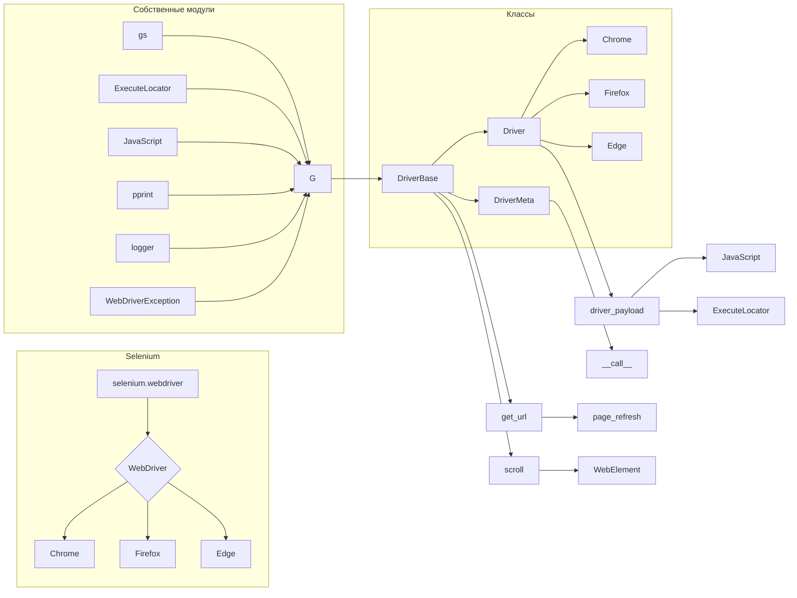

# Анализ кода `driver.py`

## <input code>

```python
import sys
import pickle
import time
import copy
from pathlib import Path
from typing import Type, Union
import urllib.parse
from selenium.webdriver.common.action_chains import ActionChains
from selenium.webdriver.common.keys import Keys
from selenium.webdriver.common.by import By
from selenium.webdriver.support import expected_conditions as EC
from selenium.webdriver.support.ui import WebDriverWait
from selenium.webdriver.remote.webelement import WebElement
from selenium.common.exceptions import (
    InvalidArgumentException,
    ElementClickInterceptedException,
    ElementNotInteractableException,
    ElementNotVisibleException
)

from src import gs
from src.webdriver.executor import ExecuteLocator
from src.webdriver.javascript.js import JavaScript
from src.utils import pprint
from src.logger import logger
from src.logger.exceptions import WebDriverException
```

```python
class DriverBase:
    """ Base class for a WebDriver with common attributes and methods.

    This class contains methods and attributes common to all WebDriver implementations, including functionalities for page interaction,
    JavaScript execution, and managing cookies.
    """
    previous_url = None
    referrer = None
    page_lang = None

    # ... (other attributes and methods omitted for brevity)
```

```python
class DriverMeta(type):
    def __call__(cls, webdriver_cls: Type, *args, **kwargs):
        """Creates a new Driver class that inherits from DriverBase and the specified WebDriver class.
        ...\n
        """
        class Driver(cls, webdriver_cls):
          pass
        Driver.driver_payload(*args, **kwargs)
        return Driver
```

```python
class Driver(metaclass=DriverMeta):
    """
    A dynamically created WebDriver class that inherits from DriverBase and a specified WebDriver class.

    @code
    from src.webdriver import Driver, Chrome, Firefox, Edge
    d = Driver(Chrome)
    @endcode
    """
    # ... (other attributes and methods omitted for brevity)
```

## <algorithm>

(Блок-схема в формате markdown не поддерживается, но описывается логика)

Алгоритм работы кода основывается на динамическом создании классов, наследующих от `DriverBase`.

1. Импортируются необходимые библиотеки (Selenium, собственные модули).
2. `DriverBase` - базовый класс, содержащий общие атрибуты (например, `previous_url`, `referrer`) и методы (например, `get_url`, `scroll`).  
3. `DriverMeta` - метакласс, который принимает класс веб-драйвера (например, `Chrome`) и генерирует новый класс `Driver`, унаследованный от `DriverBase` и указанного класса веб-драйвера.  Он инициализирует объект `driver_payload`.
4.  Класс `Driver` - динамический класс, созданный метаклассом, объединяющий функционал `DriverBase` и конкретного веб-драйвера.
5. Пользователь создает экземпляр `Driver` , например `Driver(Chrome)`.  Внутри этого происходит инициализация вебдрайвера с использованием конструктора класса  `Chrome`.
6. Используя методы `DriverBase`, пользователь может взаимодействовать с веб-страницей (переход по URL, прокрутка, поиск элементов и т.д.).


## <mermaid>



## <explanation>

**Импорты:**
Импортируются необходимые модули для работы с веб-драйверами (Selenium), управлением файлами и папками, обработкой данных,  обмен сообщениями, а так же собственные модули (`src.*`) для логирования (`logger`), обработки исключений (`WebDriverException`), работы с настройками (`gs`),  веб-драйвером (`ExecuteLocator`, `JavaScript`),  функциями форматирования вывода (`pprint`).  

**Классы:**
- `DriverBase`: Базовый класс, содержащий общие атрибуты (URL, язык страницы) и методы (прокрутка, переход по URL, работа с куками), используемые всеми драйверами. Он инкапсулирует общую логику работы.
- `DriverMeta`: Метакласс, который позволяет динамически создавать классы драйверов, наследующих от `DriverBase` и конкретного класса веб-драйвера (Chrome, Firefox). Это позволяет использовать код одинаково для разных браузеров. 
- `Driver`: Динамически создаваемый класс, представляющий собой экземпляр  специфичного веб-драйвера (Chrome, Firefox, Edge),  наследующий методы и атрибуты от `DriverBase` и конкретного драйвера. Этот класс управляет взаимодействием с веб-сайтом через  `WebDriver` объект.


**Функции:**
- `driver_payload()`:  Метод инициализации, который  устанавливает взаимодействие с `ExecuteLocator` и `JavaScript`.
- `get_url()`: Переход на указанный URL. 
- `scroll()`: Прокрутка страницы.
- `locale()`: Определение языка страницы.
- `extract_domain()`: Извлечение доменного имени из URL.
- `_save_cookies_localy()`: Сохранение куки в файл.
- `page_refresh()`: Обновление страницы.
- `window_focus()`: Восстановление фокуса на окне браузера.
- `wait()`: Задержка выполнения кода.
- `delete_driver_logs()`: Удаление временных файлов и логов WebDriver.

**Переменные:**
Переменные, например, `previous_url`, `page_lang`  и `driver_payload`, хранят данные, относящиеся к работе с веб-драйвером.

**Возможные ошибки и улучшения:**
- **Типизация**: В коде используется `typing`, но можно добавить больше типов данных для повышения устойчивости к ошибкам.
- **Исключения:** Обработка возможных исключений (например, `ElementNotVisibleException`) может быть улучшена.
- **Модульная структура:** код можно разбить на более мелкие классы и модули для лучшей организации.
- **Тестирование**: Необходимо добавление тестов для проверки корректности работы методов.

**Взаимосвязи с другими частями проекта:**
Код использует модули из `src`, что означает, что `src` содержит вспомогательные библиотеки для логгирования, обработки настроек и работы с файлами.  Код связан с классом Selenium `WebDriver`.  `gs`, `pprint`, `logger` и `WebDriverException`  предполагают наличие других модулей в `src`.