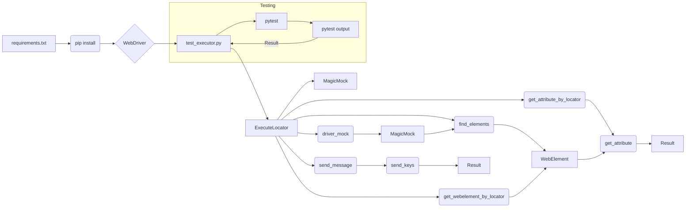

# Руководство по тестированию класса ExecuteLocator

## <input code>

```python
import pytest
from unittest.mock import MagicMock, patch
from selenium.webdriver.remote.webelement import WebElement
from selenium.webdriver.common.by import By

from src.webdriver.executor import ExecuteLocator
from src.logger.exceptions import ExecuteLocatorException

@pytest.fixture
def driver_mock():
    return MagicMock()

@pytest.fixture
def execute_locator(driver_mock):
    return ExecuteLocator(driver_mock)

# Примеры тестов для методов класса ExecuteLocator
def test_get_webelement_by_locator_single_element(execute_locator, driver_mock):
    pass  # Реализация теста
# ... (другие тесты)
```

## <algorithm>

**Шаг 1:** Подготовка окружения.
    - Устанавливаются необходимые библиотеки (pytest, selenium).
    - Настраивается WebDriver для браузера.

**Шаг 2:** Написание тестов.
    - Создаётся файл `test_executor.py` в директории `tests`.
    - Используются фикстуры `driver_mock` и `execute_locator` для создания мок-объектов `driver` и `ExecuteLocator`.

    - Тесты для `get_webelement_by_locator`:
        - Создаются мок-объекты `WebElement`.
        - Имитируется поиск элементов с помощью `driver_mock.find_elements`.
        - Проверяется, что `find_elements` вызывается с правильным локатором.
        - Проверяется, что возвращаемый элемент соответствует ожидаемому.
    - Тесты для `get_attribute_by_locator`:
        - Имитируется получение атрибута с помощью `element.get_attribute`.
        - Проверяется, что `find_elements` и `get_attribute` вызываются с правильными параметрами.
        - Проверяется, что возвращаемое значение атрибута соответствует ожидаемому.

    - Тесты для `send_message`:
        - Имитируется отправка сообщения с помощью `element.send_keys`.
        - Проверяется, что `find_elements` и `send_keys` вызываются с правильными параметрами.
        - Проверяется, что метод возвращает ожидаемое значение (True/False).
    - Тесты для `send_message_typing_speed`:
        - Аналогично тесту для `send_message` но с проверкой работы функции задержки `time.sleep`.


**Пример перемещения данных:**
Локатор (`locator`) передаётся в методы `get_webelement_by_locator`, `get_attribute_by_locator` и `send_message`.  Методы используют этот локатор для поиска элемента с помощью `driver_mock.find_elements`. Результаты поиска (элемент, атрибут или результат отправки сообщения) возвращаются методами.  Мокинг (`MagicMock`) позволяет изолировать работу `ExecuteLocator` от реального веб-драйвера.

## <mermaid>




## <explanation>

**Импорты:**
- `pytest`: Библиотека для написания и запуска тестов.  Связь с `src` - это зависимость, не связанная напрямую с `src`.
- `unittest.mock`: Библиотека для создания мок-объектов (заменителей). Это позволяет тестировать `ExecuteLocator` без реального веб-драйвера. Связь с `src` - это зависимость, не связанная напрямую с `src`.
- `selenium.webdriver.remote.webelement`: Предоставляет класс `WebElement`, представляющий элемент на веб-странице. Связь с `src` - это зависимость, не связанная напрямую с `src`.
- `selenium.webdriver.common.by`: Предоставляет константы, такие как `By.XPATH`, для выбора элементов. Связь с `src` - это зависимость, не связанная напрямую с `src`.
- `src.webdriver.executor`: Импортирует класс `ExecuteLocator`. Связь с `src` - это внутренняя зависимость проекта.
- `src.logger.exceptions`: Импортирует классы исключений, связанные с логированием. Связь с `src` - это внутренняя зависимость проекта.

**Классы:**
- `ExecuteLocator`: Класс, отвечающий за работу с веб-элементами через Selenium WebDriver.  Атрибуты:  `driver` (WebDriver), методы: `get_webelement_by_locator`, `get_attribute_by_locator`, `send_message`.

**Функции:**
- `test_get_webelement_by_locator_single_element`, `test_get_attribute_by_locator`, `test_send_message`, `test_send_message_typing_speed`: Функции для тестирования методов `ExecuteLocator`.  Они принимают фикстуры `execute_locator` и `driver_mock`. Они используют мок-объекты, чтобы проверить поведение  `ExecuteLocator` без реальных данных WebDriver.  Они возвращают `assert result == expected_value`, которые проверяют корректность результата.

**Переменные:**
- `locator`, `message`, `typing_speed`: Переменные, используемые в тестах для хранения данных, используемых в методах класса `ExecuteLocator`.


**Возможные ошибки/улучшения:**
- Тесты должны быть более подробными. В примере тесты проверяют лишь некоторые типичные случаи (один элемент, несколько элементов). Для полноценного теста нужно добавить больше тестовых сценариев, чтобы охватить все ситуации, с которыми может столкнуться `ExecuteLocator`.
- В тестах используются мокинг-объекты, которые могут быть не эффективны в сложных сценариях.
- Не хватает обработки исключений:  В методах класса `ExecuteLocator` и тестах не хватает обработки исключений.  Это может привести к сбою программы, если пользователь ввёл неправильный локатор или произошла ошибка WebDriver.
- Не хватает проверки на корректность данных в локаторах. В примере не предусмотрена проверка корректности формата локаторо.
- Не хватает  тестов для проверки логики обработки ошибок.
- Дополнительно нужно добавить документацию для самих тестов.  Приведенная в данном примере документация описывает лишь использование библиотек, но не внутреннюю логику тестов.

**Цепочка взаимосвязей:**

`requirements.txt` -> `pip install` -> `ExecuteLocator` -> `driver_mock` -> `find_elements` -> `WebElement`.  Тесты (pytest) проверяют, правильно ли работает `ExecuteLocator` при взаимодействии с WebDriver, имитируя реальное взаимодействие через мокинг.