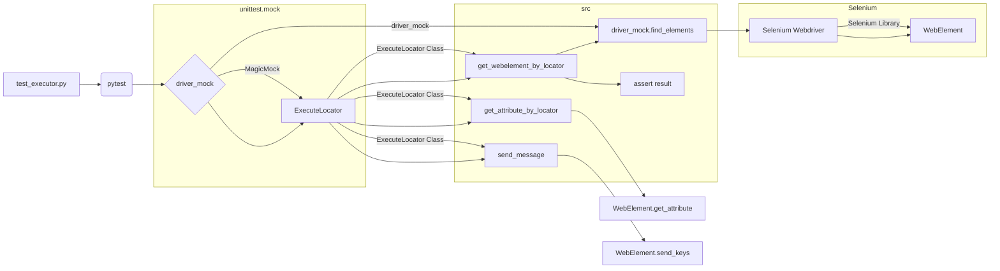

# <input code>

```python
## \file hypotez/src/webdriver/_pytest/test_executor.py
# -*- coding: utf-8 -*-\n#! venv/Scripts/python.exe\n#! venv/bin/python/python3.12\n\n"""\n.. module: src.webdriver._pytest \n\t:platform: Windows, Unix\n\t:synopsis:\n\n"""\nMODE = \'dev\'\n\n"""\n\t:platform: Windows, Unix\n\t:synopsis:\n\n"""\n\n"""\n\t:platform: Windows, Unix\n\t:synopsis:\n\n"""\n\n"""\n  :platform: Windows, Unix\n\n"""\n"""\n  :platform: Windows, Unix\n  :platform: Windows, Unix\n  :synopsis:\n"""MODE = \'dev\'\n  \n""" module: src.webdriver._pytest """\n\n\n\n""" Фикстуры:\n\ndriver_mock: создает фиктивный объект веб-драйвера.\nexecute_locator: создает экземпляр класса ExecuteLocator с фиктивным веб-драйвером.\n#Тесты:\n - test_get_webelement_by_locator_single_element: Проверяет получение одного элемента.\n - test_get_webelement_by_locator_multiple_elements: Проверяет получение нескольких элементов.\n - test_get_webelement_by_locator_no_element: Проверяет случай, когда элемент не найден.\n - test_get_attribute_by_locator: Проверяет получение атрибута элемента.\n - test_send_message: Проверяет отправку сообщения элементу.\n - test_send_message_typing_speed: Проверяет отправку сообщения элементу с задержкой между символами.\n"""\n\nimport pytest\nfrom unittest.mock import MagicMock, patch, create_autospec\nfrom selenium.webdriver.remote.webelement import WebElement\nfrom selenium.webdriver.common.by import By\nfrom selenium.webdriver.common.action_chains import ActionChains\nfrom selenium.common.exceptions import NoSuchElementException, TimeoutException\n\nfrom src.webdriver.executor import ExecuteLocator\nfrom src.logger.exceptions import ExecuteLocatorException\n\n@pytest.fixture\ndef driver_mock():\n    return MagicMock()\n\n@pytest.fixture\ndef execute_locator(driver_mock):\n    return ExecuteLocator(driver_mock)\n\n# ... (rest of the code)\n```

# <algorithm>

**Шаг 1:**  Импортируются необходимые библиотеки, включая `pytest`, `MagicMock` для создания моков, `WebElement` для работы с элементами Selenium, `By` для выбора элементов по селекторам, и `ExecuteLocator` из модуля `src.webdriver.executor`.  Это обеспечивает необходимые инструменты для тестирования.

**Шаг 2:** Определены фикстуры `driver_mock` и `execute_locator`. Фикстура `driver_mock` возвращает мок-объект веб-драйвера. Фикстура `execute_locator` использует `driver_mock` для создания экземпляра `ExecuteLocator`.  Это позволяет контролировать поведение веб-драйвера во время тестов.

**Шаг 3:**  Определены тесты.  Каждый тест проверяет определенную функцию `ExecuteLocator`.  Пример `test_get_webelement_by_locator_single_element`:
    * Создается мок-объект элемента `element`.
    * Метод `driver_mock.find_elements` имитирует поиск элементов, возвращая список, содержащий `element`.
    * Метод `execute_locator.get_webelement_by_locator` вызывается с заданным `locator`.
    * Проверяется, что `driver_mock.find_elements` был вызван с правильными аргументами.
    * Проверяется, что возвращаемое значение `result` равно `element`.

**Шаг 4:** Аналогично, тесты `test_get_webelement_by_locator_multiple_elements`, `test_get_webelement_by_locator_no_element`, `test_get_attribute_by_locator`, `test_send_message`, и `test_send_message_typing_speed` проверяют соответствующие функции.  Данные передаются между функциями, как аргументы (`locator`, `message`, `typing_speed`).

**Шаг 5:**  В тесте `test_send_message_typing_speed` используется патч `time.sleep` для моделирования задержек, вводимых при вводе текста с различной скоростью.


# <mermaid>



# <explanation>

**Импорты:**

* `pytest`: Фреймворк для тестирования.
* `unittest.mock`: Модуль для создания моков (заглушек) объектов.
* `selenium.webdriver.remote.webelement`: Класс для работы с веб-элементами.
* `selenium.webdriver.common.by`:  Константы для выбора элементов (By.XPATH, By.ID, etc.).
* `selenium.webdriver.common.action_chains`:  Для управления действиями с элементами.
* `selenium.common.exceptions`: Обработка исключений.
* `src.webdriver.executor`: Модуль с классом `ExecuteLocator`, который, предположительно, реализует логику взаимодействия с веб-драйвером.
* `src.logger.exceptions`:  Вероятно, модуль для обработки исключений, связанных с логированием.

**Классы:**

* `ExecuteLocator`: Класс, реализующий логику поиска, получения атрибутов и отправки сообщений элементам веб-страницы.  В этом коде нет полного определения класса `ExecuteLocator`, поэтому дальнейшие детали предполагаются.


**Функции:**

* `driver_mock()`:  Создает фиктивный объект веб-драйвера.  Важная фикстура для тестирования, позволяющая изолировать код от реального взаимодействия с браузером.
* `execute_locator(driver_mock)`: Создает экземпляр `ExecuteLocator` с предопределённым `driver_mock`. Это позволяет контролировать действия веб-драйвера.
*  Функции тестов (например, `test_get_webelement_by_locator_single_element`, `test_send_message`) проверяют разные методы класса `ExecuteLocator`.  Они принимают `execute_locator` и `driver_mock` как аргументы для инициализации и проверки поведения тестируемого кода.

**Переменные:**

* `MODE`: Переменная, содержащая режим работы (скорее всего, для логирования).
* `locator`: Словарь, содержащий информацию о локаторе элемента.
* `message`: Строка, которую нужно отправить.
* `typing_speed`: Время задержки между символами при вводе.
* `element`, `elements`: Представляют собой мок-объекты `WebElement` и список таких объектов.

**Возможные ошибки и улучшения:**

* Отсутствует проверка на корректность входных данных `locator`.  Необходимо убедиться, что `locator` содержит необходимые поля ("by", "selector").
* Отсутствует обработка `NoSuchElementException` или `TimeoutException`.  Важно добавить проверку на случай, если элемент не найден или поиск элемента превышает лимит времени.
* Тестирование не охватывает все возможные ситуации (например, ошибки при отправке сообщений).


**Взаимосвязь с другими частями проекта:**

* `ExecuteLocator` взаимодействует с `src.webdriver` (вероятно, для взаимодействия с веб-драйвером).
* `ExecuteLocator` может взаимодействовать с `src.logger` (если `ExecuteLocator` использует логирование).


**Итог:** Предоставленный код представляет собой набор тестов для класса `ExecuteLocator`. Тесты написаны с использованием фикстур и моков, что позволяет контролировать и тестировать функциональность класса изолированно от реальной среды браузера. Код демонстрирует проверку основных методов класса `ExecuteLocator`. Необходимо добавить более полное тестирование, включая проверки на исключения, валидацию входных данных и различные сценарии.