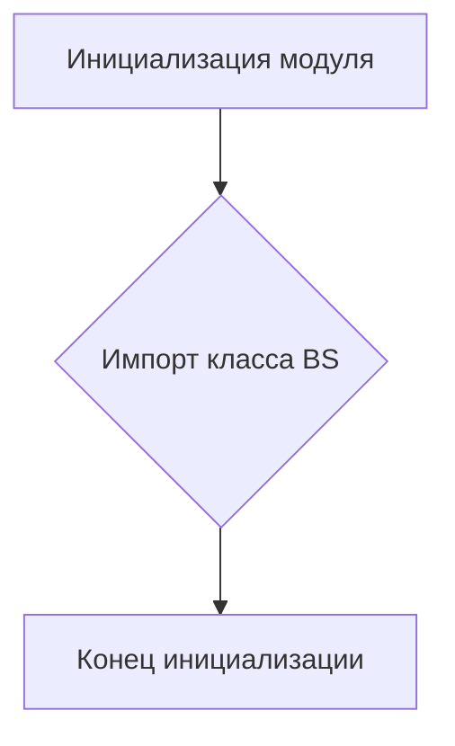

# <input code>

```python
## \file hypotez/src/webdriver/bs/__init__.py
# -*- coding: utf-8 -*-
#! venv/Scripts/python.exe
#! venv/bin/python/python3.12

"""
.. module: src.webdriver.bs 
	:platform: Windows, Unix
	:synopsis:

"""
MODE = 'dev'

from .bs import BS
```

# <algorithm>

Этот код представляет собой инициализацию модуля `src.webdriver.bs`.  Алгоритм очень прост: он импортирует класс `BS` из подмодуля `bs`.

**Блок-схема:**



**Пример:**

Если в `hypotez/src/webdriver/bs/bs.py` определен класс `BS`,  данный код просто импортирует его.  Никаких вычислений или дополнительных действий не происходит.


# <mermaid>

```mermaid
graph LR
    subgraph Модуль bs
        BS[BS (класс)]
    end
    subgraph Модуль __init__.py
        init[__init__.py]
        init --> BS;
    end

```

**Объяснение диаграммы:**

Диаграмма отображает зависимость. Модуль `__init__.py`  импортирует класс `BS` из подмодуля `bs`.  Это типичная структура для организации кода по модулям и пакетам.

# <explanation>

**Импорты:**

* `from .bs import BS`: Этот импорт подключает класс `BS` из файла `bs.py` внутри пакета `webdriver/bs`. Символ `.` указывает, что импортируемый модуль находится в текущей директории или в подпакете текущего модуля.  Этот импорт позволяет использовать класс `BS` в других частях кода проекта `hypotez`.  Связь с другими частями:  `src.webdriver.bs` зависит от `src.webdriver.bs.bs`.

**Классы:**

* `BS`: Класс, который должен быть определен в файле `hypotez/src/webdriver/bs/bs.py`.  Без просмотра `bs.py`,  мы не знаем точную роль, атрибуты и методы этого класса.  Его присутствие здесь указывает на то, что он предоставляет функциональность, связанную с драйвером веб-драйвера.


**Функции:**

В данном файле нет функций, только импорт.

**Переменные:**

* `MODE = 'dev'`:  Строковая переменная, вероятно, определяющая режим работы (например, `dev` для разработки, `prod` для производства).  Она глобальная для данного модуля.

**Возможные ошибки/улучшения:**

* **Отсутствующая документация:**  Несмотря на `""".. module..."""`,  отсутствует подробная документация внутри файла. Для лучшей читаемости и поддержки добавление docstrings в класс `BS` было бы полезно.
* **Не указаны необходимые зависимости:** Файл не показывает, какие другие библиотеки используются (`selenium`, `requests` и т.д.).  Это необходимо для полного понимания и тестирования.
* **Нет примеров использования:** Необходимы примеры использования класса `BS` для полного понимания его функциональности.

**Цепочка взаимосвязей:**

`hypotez/src/webdriver/bs/__init__.py`  импортирует `BS` из `hypotez/src/webdriver/bs/bs.py`.  Этот класс `BS` скорее всего взаимодействует с драйвером веб-драйвера (Selenium или подобным), управляя веб-браузером.  Дальше может идти взаимодействие с другими компонентами проекта, например, с контроллерами или сервисами, для управления и использования веб-драйвера. Без файла `bs.py` трудно дать более подробную взаимосвязь.