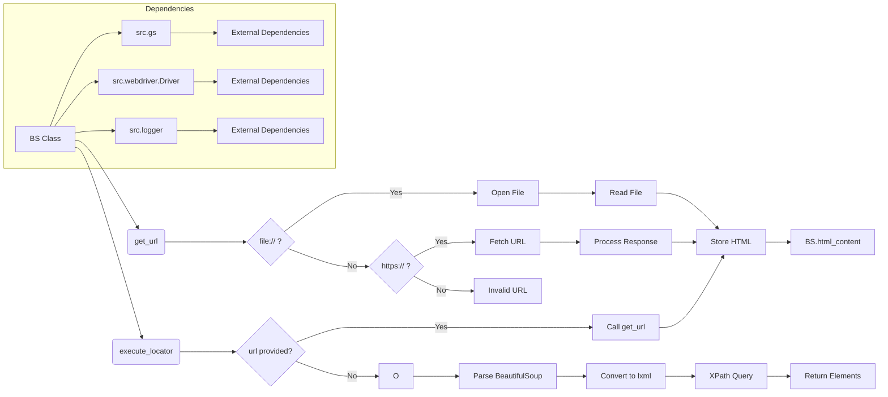

```MD
# <input code>

```python
## \file hypotez/src/webdriver/bs/bs.py
# -*- coding: utf-8 -*-
#! venv/Scripts/python.exe
#! venv/bin/python/python3.12

"""
.. module: src.webdriver.bs 
	:platform: Windows, Unix
	:synopsis: parse pages with `BeautifulSoup` and XPath 
```python
if __name__ == "__main__":
    driver = Driver()
    # For file
    driver.get_url('path/to/your/file.html')
    # For URL
    driver.get_url('https://example.com')
    driver.execute_locator(locator)
```

"""
MODE = 'dev'


import re
from math import log
from bs4 import BeautifulSoup
from types import SimpleNamespace
from lxml import etree
import requests
from pathlib import Path
from src import gs
from src.webdriver import Driver
from src.logger import logger

class BS:
    
    html_content:str
    def __init__(self, url:str|None=None):
        """"""
        self.html_content = url


    def get_url(self, url: str):
        """ Fetch HTML content from a file or URL and parse it with BeautifulSoup and XPath

        @param url: The file path or URL to fetch HTML content from
        """

        if url.startswith('file://'):
            # Remove 'file://' prefix and clean up the path
            cleaned_url = url.replace(r'file:///', '')
            
            # Extract the Windows path if it's in the form of 'c:/... ' or 'C:/...'
            match = re.search(r'[a-zA-Z]:[\\\\/].*', cleaned_url)
            if match:
                file_path = Path(match.group(0))
                if file_path.exists():
                    try:
                        with open(file_path, 'r', encoding='utf-8') as file:
                            self.html_content = file.read()
                        return True
                    except Exception as ex:
                        logger.error('Exception while reading the file:', ex)
                        ...
                else:
                    logger.error('Local file not found:', file_path)
                    ...
            else:
                logger.error('Invalid file path:', cleaned_url)
                ...
        elif url.startswith('https://'):
            # Handle web URLs
            try:
                response = requests.get(url)
                response.raise_for_status()  # Check for HTTP request errors
                self.html_content = response.text
                return True
            except requests.RequestException as ex:
                logger.error(f"Error fetching {url}:", ex)
                ...
        else:
            logger.error('Invalid URL or file path:', url)
            ...
        


    def execute_locator(self,locator:SimpleNamespace|dict, url: str = None):
        """ мини версия экзкьютора вебдрайвера `Driver` (`src.webdriver.executor`)"""
        ...
        if url:
            self.get_url(url)
            
        soup = BeautifulSoup(self.html_content, 'lxml')
        tree = etree.HTML(str(soup))  # Convert BeautifulSoup object to lxml tree
        attribute = locator.attribute
        by = locator.by
        selector = locator.selector
        elements = None
        
        if by.upper() == 'ID':
            elements = tree.xpath(f'//*[@id="{attribute}"]')
        elif by.upper() == 'CSS':
            elements = tree.xpath(f'//*[contains(@class, "{attribute}")]')
        elif by.upper() == 'TEXT':
            elements = tree.xpath(f'//input[@type="{attribute}"]')
         ## @todo: - это костыль, а не логика"""
        else:
            ...
            elements = tree.xpath(selector)
            
        return elements
    
if __name__ == "__main__":
    driver = Driver()
    # For file
    driver.get_url('path/to/your/file.html')
    # For URL
    driver.get_url('https://example.com')
    locator:SimpleNamespace
    driver.execute_locator(locator)
```

# <algorithm>

**Шаг 1:** Инициализация объекта `BS` (при необходимости с URL).

**Пример:** `bs_object = BS('https://example.com')`


**Шаг 2:** Метод `get_url` обрабатывает URL.

* **Подслучай 1:** Если URL начинается с `file://`, метод пытается открыть локальный файл, обработать исключения (FileNotFoundError, encoding problems) и логировать ошибки.
* **Подслучай 2:** Если URL начинается с `https://`, метод использует `requests` для получения HTML-контента. Обрабатываются ошибки сети.
* **Иначе:** Логируется ошибка.

**Шаг 3:**  Метод `execute_locator` получает `locator` (объект `SimpleNamespace` или `dict`) и опциональный `url`.

* **Подслучай 1:** Если передан `url`, то вызывается `get_url` для получения HTML-контента.
* **Подслучай 2:**  Конвертация `BeautifulSoup` объекта в `lxml` дерево.
* **Подслучай 3:** Используя XPath, выбираются элементы по указанным в `locator` критериям (ID, CSS, TEXT или пользовательский селектор).
* **Подслучай 4:** Возвращаются найденные элементы.


**Пример передачи данных:**


```
locator = SimpleNamespace(attribute='myelement', by='ID', selector=None)
elements = bs_object.execute_locator(locator, 'https://example.com')
```


# <mermaid>




# <explanation>

**Импорты:**

* `re`: Для работы с регулярными выражениями (например, для проверки формата URL).
* `math`: Для математических операций (пока не используется в данном коде).
* `bs4`: Библиотека для парсинга HTML/XML.
* `types`: Для работы с типом данных `SimpleNamespace`.
* `lxml`: Библиотека для обработки XML и XPath.
* `requests`: Библиотека для отправки HTTP запросов (для обработки web-URL).
* `pathlib`: Для работы с путями к файлам.
* `src.gs`:  Вероятно, модуль для работы с Google Sheets (данных, скорее всего).  Необходимо больше контекста для точного понимания.
* `src.webdriver.Driver`:  Класс, вероятно, для управления веб-драйвером (webdriver).
* `src.logger`: Модуль для логирования ошибок и сообщений.


**Классы:**

* **`BS`:**  Класс для парсинга HTML контента, полученного с файла или URL, с помощью `BeautifulSoup` и `lxml`. Хранит  `html_content`.
    * **`__init__`:** Инициализирует объект `BS` с URL (опционально).
    * **`get_url`:** Загружает HTML контент из файла или URL. Обрабатывает разные типы URL (локальные файлы и web-страницы) и валидирует входные данные. Очень важная часть кода, так как содержит всю логику работы с различными источниками.
    * **`execute_locator`:**  Используя `BeautifulSoup` и `lxml`, находит элементы, соответствующие locator (ID, CSS, TEXT, или XPath селектор). Очень важная функция для поиска нужных элементов на странице.


**Функции:**

* **`get_url`:**  Принимает URL (строка) и загружает HTML-контент из файла или URL-адреса. Возвращает `True` при успехе.


**Переменные:**

* **`html_content`:** Строка, содержащая HTML-контент, полученный с помощью `get_url`.
* **`locator`:** `SimpleNamespace` или `dict`, содержащий атрибуты для поиска элементов (например, ID, CSS-селектор, текст).
* **`url`:** Строка, содержащая URL.

**Возможные ошибки и улучшения:**

* **Обработка ошибок:** Обработка исключений `requests.RequestException` при работе с `requests` очень важна.
* **Универсальный `locator`:**  В `execute_locator`  есть примитивный `locator`, но он не полностью реализован. Добавьте поддержку различных типов `locator`. 
* **Более полная валидация:** Добавление проверки `url` на корректность (правильный формат, существование файла).
* **Документация:**  Добавьте более подробную документацию к методам и атрибутам.
* **Логирование:**  Логируйте более детальную информацию о происходящих действиях.
* **Обработка `selector`:** Код не обрабатывает `selector`.

**Взаимосвязи:**

Код `bs.py` зависит от `src.logger`, `src.webdriver.Driver`, `requests`, и `BeautifulSoup`.  `src.webdriver.Driver` вероятно использует `bs.py` для обработки HTML.  `gs` вероятно необходим для  хранения, работы или обработки данных, связанных с `html_content`.

В целом, код написан в хорошо структурированном стиле и подходит для обработки HTML-контента. Но требует доработки для полной функциональности.