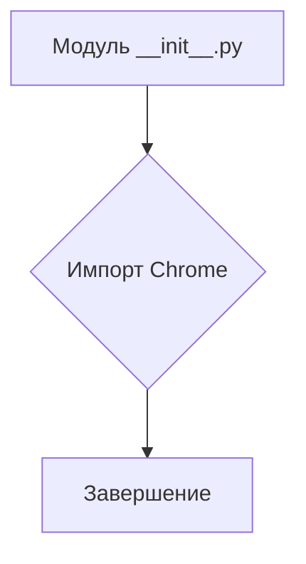
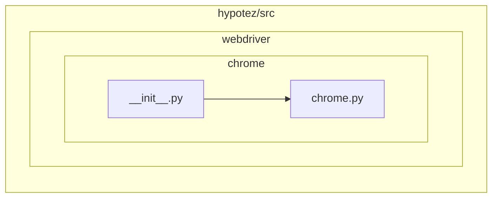

# Анализ кода hypotez/src/webdriver/chrome/__init__.py

## <input code>

```python
## \file hypotez/src/webdriver/chrome/__init__.py
# -*- coding: utf-8 -*-
#! venv/Scripts/python.exe
#! venv/bin/python/python3.12

"""
.. module: src.webdriver.chrome 
	:platform: Windows, Unix
	:synopsis:

"""

from .chrome import Chrome
```

## <algorithm>

Этот код представляет собой инициализацию модуля `src.webdriver.chrome`.  В нём нет сложного алгоритма.  Он просто импортирует класс `Chrome` из подмодуля `chrome` текущей директории.  Вследствие отсутствия функций или циклов, блок-схема будет тривиальной.

**Блок-схема:**



**Пример:**

При выполнении импорта `from .chrome import Chrome` интерпретатор находит и импортирует класс `Chrome` из файла `chrome.py`, находящегося в папке `webdriver/chrome` текущего проекта. Данные не перемещаются между функциями или классами, так как нет вызовов функций.


## <mermaid>



**Объяснение диаграммы:**

Диаграмма показывает иерархическую структуру модулей.  `hypotez/src/webdriver/chrome/__init__.py` (обозначенный как `__init__`) импортирует `Chrome` из подмодуля `chrome` (обозначен как `Chrome`).  Это означает, что `__init__.py` предоставляет доступ к классу `Chrome` из других частей проекта.


## <explanation>

**Импорты:**

- `from .chrome import Chrome`: Этот импорт подключает класс `Chrome` из файла `chrome.py` (который предположительно находится в папке `hypotez/src/webdriver/chrome`).  `.` указывает на поиск в текущем подмодуле (`webdriver/chrome`).  Это типичная практика, когда модули организованы в иерархии.

**Классы:**

- `Chrome`:  Данный код сам по себе не определяет класс `Chrome`, а только импортирует его из другого файла.  Предположительно, в `chrome.py` содержится определение класса `Chrome`, который, скорее всего, связан с управлением браузером Chrome.

**Функции:**

- Нет определенных функций.

**Переменные:**

- Нет объявленных переменных.


**Возможные ошибки/улучшения:**

- Отсутствует документация для класса `Chrome`.  В идеале в `chrome.py` и `__init__.py` должны быть  дополнительные docstrings (используя `""" ... """`) для объяснения функциональности.
- Отсутствует указание на то, какие зависимости потребуются для корректной работы.
- Без детализации класса `Chrome` сложно определить, как он используется в проекте.


**Взаимосвязи с другими частями проекта:**

Предположительно, класс `Chrome` используется в других частях проекта (например, `hypotez/src/main.py`) для управления процессами взаимодействия с браузером.  Это типичная практика для фреймворков автоматизации тестирования.