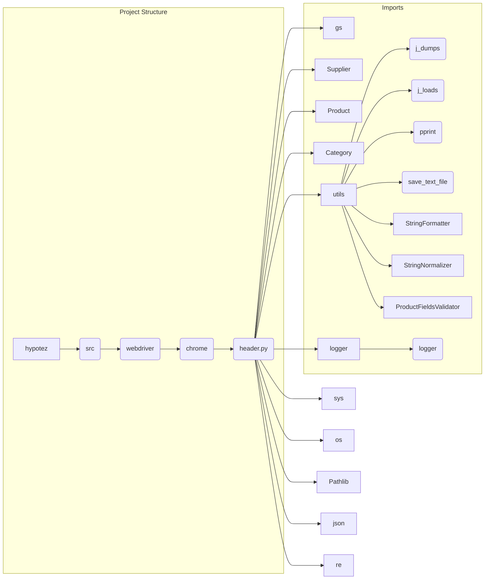

```MD
# Анализ кода header.py

1. **<input code>**:

```python
## \file hypotez/src/webdriver/chrome/_examples/header.py
# -*- coding: utf-8 -*-\
#! venv/Scripts/python.exe
#! venv/bin/python/python3.12

"""
.. module: src.webdriver.chrome._examples 
	:platform: Windows, Unix
	:synopsis:

"""
MODE = 'dev'

"""
	:platform: Windows, Unix
	:synopsis:

"""


"""
	:platform: Windows, Unix
	:synopsis:

"""


"""
  :platform: Windows, Unix

"""
"""
  :platform: Windows, Unix
  :platform: Windows, Unix
  :synopsis:
"""MODE = 'dev'
  
""" module: src.webdriver.chrome._examples """


import sys
import os
from pathlib import Path

dir_root : Path = Path (os.getcwd()[:os.getcwd().rfind('hypotez')+11])
sys.path.append (str (dir_root) )  # Добавляю корневую папку в sys.path
dir_src = Path (dir_root, 'src')
sys.path.append (str (dir_root) ) 
...

print(dir_root)
# ----------------
from pathlib import Path
import json
import re
# ----------------

from src import gs
from src.suppliers import Supplier
from src.product import Product, ProductFields, ProductFieldsLocators
from src.category import Category
from src.utils import j_dumps, j_loads,   pprint, save_text_file
from src.logger import logger
from src.utils.string import StringFormatter, StringNormalizer, ProductFieldsValidator
...
```

2. **<algorithm>**:

Этот код представляет собой заголовок Python-скрипта, который устанавливает путь к корневой папке проекта и импортирует необходимые модули.  
**Шаг 1:**  Определение корневой папки проекта. Код находит корневую папку проекта (`hypotez`) и сохраняет ее путь в переменной `dir_root`.
**Шаг 2:** Добавление корневой папки в `sys.path`. Это необходимо, чтобы Python мог найти модули, расположенные в папке `src` и вложенных поддиректориях.
**Шаг 3:** Импорт модулей.  Код импортирует различные модули из пакета `src`.
**Шаг 4:** Печать пути корневой директории.
**Шаг 5:** Дополнительные импорты.  Код добавляет дополнительные импорты, необходимые для функциональности,  таких как обработка файлов, JSON, регулярные выражения и т.д.

3. **<mermaid>**:



**Объяснение диаграммы:**

Диаграмма показывает структуру проекта и взаимосвязи между модулями. `header.py` импортирует модули из разных подпапок `src`, включая `gs`, `suppliers`, `product`, `category`, `utils`, `logger`, и модули из `utils.string`.  `sys` и `os` и другие модули Python  также необходимы для корректной работы.

4. **<explanation>**:

* **Импорты**: Код импортирует модули из разных пакетов, в основном из пакета `src`.  Это указывает на структуру проекта с модулями, организованными в иерархическом формате для поддержки повторного использования кода и модульности.  Примеры: `src.suppliers`, `src.product`, `src.category`,  `src.utils`, `src.logger`, `src.utils.string`.
* **Классы**:  Импортируются классы `Supplier`, `Product`, `ProductFields`, `ProductFieldsLocators`, `Category`, `StringFormatter`, `StringNormalizer`, `ProductFieldsValidator` и другие, представляющие сущности (поставщики, продукты, категории). Взаимодействие между классами, например, как `Product` может взаимодействовать с `Supplier` или `Category` продемонстрировано в других файлах, которые не предоставлены в исходном коде.
* **Функции**:  Импортируются функции `j_dumps`, `j_loads`, `pprint`, `save_text_file` и др. из модуля `src.utils`. Они выполняют функции обработки данных (JSON, вывод в консоль, сохранение файлов).
* **Переменные**:  `dir_root` и `dir_src` – типы `Path` – хранят пути к директориям, необходимые для работы кода. Переменная `MODE` — строковая константа, скорее всего, задает режим работы (например, 'dev' или 'prod').
* **Возможные ошибки/улучшения**:

    * **`...`**: Код содержит неполные импорты и комментарии.  Не хватает реализации (`...`), вероятно, функция `print(dir_root)` используется в последующем коде.
    * **Пути**: Проверка корректности путей к `dir_root` и `dir_src` — важный момент. Нужно  обрабатывать возможные ошибки, если директория не найдена.
    * **Комментарии**: Некоторые комментарии являются пустыми или повторяющимися. Необходимо улучшить документацию.


**Цепочка взаимосвязей**:

Файл `header.py` является частью проекта, вероятно, связанного с автоматизацией тестирования или другими задачами с использованием веб-драйвера Chrome.  Импорт различных компонентов `src` указывает на наличие других файлов и модулей, которые определяют классы и функции, используемые для работы с продуктами, поставщиками, категориями, файлами и т. д. (`gs`, `suppliers`, `product`, `category`, `utils`, `logger`) в рамках системы.