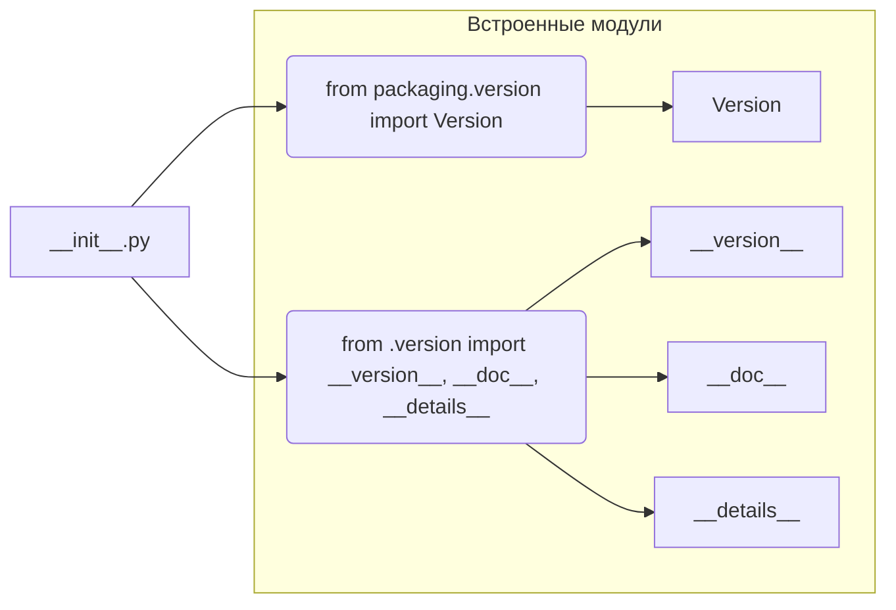

# Анализ кода hypotez/src/webdriver/chrome/extentions/__init__.py

## <input code>

```python
## \file hypotez/src/webdriver/chrome/extentions/__init__.py
# -*- coding: utf-8 -*-
#! venv/Scripts/python.exe
#! venv/bin/python/python3.12

"""
.. module: src.webdriver.chrome.extentions 
	:platform: Windows, Unix
	:synopsis:

"""
MODE = 'dev'

"""
	:platform: Windows, Unix
	:synopsis:

"""

"""
	:platform: Windows, Unix
	:synopsis:

"""


"""
  :platform: Windows, Unix

"""
"""
  :platform: Windows, Unix
  :platform: Windows, Unix
  :synopsis:
"""MODE = 'dev'
  
""" module: src.webdriver.chrome.extentions """


from packaging.version import Version
from .version import __version__, __doc__, __details__
```

## <algorithm>

Алгоритм работы файла `__init__.py` тривиален. Файл, по сути, содержит импорты и константы.  Не существует управляемого алгоритма, который бы что-то делал с данными.  Пошаговый алгоритм в данном случае не требуется.


## <mermaid>



## <explanation>

**Импорты:**

- `from packaging.version import Version`: Импортирует класс `Version` из пакета `packaging`. Этот пакет используется для работы с версиями программного обеспечения, в частности, для сравнения версий.  `src` указывает на корневую директорию проекта, и `webdriver/chrome/extentions` указывает на структуру проекта.
- `from .version import __version__, __doc__, __details__`: Импортирует переменные `__version__`, `__doc__`, и `__details__` из модуля `.version` внутри текущей директории. Это, вероятно, метаданные, описывающие версию, документацию и другие сведения о модуле `extentions` или всей подсистеме.  Это типичная практика для организации модулей Python.


**Классы:**

Нет классов.


**Функции:**

Нет функций.


**Переменные:**

- `MODE = 'dev'`: Глобальная переменная, содержащая строковое значение. Вероятно, используется для определения режима работы, например, для разделения кода разработки и релизной версии.  Возможно, в других частях проекта она используется для выбора различных конфигураций.


**Возможные ошибки или области для улучшений:**

- **Неявное использование:** Значения `__version__`, `__doc__`, `__details__` импортируются, но их значение не используется.  Это не ошибка, но может указывать на то, что эти данные пока не используются в коде.


**Взаимосвязи с другими частями проекта:**

Файл `__init__.py` в данном контексте служит своего рода "входной точкой" для модуля `extentions`. Он импортирует необходимые компоненты из модуля `.version`, а далее логика может вызывать методы из других модулей пакета `extentions`.  Это указывает на наличие других связанных файлов, например, `extentions/version.py`, содержащих определения данных переменных.  Связь происходит через механизм импорта Python.