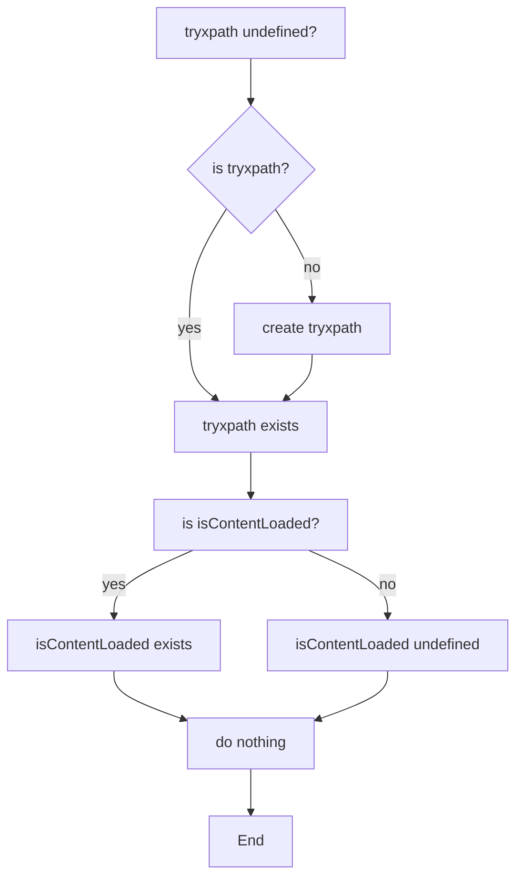

```MD
# Анализ кода try_xpath_check_frame.js

**<input code>**

```javascript
/* This Source Code Form is subject to the terms of the Mozilla Public
 * License, v. 2.0. If a copy of the MPL was not distributed with this
 * file, You can obtain one at http://mozilla.org/MPL/2.0/. */

// namespace
if (!tryxpath) {
    var tryxpath = {};
}

tryxpath.isContentLoaded;
```

**<algorithm>**

Код представляет собой фрагмент JavaScript, определяющий, существует ли переменная `tryxpath.isContentLoaded`.  Поскольку сам код не производит действий, алгоритм состоит из единственного шага:

1. **Проверка существования объекта:** Проверяется, существует ли объект `tryxpath`. Если нет, создается пустой объект `tryxpath`.
2. **Проверка существования свойства:** Проверяется, существует ли свойство `isContentLoaded` объекта `tryxpath`. Если оно существует, ничего не происходит.

В этом фрагменте нет циклов, условных операторов, вызовов функций, которые изменяют состояние.

**Пример:**

Предполагая, что переменная `tryxpath` в глобальном контексте не определена.
1. `if (!tryxpath)` - истина, создается объект `tryxpath`
2. `tryxpath.isContentLoaded` - попытка обратиться к свойству, оно не определено, но не вызывает ошибок.


**<mermaid>**



**<explanation>**

* **Импорты:**  Нет импортов. Код работает в контексте, где предположительно уже доступны необходимые переменные или объекты.
* **Классы:** Нет классов. Код работает с простыми переменными и объектами.
* **Функции:** Нет функций.  Код выполняет только проверку существования объекта и свойства.
* **Переменные:** Переменная `tryxpath` - объект.  `tryxpath.isContentLoaded` – свойство объекта `tryxpath`.  Их тип определяется в контексте выполнения.

**Возможные ошибки или области для улучшений:**

* **Необходимость присвоения значения:** Если переменная `tryxpath.isContentLoaded` используется в другом месте кода, и ожидается, что она содержит какое-то значение, этот код не присваивает ей значение.
* **Неясная цель:** Неясно, зачем именно нужна проверка существования `tryxpath.isContentLoaded` без присвоения значения.  Без дополнительного контекста трудно сказать, нужно ли ее наличие или нет.

**Взаимосвязи с другими частями проекта:**

Этот код – очень маленький фрагмент, который, вероятно, находится в скрипте расширения браузера и взаимодействует с другими скриптами расширения, с помощью механизмов расширения браузера (например, `chrome.tabs` или `chrome.runtime`).  Наличие `tryxpath` подразумевает, что есть какая-то библиотека (или набор функций) с этим названием, которую использует код. Влияние этого кода на остальной проект зависит от роли `tryxpath` в системе. Подробности могут быть видны в других файлах.