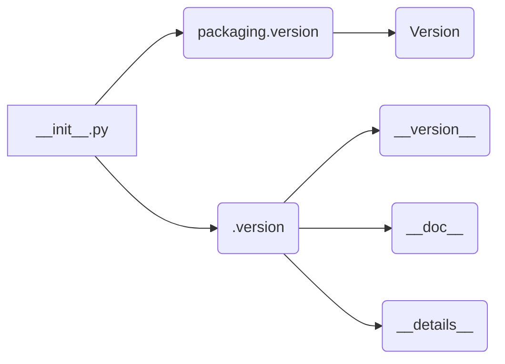

# Анализ файла `hypotez/src/webdriver/edge/_examples/__init__.py`

## <input code>

```python
## \file hypotez/src/webdriver/edge/_examples/__init__.py
# -*- coding: utf-8 -*-\n#! venv/Scripts/python.exe\n#! venv/bin/python/python3.12\n\n"""
.. module: src.webdriver.edge._examples 
	:platform: Windows, Unix
	:synopsis:

"""
MODE = 'dev'

"""
	:platform: Windows, Unix
	:synopsis:

"""


"""
	:platform: Windows, Unix
	:synopsis:

"""


"""
  :platform: Windows, Unix

"""
"""
  :platform: Windows, Unix
  :platform: Windows, Unix
  :synopsis:
"""MODE = 'dev'
  
""" module: src.webdriver.edge._examples """


from packaging.version import Version
from .version import __version__, __doc__, __details__
```

## <algorithm>

Этот файл, `__init__.py`, скорее всего, служит для инициализации модуля `_examples` внутри пакета `webdriver.edge` проекта `hypotez`. Алгоритм работы в данном случае тривиален: файл импортирует необходимую функциональность из другого модуля.

**Шаг 1:** Импорт модуля `Version` из пакета `packaging`.

**Шаг 2:** Импорт переменных `__version__`, `__doc__` и `__details__` из подмодуля `version`.

**Пример:**

В файле `version.py` содержатся данные о версии, документации и прочих метаданных, относящихся к этому подмодулю.


## <mermaid>



**Объяснение диаграммы:**

Модуль `__init__.py` зависит от модуля `packaging.version` и своего подмодуля `.version`. Из `packaging.version` импортируется класс `Version`, а из `.version` - переменные, содержащие метаданные.


## <explanation>

**Импорты:**

- `from packaging.version import Version`: Импортирует класс `Version` из пакета `packaging`. Этот пакет используется для работы с версиями программного обеспечения.  Связь с другими частями проекта: Этот пакет, скорее всего, используется для управления версиями различных компонентов проекта, например, для проверки совместимости.
- `from .version import __version__, __doc__, __details__`: Импортирует переменные `__version__`, `__doc__` и `__details__` из файла `version.py` в текущей директории.  Эти переменные обычно содержат информацию о версии модуля, документацию и прочие метаданные. Связь с другими частями проекта: Этот импорт указывает на наличие файла `version.py` в подпапке `._examples`, который содержит конкретные значения для этих переменных.

**Классы:**

Файл `__init__.py` не определяет классы.


**Функции:**

Файл `__init__.py` не содержит функций.


**Переменные:**

- `MODE = 'dev'`: Строковая переменная, вероятно, определяющая режим работы модуля (например, `dev`, `test`, `prod`).


**Возможные ошибки и улучшения:**

- **Недостаточная документация:**  Документация в начале файла не описывает назначение переменной `MODE`, что может сделать код менее понятным.
- **Потенциально лишние строки:**  Большое количество пустых строк и комментариев, начинающихся с `"""..."""` может быть избыточным и затруднять чтение.  Рекомендуется сконцентрироваться на наиболее важной информации.
- **Отсутствие явного назначения переменных:** Переменные `__version__`, `__doc__`, `__details__` нужны для более широкого контекста.
- **Неизвестный контекст:**  Без дополнительных сведений о проекте трудно оценить целесообразность и структуру файла.

**Цепочка взаимосвязей:**

Файл `__init__.py` зависит от файла `version.py` для получения информации о версии и метаданных.  Цепочка взаимосвязей с другими частями проекта не может быть определена без дополнительного контекста. Файл является частью подпапки `_examples`, которая, возможно, содержит примеры использования `webdriver` для взаимодействия с браузером Edge.