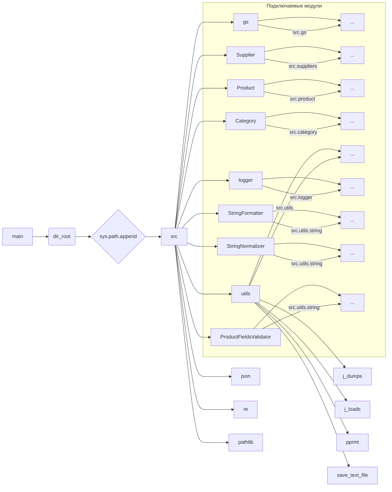

```MD
# <input code>

```python
## \file hypotez/src/webdriver/edge/_examples/header.py
# -*- coding: utf-8 -*-
#! venv/Scripts/python.exe
#! venv/bin/python/python3.12

"""
.. module: src.webdriver.edge._examples 
	:platform: Windows, Unix
	:synopsis:

"""
MODE = 'dev'

"""
	:platform: Windows, Unix
	:synopsis:

"""


"""
	:platform: Windows, Unix
	:synopsis:

"""


"""
  :platform: Windows, Unix

"""
"""
  :platform: Windows, Unix
  :platform: Windows, Unix
  :synopsis:
"""MODE = 'dev'
  
""" module: src.webdriver.edge._examples """


import sys
import os
from pathlib import Path

dir_root : Path = Path (os.getcwd()[:os.getcwd().rfind('hypotez')+11])
sys.path.append (str (dir_root) )  # Добавляю корневую папку в sys.path
dir_src = Path (dir_root, 'src')
sys.path.append (str (dir_root) ) 
...

print(dir_root)
# ----------------
from pathlib import Path
import json
import re
# ----------------

from src import gs
from src.suppliers import Supplier
from src.product import Product, ProductFields, ProductFieldsLocators
from src.category import Category
from src.utils import j_dumps, j_loads,   pprint, save_text_file
from src.logger import logger
from src.utils.string import StringFormatter, StringNormalizer, ProductFieldsValidator
...
```

# <algorithm>

Невозможно построить блок-схему, так как код прерван многоточием (`...`).  Блок-схема для этой части кода должна бы отображать:

1. **Получение корневого каталога (`dir_root`):** Определяется текущий рабочий каталог (`os.getcwd()`) и из него извлекается путь до директории `hypotez`.
2. **Добавление корневого каталога в `sys.path`:** Это позволяет Python импортировать модули из каталога `src`, который находится в корневом каталоге проекта.
3. **Импорты:**  Импортируются различные модули из различных подкаталогов, таких как `src.suppliers`, `src.product`, `src.utils` и т.д.
4. **Печать `dir_root`:** Выводится путь к корневой директории.


# <mermaid>



**Объяснение к диаграмме:**

Диаграмма показывает, как различные модули (из `src` и `src.utils`) импортируются и используются в скрипте `header.py`.  Справа от стрелок указаны импортированные модули из соответствующих директорий `src`, а внутри подключаемых модулей - обозначения отсутствующих частей кода (`...`).  Главная функция `main` вызывает функцию определения `dir_root` и далее выполняет импорт необходимых модулей.

# <explanation>

**Импорты:**

- `sys`, `os`, `pathlib`: Стандартные модули Python, используемые для работы с системой (текущий каталог, пути, добавление в `sys.path`).
- `json`, `re`: Модули для работы с JSON и регулярными выражениями, вероятно, необходимы для работы с данными.
- `pathlib`: Модуль для работы с путями в файловой системе, используется для безопасной и читаемой работы с файлами.
- `gs`, `Supplier`, `Product`, `ProductFields`, `ProductFieldsLocators`, `Category`, `j_dumps`, `j_loads`, `pprint`, `save_text_file`, `logger`, `StringFormatter`, `StringNormalizer`, `ProductFieldsValidator`:  Это модули из пакета `src`.  Связь с другими частями проекта: `src` является основным пакетом проекта,  `src.utils` содержит утилиты для работы с данными, `src.suppliers`, `src.product`, `src.category` содержат классы и данные, связанные с поставщиками, товарами и категориями.  Использование таких импортов указывает на то, что код связан с обработкой данных о товарах, поставщиках и категориях.

**Классы:**

- `Supplier`, `Product`, `Category`, `StringFormatter`, `StringNormalizer`, `ProductFieldsValidator`: Вероятно, представляют сущности из предметной области (поставщики, товары, категории и утилиты для форматирования/валидации).

**Функции:**

Код содержит определения функций (неполные из-за многоточия), которые обрабатывают данные.

**Переменные:**

- `dir_root`: Путь к корневому каталогу проекта.
- `MODE`: Строковая переменная, вероятно, определяющая режим работы (например, 'dev', 'prod').

**Возможные ошибки/улучшения:**

- Многоточие (`...`) в коде затрудняет понимание его функциональности.  Необходимо продолжение кода.
- Не хватает описания обработки `dir_root`.
- Отсутствуют вызовы функций и методы классов, что делает сложность анализа.
- Не указаны конкретные действия с импортированными классами, функциями и переменными.


**Цепочка взаимосвязей:**

Код импортирует и использует классы и функции из пакета `src`, что указывает на его интеграцию с другими частями проекта. Подробные детали взаимодействия (например, как конкретные данные передаются между функциями) не могут быть определены без полного кода.