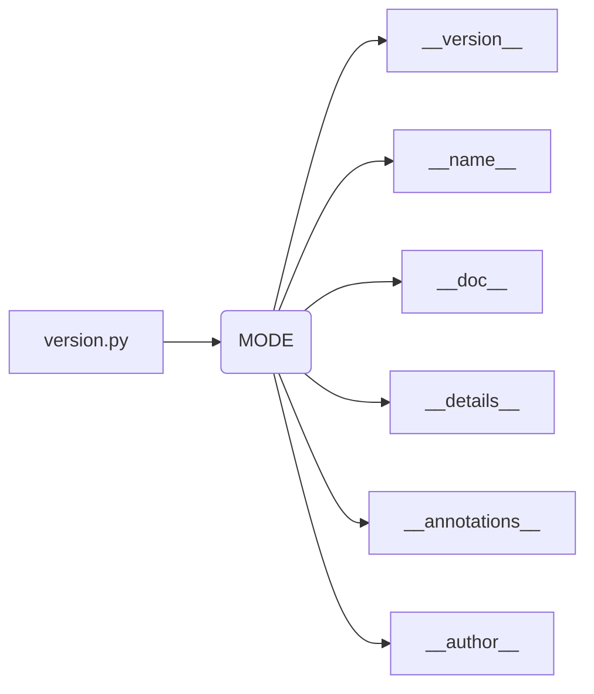

# <input code>

```python
## \file hypotez/src/webdriver/edge/_examples/version.py
# -*- coding: utf-8 -*-\n#! venv/Scripts/python.exe
#! venv/bin/python/python3.12

"""
.. module: src.webdriver.edge._examples 
	:platform: Windows, Unix
	:synopsis:

"""
MODE = 'dev'

"""
	:platform: Windows, Unix
	:synopsis:

"""


"""
	:platform: Windows, Unix
	:synopsis:

"""


"""
  :platform: Windows, Unix

"""
"""
  :platform: Windows, Unix
  :platform: Windows, Unix
  :synopsis:
"""MODE = 'dev'
  
""" module: src.webdriver.edge._examples """


"""
- `__version__`: This variable holds the version of the module or package.
- `__name__`: Contains the name of the module. If the script is being run directly, the value will be `"__main__"`.
- `__doc__`: The module's documentation string.
- `__details__`: This variable likely contains additional details about the module, but the exact purpose depends on the specific module or package.
- `__annotations__`: Contains type annotations for variables and functions in the module.
- `__author__`: The name(s) of the author(s) of the module.
"""
__name__:str
__version__="3.12.0.0.0.4"
__doc__:str
__details__:str="Details about version for module or class"
__annotations__

__author__='hypotez '
```

# <algorithm>

Этот код не содержит алгоритма в традиционном смысле, т.к. он не выполняет вычислений или обработки данных. Он определяет константы, строки документации и метаданные для модуля.  Поток данных отсутствует, так как нет функций, вызывающих другие функции.

# <mermaid>



# <explanation>

Этот файл `version.py` определяет метаданные для модуля `src.webdriver.edge._examples`.  Он не выполняет какую-либо функциональность, а просто описывает сам модуль.

**Импорты:**  В файле нет импортированных библиотек.  В данном случае, импорты не требуются, так как файл определяет константы и метаданные.

**Классы:**  Нет классов.

**Функции:** Нет функций.

**Переменные:**
* `MODE`: Строковая переменная, хранящая значение 'dev'.  Вероятно используется для определения режима работы (например, разработки или производства).
* `__version__`: Строковая переменная, хранящая версию модуля (3.12.0.0.0.4).
* `__name__`: Строковая переменная, хранящая имя модуля.  Во время выполнения скрипта, эта переменная будет содержать `"__main__"`.
* `__doc__`: Строковая переменная, хранящая строку документации для модуля.
* `__details__`: Строковая переменная, хранящая дополнительные детали о версии модуля.
* `__annotations__`: Переменная, которая потенциально содержит аннотации типов.
* `__author__`: Строковая переменная, хранящая имя автора.

**Возможные ошибки и улучшения:**

* **Недостаточная документация:** Хотя в файле есть строки документации (`"""Docstring"""`), их качество можно улучшить. Необходимо добавить более подробные и информативные пояснения о назначении переменных, например, `MODE`.
* **Неявные типы данных:** Хотя используются аннотации типов, они не используются в полной мере. В коде используются только комментарии для описания типов. 


**Взаимосвязи с другими частями проекта:**

Этот файл `version.py` является частью пакета `src.webdriver.edge._examples`.  Другие части проекта (модули или файлы) могут использовать `__version__`, например, для контроля версий или для отображения информации о модуле в пользовательском интерфейсе.  Связь - это использование информации из `version.py` другими частями проекта.  Отсутствуют прямые вызовы или взаимодействия с другими модулями.