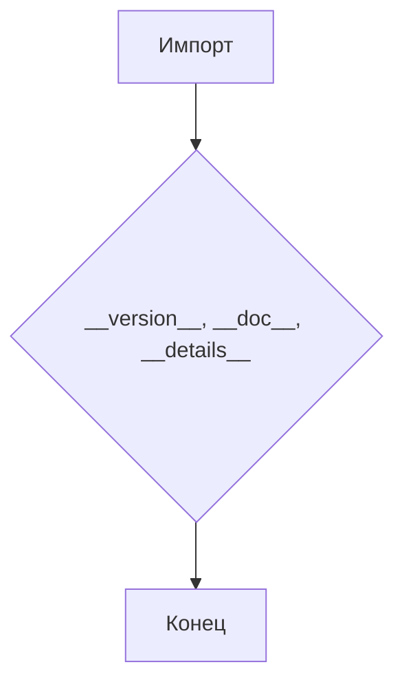
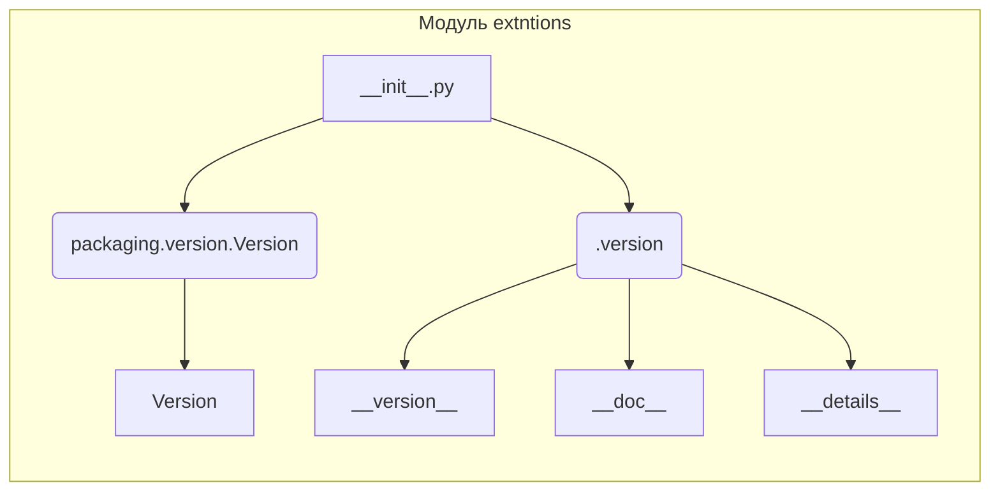

```MD
# Анализ файла hypotez/src/webdriver/edge/extentions/__init__.py

**1. <input code>**

```python
## \file hypotez/src/webdriver/edge/extentions/__init__.py
# -*- coding: utf-8 -*-
#! venv/Scripts/python.exe
#! venv/bin/python/python3.12

"""
.. module: src.webdriver.edge.extentions 
	:platform: Windows, Unix
	:synopsis:

"""
MODE = 'dev'

"""
	:platform: Windows, Unix
	:synopsis:

"""


"""
	:platform: Windows, Unix
	:synopsis:

"""


"""
  :platform: Windows, Unix

"""
"""
  :platform: Windows, Unix
  :platform: Windows, Unix
  :synopsis:
"""MODE = 'dev'
  
""" module: src.webdriver.edge.extentions """


from packaging.version import Version
from .version import __version__, __doc__, __details__
```

**2. <algorithm>**

Файл `__init__.py`  — это модуль инициализации.  Он не содержит существенного алгоритма в виде циклов или сложных вычислений. Он выполняет лишь импорт функций и переменных.  Блок-схема в данном случае тривиальна:



Пример:
При запуске кода, который импортирует этот модуль, Python выполнит импорт из подмодуля `version.py`.

**3. <mermaid>**



**4. <explanation>**

* **Импорты:**
    * `from packaging.version import Version`: Импортирует класс `Version` из пакета `packaging`. Этот пакет, вероятно, используется для работы с версиями, предоставляя структурированный способ представления и сравнения версий программного обеспечения.  Связь с `src` - косвенная, пакет `packaging` - это внешний модуль, не являющийся частью проекта `hypotez`.
    * `from .version import __version__, __doc__, __details__`: Импортирует переменные `__version__`, `__doc__`, `__details__` из подмодуля `version.py` в том же каталоге. Это стандартный способ определения метаданных модуля, таких как версия, документация, и дополнительные сведения.  Связь с `src` - прямая, файлы `__init__.py` и `version.py` находятся в одном каталоге.


* **Классы:** В коде нет определенных классов.

* **Функции:** Нет функций.

* **Переменные:**
    * `MODE = 'dev'`: Строковая константа, вероятно, используемая для указания режима работы (например, разработки `dev`, производства `prod`).
    * `__version__`, `__doc__`, `__details__`: Переменные из модуля `version.py`, содержащие информацию о модуле.

* **Возможные ошибки или области для улучшений:**

    * **Недостаточная документация:**  Комментарии `"""..."""` в коде не содержат существенной информации.  Необходимо дополнить комментарии более подробными описаниями.
    * **Дублирование:** Переменная `MODE` объявлена дважды. Это потенциальная ошибка, если ожидается что `MODE` имеет значение.  Нужно удалить одно из определений.


* **Цепочка взаимосвязей с другими частями проекта:** Файл `__init__.py` играет роль точк вхождения в модуль `extentions`.  Он импортирует необходимые данные из  `version.py`.  Дальнейшее использование этих данных предполагается в других частях проекта `hypotez`, но  эти детали не видны в представленном фрагменте кода.