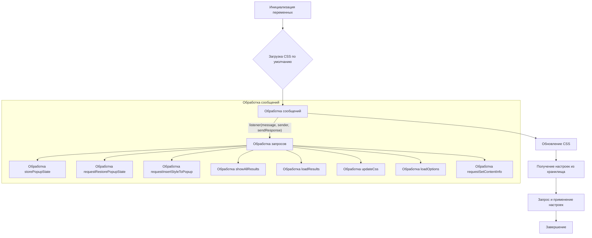

# Анализ кода try_xpath_background.js

## <input code>

```javascript
/* This Source Code Form is subject to the terms of the Mozilla Public
 * License, v. 2.0. If a copy of the MPL was not distributed with this
 * file, You can obtain one at http://mozilla.org/MPL/2.0/. */

(function (window, undefined) {
    "use strict";

    // alias
    var tx = tryxpath;
    var fu = tryxpath.functions;

    var popupState = null;
    var popupCss = "body{width:367px;height:auto;}";
    var results = {};
    var css = "";
    var attributes = {
        "element": "data-tryxpath-element",
        "context": "data-tryxpath-context",
        "focused": "data-tryxpath-focused",
        "focusedAncestor": "data-tryxpath-focused-ancestor",
        "frame": "data-tryxpath-frame",
        "frameAncestor": "data-tryxpath-frame-ancestor"
    };

    function loadDefaultCss() {
        return new Promise((resolve, reject) => {
            var req = new XMLHttpRequest();
            req.open("GET",
                     browser.runtime.getURL("/css/try_xpath_insert.css"));
            req.responseType = "text";
            req.onreadystatechange = function () {
                if (req.readyState === XMLHttpRequest.DONE) {
                    resolve(req.responseText);
                }
            };
            req.send();
        });
    }

    // ... (остальной код)
```

## <algorithm>

**Блок-схема**



**Пошаговое описание:**

1. **Инициализация:**  Определяются переменные `popupState`, `popupCss`, `results`, `css`, `attributes`.
2. **Загрузка CSS по умолчанию:** Вызывается функция `loadDefaultCss()`, которая загружает CSS из файла `/css/try_xpath_insert.css` с помощью `XMLHttpRequest`.  Результат (текст CSS) передается в цепочку промисов.
3. **Обработка сообщений:** Функция `genericListener` обрабатывает сообщения из других частей расширения или вкладок.
4. **Обновление CSS:** Обработка сообщений, связанных с изменением CSS, включает удаление старого CSS и добавление нового. Используется `browser.tabs.removeCSS` и `browser.tabs.insertCSS`.
5. **Получение настроек:** Функция `browser.storage.sync.get` загружает настройки из хранилища, включая `attributes`, `css`, `popupCss`.
6. **Запрос и применение настроек:** Если загруженный `css` — это null, то загружается CSS по умолчанию, в противном случае, загруженный CSS применяется.
7. **Завершение:** Выполнение основного скрипта завершается.

## <mermaid>

```mermaid
graph LR
    A[try_xpath_background.js] --> B(browser.runtime.onMessage);
    B --> C{genericListener};
    C -- message.event = storePopupState --> D[storePopupState];
    C -- message.event = requestRestorePopupState --> E[requestRestorePopupState];
    C -- message.event = requestInsertStyleToPopup --> F[requestInsertStyleToPopup];
    C -- message.event = showAllResults --> G[showAllResults];
    C -- message.event = loadResults --> H[loadResults];
    C -- message.event = updateCss --> I[updateCss];
    C -- message.event = loadOptions --> J[loadOptions];
    C -- message.event = requestSetContentInfo --> K[requestSetContentInfo];
    D --> L(popupState = message.state);
    E --> M(browser.runtime.sendMessage);
    F --> N(browser.runtime.sendMessage);
    G --> O(results = message; browser.tabs.create);
    H --> P(sendResponse(results));
    I --> Q(browser.storage.onChanged);
    Q --> R(attributes, css, popupCss);
    I --> S(browser.storage.sync.get);
    S --> T(loadDefaultCss);
    T --> U(css = loadedCss);
    S --> V(attributes, css, popupCss);

    subgraph Хранилище настроек
        R --> W(attributes = changes.attributes.newValue);
        R --> X(css = changes.css.newValue);
        R --> Y(popupCss = changes.popupCss.newValue);
    end


    subgraph Загрузка CSS
        T --> Z[XMLHttpRequest];
        Z --> AA(req.responseText);
    end
```


## <explanation>

**Импорты:**

Нет прямых импортов из других модулей в коде (в этом виде). `tx` и `fu` — это скорее всего алиасы, определённые в другом месте кода, вероятно, в `tryxpath` модуле, который предоставляет функции.

**Классы:**

Нет явных определений классов.

**Функции:**

* **`loadDefaultCss()`:**  Загружает CSS из файла `/css/try_xpath_insert.css` с помощью `XMLHttpRequest` и возвращает его в виде промиса.  Это асинхронная операция, необходимая для загрузки внешнего ресурса.

* **`genericListener`:** Обработчик сообщений, принимающий `message`, `sender`, и `sendResponse` в качестве аргументов. Использует объект `genericListener.listeners` для поиска и вызова соответствующих функций-обработчиков, связанных с типами событий.

* **`genericListener.listeners.*`:**  Коллекция функций-обработчиков для разных типов сообщений. Например, `storePopupState` сохраняет состояние всплывающего окна, `updateCss` управляет обновлением CSS стилей, а `loadResults` возвращает результаты поиска.  Они взаимодействуют с API `browser.runtime` и `browser.tabs` для отправки и получения сообщений, а также для управления стилями и содержимым вкладок.

**Переменные:**

* `popupState`: Сохраняет состояние всплывающего окна.
* `popupCss`: Строка CSS стилей для всплывающего окна.
* `results`: Объект, содержащий результаты поиска.
* `css`: Строка CSS стилей для вкладки.
* `attributes`: Объект, содержащий атрибуты элементов.

**Возможные ошибки и улучшения:**

* **Обработка ошибок:**  Используется `.catch(fu.onError)`, но не понятно, что делает `fu.onError`.  Следует добавить более подробную обработку ошибок (`try...catch`) для всех асинхронных операций, чтобы предотвратить падение расширения.

* **Ясность кода:**  Использование алиасов (`tx`, `fu`) может улучшить читаемость, но следует добавить комментарии к их значению, если они не очевидны.


**Взаимосвязи с другими частями проекта:**

Этот код является частью расширения `tryxpath`, которое вероятно взаимодействует с другими частями (например, с `content`-скриптом, или страницами отображения результатов (`show_all_results.html`)) для поиска, отображения и сохранения результатов. API `browser.runtime` и `browser.tabs` — это ключевые компоненты связи с другими частями расширения, а `browser.storage` — для сохранения настроек.  Подключение внешних файлов (css) очевидно.