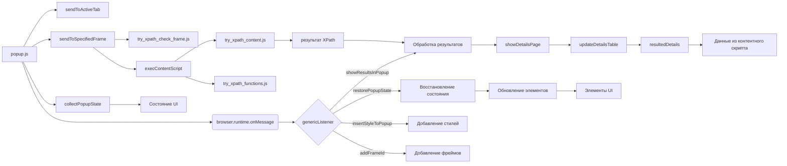

# Анализ кода popup.js

## <input code>

```javascript
/* ... (Комментарии) ... */

(function (window) {
    // ... (Остальной код) ...
});
```

## <algorithm>

Этот код представляет собой JavaScript-код, вероятно, для расширения браузера.  Он управляет пользовательским интерфейсом всплывающего окна, взаимодействует с активной вкладкой браузера и обрабатывает сообщения, получаемые от контентного скрипта.  Пошаговый алгоритм:

1. **Инициализация:**
    * Код определяет константы и переменные, представляющие состояния и данные.
    * Находит элементы HTML в всплывающем окне.
    * Добавляет обработчики событий для элементов управления.
2. **Обработка сообщений:**
    * Функция `genericListener` слушает сообщения от контентного скрипта.
    * При получении сообщения определенного типа (например, `showResultsInPopup`) выполняет действия, соответствующие этому типу.  В частности, обновляет данные в интерфейсе, показывает результаты в таблице.
3. **Собирание состояния:**
    * Функция `collectPopupState` собирает текущее состояние элементов управления в всплывающем окне.
    * Полученные данные сохраняются в объекте.
4. **Изменение видимости:**
    * Несколько функций (`changeContextVisible`, `changeResolverVisible` и т.д.) скрывают или показывают части пользовательского интерфейса в зависимости от состояния соответствующих чекбоксов.
5. **Создание сообщения для выполнения:**
    * Функция `makeExecuteMessage` собирает данные из элементов управления пользователем для отправки в контентный скрипт.  Она собирает выражения XPath, методы, типы данных и фрейм для выполнения.
6. **Отправка сообщения в активную вкладку:**
    * Функция `sendToActiveTab` отправляет сообщение в активную вкладку браузера.
7. **Выполнение контентного скрипта:**
    * Функция `execContentScript` выполняет контентный скрипт для подготовки к выполнению XPath выражения.
8. **Обработка результатов:**
    * Обработка результатов из контентного скрипта, обновление таблиц в popup.
9. **Отображение результатов:**
    * Функция `showDetailsPage` отображает результаты в таблице, используя данные `resultedDetails` с пагинацией.
10. **Обработка ошибок:**
    * Функция `showError` отображает ошибки в пользовательском интерфейсе.


## <mermaid>



## <explanation>

**Импорты:**

Кода `tryxpath` и `tryxpath.functions`, как и многих других функций и переменных в коде, нет явных импортов. Вероятно, они импортируются из других файлов или модулей, входящих в состав расширения.

**Классы:**

Нет явных классов. Код использует функции для обработки различных задач.

**Функции:**

* `sendToActiveTab`, `sendToSpecifiedFrame`, `execContentScript`: Отправляют запросы или выполняют скрипты в активной вкладке или указанном фрейме.
* `collectPopupState`: Собирает текущее состояние всплывающего окна.
* `changeContextVisible`, `changeResolverVisible`, `changeFrameIdVisible`: Изменяют видимость элементов интерфейса.
* `makeExecuteMessage`: Формирует сообщение для выполнения запросов XPath.
* `getSpecifiedFrameId`: Получает ID указанного фрейма.
* `showDetailsPage`: Отображает результаты XPath в таблице.
* `showError`: Отображает сообщения об ошибках.
* `genericListener`: Обработчик сообщений из контентного скрипта.
    * `genericListener.listeners`: Словарь для хранения обработчиков различных типов событий.  Важная особенность: расширение получает сообщения о новых типах событий через `browser.runtime.onMessage` и добавляет их в `genericListener.listeners`.

**Переменные:**

Переменные хранят состояния, данные и ссылки на элементы HTML.  Например, `resultedDetails` хранит результаты выполнения XPath, `relatedTabId` - идентификатор активной вкладки, `detailsPageSize` размер пагинации результатов.

**Возможные ошибки и улучшения:**

* **Обработка ошибок:** Хотя есть обработка ошибок (`catch(e)`), необходимо более тщательно проверять возвращаемые значения и типы данных.
* **Многократные `.then`:** Цепочки `.then` могут стать громоздкими.  Можно рассмотреть альтернативные способы объединения асинхронных операций.
* **Условные проверки:**  Некоторые условные проверки (`if (resol = ...)` и т.д.) могут быть упрощены, используя логические операторы.
* **Использование `try...catch`:** Вместо `catch(e => { ... })` можно использовать более конкретные виды исключений, например `catch(e => {if(e instanceof Error){...}})` для более точной диагностики ошибок.
* **Комментарии:** Добавление более подробных комментариев к функциям, блокам кода и переменным существенно повысит читаемость и поддерживаемость кода, особенно для функций обработчиков событий.

**Взаимосвязи с другими частями проекта:**

Код взаимодействует с контентными скриптами (`try_xpath_check_frame.js`, `try_xpath_functions.js`, `try_xpath_content.js`), которые выполняют запросы XPath на странице и возвращают результаты в виде данных `resultedDetails`.  Код использует API браузера для взаимодействия с вкладками и фреймами.  Обработка сообщений и `browser.runtime` показывает связь с другими частями расширения.  Также код зависит от функции `fu.updateDetailsTable` из какого-то другого модуля (`fu` предполагает функцию из внешней библиотеки).