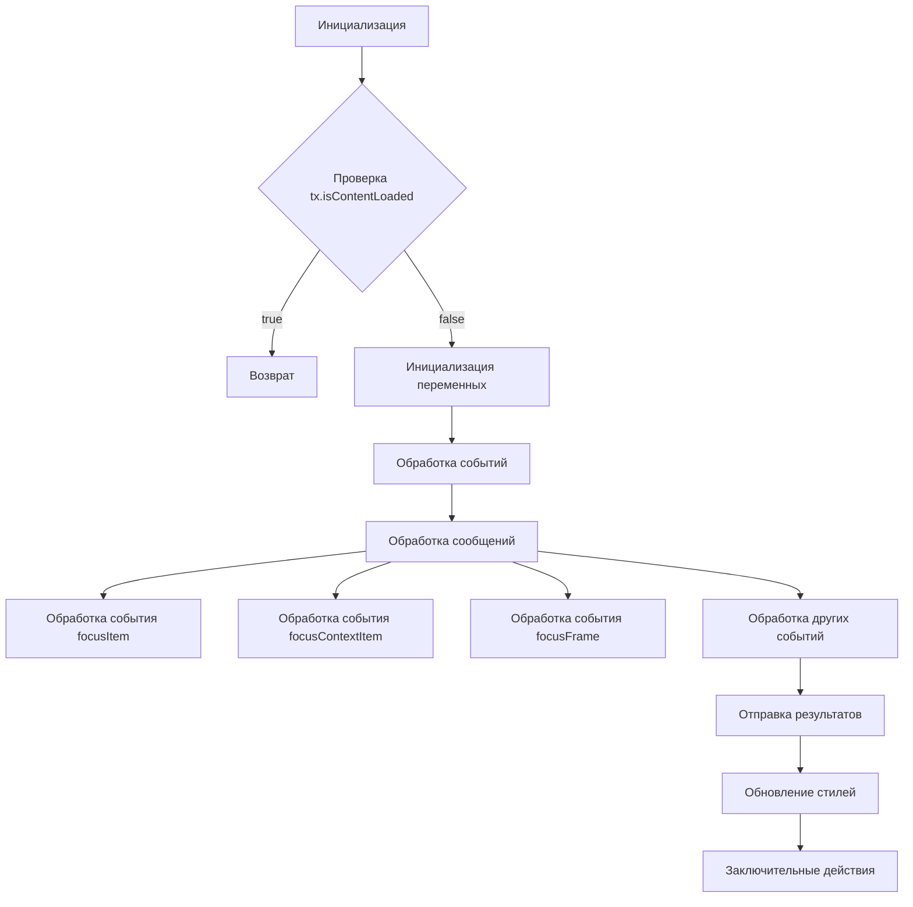

# Анализ кода try_xpath_content.js

```javascript
/* This Source Code Form is subject to the terms of the Mozilla Public
 * License, v. 2.0. If a copy of the MPL was not distributed with this
 * file, You can obtain one at http://mozilla.org/MPL/2.0/. */

(function (window, undefined) {
    "use strict";

    // alias
    var tx = tryxpath;
    var fu = tryxpath.functions;

    // prevent multiple execution
    if (tx.isContentLoaded) {
        return;
    }
    tx.isContentLoaded = true;

    // ... (остальной код)
});
```

## <algorithm>

**Блок-схема:**



**Примеры:**

* **A[Инициализация]:**  `tx = tryxpath; fu = tryxpath.functions;` -  получаются ссылки на объекты tryxpath и его функции.
* **D[Инициализация переменных]:**  Инициализируются переменные, например, `contextItem`, `currentItems`,  для хранения данных об элементах.
* **E[Обработка событий]:** Происходит прослушивание сообщений от сторонних источников (например, от вкладки браузера).
* **F[Обработка сообщений]:** Если получено сообщение "tryxpath-focus-frame", выполняется поиск элемента по указанному индексу.
* **G/H/I[Обработка событий]:** Эти блоки обрабатывают запросы на фокусировку элементов, контекста и фреймов соответственно, обновляя  соответствующие атрибуты.
* **K[Отправка результатов]:** Если обработка выполняется успешно, отправляются результаты в popup браузера.
* **L[Обновление стилей]:**  Обновляются стили, если необходимо.


## <mermaid>

```mermaid
graph LR
    subgraph tryxpath
        tx[tryxpath] --> fu(tryxpath.functions);
    end
    tx -->  browser.runtime[runtime API];
    tx --> window[window object];
    window --> document[document object];
    fu --> originalAttributes[Map];
    fu --> currentItems[Array];
    fu --> contextItem[object];
    browser.runtime --> GenericListener[genericListener];

    subgraph window events
        window --> messageEvent[message event listener];
        messageEvent --> event(data)[Event data];
        event(data) --> tryxpath
    end
    tryxpath --> browser.storage[storage API]
```

**Объяснение к диаграмме:**

* `tryxpath` и `tryxpath.functions` — собственные модули скрипта.
* `browser.runtime`, `browser.storage` — API браузера для взаимодействия с расширением и хранилищем данных.
* `window` — объект текущего окна браузера, через него происходят взаимодействия с DOM.
* `messageEvent` — обработчик сообщений.


## <explanation>

**Импорты:**


* Нет явных импортов из внешних модулей, но `tryxpath` и `tryxpath.functions` предполагают существование внешнего модуля, предоставляющего эти объекты и связанные с ними функции. Вероятно, это внутренние части расширения браузера.

**Классы:**


* Нет явных классов, используются функции и объекты.

**Функции:**


* `setAttr`, `setIndex`: Устанавливают атрибуты элементам.
* `focusItem`: Фокусирует элемент.
* `setMainAttrs`: Устанавливает основные атрибуты, связанные с текущим контекстом.
* `restoreAttrs`: Восстанавливает исходные атрибуты элементов.
* `resetPrev`: Сбрасывает состояние выполнения.
* `handleCssChange`: Обрабатывает изменения CSS.
* `getFrames`, `parseFrameDesignation`, `traceBlankWindows`: Работают с фреймами.
* `findFrameByMessage`: Ищет элемент внутри фрейма.
* `setFocusFrameListener`: Устанавливает слушатель сообщений для обработки фокуса на фреймах.
* `initBlankWindow`: Инициализирует работу расширения в пустых окнах.
* `findStyleParent`, `updateStyleElement`, `updateAllStyleElements`, `removeStyleElement`, `removeAllStyleElements`:  Работают с стилями.
* `createResultMessage`: Создаёт сообщение об ошибке.
* `genericListener`: Центральный обработчик всех сообщений, принимает сообщения, и вызывает соответствующую обработку.
* `genericListener.listeners`: Объект, содержащий функции-обработчики для различных событий. (Например, `execute`, `focusItem`)
* Многие функции принимают данные `message` или `event`, содержащие информацию об операции, которую нужно выполнить.

**Переменные:**


* `tx`, `fu`: Ссылки на объекты `tryxpath` и `tryxpath.functions`.
* `attributes`:  Объект, содержащий имена атрибутов.
* `prevMsg`, `executionCount`, `inBlankWindow`, `currentDocument`, `contextItem`, `currentItems`, `focusedItem`, `focusedAncestorItems`, `currentCss`, `insertedStyleElements`, `expiredCssSet`, `originalAttributes`:  Переменные для хранения информации о текущем состоянии выполнения и контекста.
* `dummyItem`, `dummyItems`:  Пустые значения для инициализации переменных.
* `invalidExecutionId`: Некорректное значение для `executionId` (NaN).

**Возможные ошибки и улучшения:**


* **Проверка входных данных:** Не все функции корректно проверяют корректность входных данных. Например,  `traceBlankWindows` должна проверять, что `desi` - массив чисел.
* **Обработка ошибок:**  В отдельных местах отсутствует надежная обработка исключений, что может привести к краху скрипта. Обработка ошибок в `try...catch`  улучшит устойчивость.
* **Избыточность кода:** Некоторый код (например, проверка `currentCss === null`) может быть оптимизирован.
* **Использование констант:**  Использование констант вместо магических чисел улучшит читаемость и позволит легче модифицировать код.
* **Документация:** Недостаточная документация затрудняет понимание отдельных функций и классов.

**Взаимосвязи с другими частями проекта:**

Код взаимодействует с другим кодом расширения браузера через `browser.runtime.sendMessage` и `addEventListener` на объекте `window`. Он использует функции, которые, вероятно, определены в других файлах расширения (`tryxpath`, `tryxpath.functions`).


**Заключение:**

Код представляет собой сложную систему обработки запросов, фокусировки элементов и управления стилями в контексте расширения браузера. Он эффективно взаимодействует с другими частями проекта, используя API браузера.  Для повышения качества необходимо добавить проверки входящих данных,  улучшить обработку исключений, и документировать код.