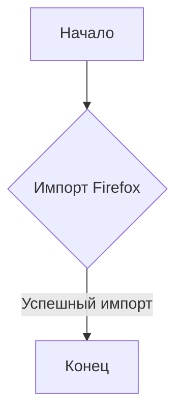
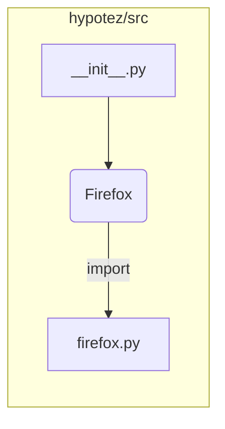

# <input code>

```python
## \file hypotez/src/webdriver/firefox/__init__.py
# -*- coding: utf-8 -*-
#! venv/Scripts/python.exe
#! venv/bin/python/python3.12

"""
.. module: src.webdriver.firefox 
	:platform: Windows, Unix
	:synopsis:

"""
MODE = 'dev'


from .firefox import Firefox
```

# <algorithm>

Алгоритм работы представленного кода крайне прост. Он импортирует модуль `Firefox` из подпапки `firefox` текущего каталога.  Этот импорт делает функции и классы из файла `firefox.py` доступными в текущем файле.  

**Шаг 1:**  Импорт модуля `Firefox`.  
*Пример:*  Если в `firefox.py` определен класс `Firefox` и метод `start_browser`, то после импорта `Firefox.start_browser()` станет доступен.

**Пошаговая блок-схема:**



# <mermaid>



**Объяснение диаграммы:**

* `hypotez/src/__init__.py` импортирует класс `Firefox` из `firefox.py`.  Это базовая структура импорта. 
* Нет дополнительных зависимостей за пределами указанных файлов.


# <explanation>

* **Импорты:**  `from .firefox import Firefox` —  импортирует класс `Firefox` из модуля `firefox.py`, который находится в той же директории (`./firefox`). Значок `.` перед `firefox` означает текущую папку (`src/webdriver/firefox`).  Это стандартный способ импорта модулей внутри проекта.  Подразумевается, что в файле `firefox.py` определен класс `Firefox`.
* **Классы:**  `Firefox` —  это  класс, который, скорее всего, отвечает за взаимодействие с браузером Firefox. Без просмотра `firefox.py` определить точные его атрибуты и методы невозможно.
* **Функции:**  Нет явных функций в файле `__init__.py`.  Вся функциональность содержится в классе `Firefox`.
* **Переменные:** `MODE = 'dev'` — строковая переменная, вероятно, определяющая режим работы (разработка, производство). Она может использоваться для настройки других параметров в последующих частях кода.
* **Возможные ошибки и улучшения:**  
    * **Отсутствие документации:** Необходимо добавить более подробную документацию к коду, включая описание параметров, возвращаемых значений и предполагаемого поведения класса `Firefox`.
    * **Проверка ошибок:**  При взаимодействии с внешними ресурсами (в данном случае браузером), необходимо добавить обработку возможных ошибок (например, исключений) для повышения надежности работы.
    * **Конкретизация класса `Firefox`:** Необходимо просмотреть файл `firefox.py` для лучшего понимания функциональности.


**Цепочка взаимосвязей:**

Этот `__init__.py` файл служит для экспорта возможностей модуля `firefox` в более широкую область приложения `hypotez`. Следующие файлы могут импортировать `src.webdriver.firefox.Firefox` для работы с браузером Firefox.


**Заключение:**

Файл `__init__.py` — это точка входа для модуля `firefox`, который отвечает за управление веб-драйвером Firefox.  Для более глубокого анализа необходимо изучить `firefox.py`.