# <input code>

```python
## \file hypotez/src/webdriver/firefox/_examples/__init__.py
# -*- coding: utf-8 -*-
#! venv/Scripts/python.exe
#! venv/bin/python/python3.12

"""
.. module: src.webdriver.firefox._examples 
	:platform: Windows, Unix
	:synopsis:

"""
MODE = 'dev'

"""
	:platform: Windows, Unix
	:synopsis:

"""


"""
	:platform: Windows, Unix
	:synopsis:

"""


"""
  :platform: Windows, Unix

"""
"""
  :platform: Windows, Unix
  :platform: Windows, Unix
  :synopsis:
"""MODE = 'dev'
  
""" module: src.webdriver.firefox._examples """


""" Firefox examples """


from packaging.version import Version
from .version import __version__, __doc__, __details__
```

# <algorithm>

Этот код представляет собой модуль `__init__.py` для пакета `_examples` внутри пакета `firefox` в модуле `webdriver`.  Алгоритм работы в данном случае тривиален. Он не содержит функций, изменяющих состояние или обрабатывающих данные, вместо этого он определяет константу `MODE` со значением 'dev'.  Этот модуль скорее всего служит для организации примеров, связанных с Firefox webdriver, и не содержит логики, управляющей поведением программы.  

**Блок-схема:**


**Примеры данных:**

* Входные данные: Нет данных, принимаемых извне
* Выходные данные: Значение константы `MODE` ('dev')

```mermaid
graph LR
    subgraph Модуль __init__.py
        A[MODE = 'dev']
    end
    subgraph Пакет _examples
        B[__init__.py] --> A
    end
    subgraph Пакет firefox
        C[__init__.py] --> B
    end
    subgraph Пакет webdriver
        D[__init__.py] --> C
    end
    subgraph Пакет src
        E[__init__.py] --> D
    end
    subgraph Модуль packaging
        F[Version]
    end
    subgraph Модуль .version
        G[__version__]
        H[__doc__]
        I[__details__]
    end
    B --> F
    B --> G
    B --> H
    B --> I
```

# <mermaid>



# <explanation>

**Импорты:**

* `from packaging.version import Version`: Импортирует класс `Version` из пакета `packaging`. Этот пакет, скорее всего, используется для работы с версиями пакетов.  Связь с `src`:  Используется для работы с версиями, вероятно, для проверки версии Firefox webdriver.  Связь с другими частями проекта:  Для управления версиями пакетов.
* `from .version import __version__, __doc__, __details__`: Импортирует атрибуты `__version__`, `__doc__` и `__details__` из модуля `version` в том же подкаталоге (`./version`). Эти атрибуты скорее всего содержат информацию о версии, документацию и другие детали модуля. Связь с другими частями проекта:  Этот модуль (`version`) должен хранить информацию о версии и других деталях, связанных с компонентами, предоставляемыми этим модулем.

**Классы:**

В данном коде нет классов.

**Функции:**

В коде нет функций.

**Переменные:**

* `MODE = 'dev'`: Строковая переменная, хранящая константу, которая скорее всего используется для определения режима работы. Возможно, в других частях проекта используются разные значения `MODE`, чтобы получить различное поведение (например, для отладки или для реальной работы).


**Возможные ошибки или области для улучшений:**

* Нет обработки исключений: Код не содержит `try...except` блоков для обработки потенциальных ошибок.  Это может быть важно, если вызов `Version` или других импортируемых функций может привести к исключениям.
* Неочевидное использование: Константные строки MODE без комментариев не очень информативны. Должно быть более подробное описание, почему `MODE` используется и какие значения она может принимать.
* Некритичное использование импорта `Version`:  Если `__version__`, `__doc__` и `__details__` не используются, то импорт `packaging` не имеет практического значения.
* Недостаточная документация: Несмотря на документационные строки, подробности использования `MODE` не достаточно ясны.


**Цепочка взаимосвязей с другими частями проекта:**

Этот модуль скорее всего используется для работы с Firefox webdriver.  Вероятнее всего, `_examples` содержит примеры использования webdriver, а `src.webdriver.firefox` содержит основной код.  Определение константы `MODE` может иметь отношение к различным сценариям использования (разные режимы работы).  Более полное понимание взаимосвязей требует анализа других файлов в проекте `hypotez`.