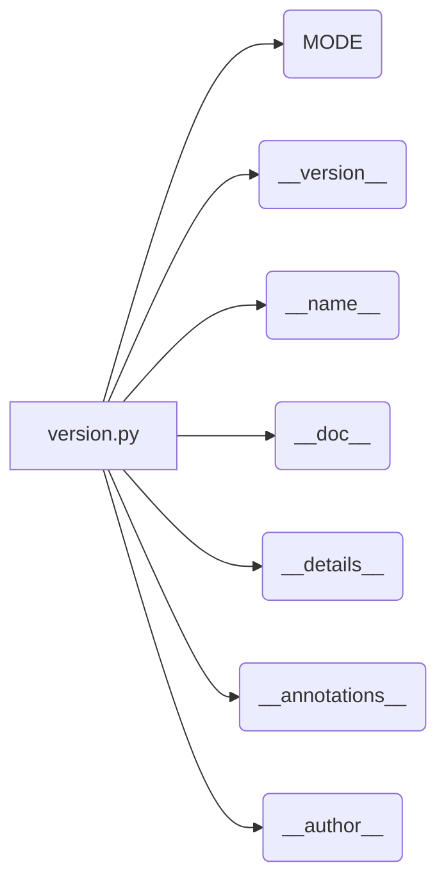

# <input code>

```python
## \file hypotez/src/webdriver/firefox/_examples/version.py
# -*- coding: utf-8 -*-\
#! venv/Scripts/python.exe
#! venv/bin/python/python3.12

"""
.. module: src.webdriver.firefox._examples 
	:platform: Windows, Unix
	:synopsis:

"""
MODE = 'dev'

"""
	:platform: Windows, Unix
	:synopsis:

"""


"""
	:platform: Windows, Unix
	:synopsis:

"""


"""
  :platform: Windows, Unix

"""
"""
  :platform: Windows, Unix
  :platform: Windows, Unix
  :synopsis:
"""MODE = 'dev'
  
""" module: src.webdriver.firefox._examples """


"""
- `__version__`: This variable holds the version of the module or package.
- `__name__`: Contains the name of the module. If the script is being run directly, the value will be `"__main__"`.
- `__doc__`: The module's documentation string.
- `__details__`: This variable likely contains additional details about the module, but the exact purpose depends on the specific module or package.
- `__annotations__`: Contains type annotations for variables and functions in the module.
- `__author__`: The name(s) of the author(s) of the module.
"""
__name__:str
__version__="3.12.0.0.0.4"
__doc__:str
__details__:str="Details about version for module or class"
__annotations__

__author__='hypotez '
```

# <algorithm>

Этот код не содержит логики выполнения. Он представляет собой определения переменных и строк документации, которые будут использоваться в других частях проекта.  Нет пошаговой блок-схемы, так как нет циклов, ветвлений или вызовов функций.

# <mermaid>



# <explanation>

Этот файл (`version.py`) представляет собой модуль, вероятно, часть проекта `hypotez`, содержащий константы и метаданные о версии.

**Импорты:**

Нет импортируемых модулей. Этот файл сам является модулем.

**Классы:**

Нет определений классов.

**Функции:**

Нет определений функций.

**Переменные:**

- `MODE`:  Строковая константа, вероятно, задающая режим работы (например, 'dev', 'prod').
- `__version__`: Строковая константа, хранящая версию модуля (или пакета).
- `__name__`: Строковая константа, содержащая имя модуля (равно `"__main__"` если файл запущен напрямую).
- `__doc__`: Строковая константа, содержащая строку документации модуля.
- `__details__`: Строковая константа, содержащая дополнительные детали о версии или модуле.
- `__annotations__`:  Пустая переменная, предполагается, что она будет содержать анотации типов, если они будут добавлены в будущем.
- `__author__`: Строковая константа, содержащая имя автора.

**Возможные ошибки или области для улучшений:**

- **Неиспользуемые переменные:**  Переменные `MODE` и `__version__` используются, а остальные — нет. Неиспользование может быть ошибкой или простым заготовками под будущие функции.
- **Документация:**  Документация слишком обширная для очень небольшого файла.  Можно сфокусироваться на самом необходимом.
- **Стиль кода:**  Можно было бы использовать более стандартный стиль именования переменных (например, `mode`).


**Взаимосвязь с другими частями проекта:**

Этот файл, скорее всего, используется другими частями проекта `hypotez` для получения информации о версии, режиме работы и других метаданных.  Например, другие скрипты могут импортировать его и использовать значения переменных `__version__`, `MODE`.  Файл `version.py` — типичный файл метаданных проекта, который помогает организовать и управлять версиями компонентов.