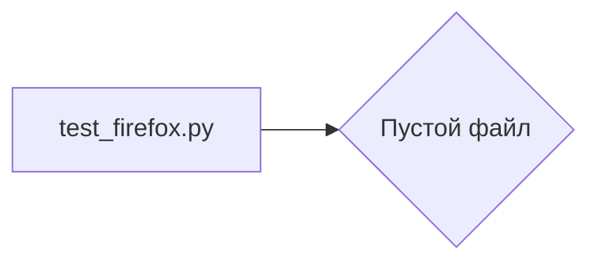

```MD
# Анализ кода hypotez/src/webdriver/firefox/_pytest/test_firefox.py

1. **<input code>**

```python
## \file hypotez/src/webdriver/firefox/_pytest/test_firefox.py
# -*- coding: utf-8 -*-\n#! venv/Scripts/python.exe\n#! venv/bin/python/python3.12\n\n"""\n.. module: src.webdriver.firefox._pytest \n\t:platform: Windows, Unix\n\t:synopsis:\n\n"""\nMODE = 'dev'\n\n"""\n\t:platform: Windows, Unix\n\t:synopsis:\n\n"""\n\n"""\n\t:platform: Windows, Unix\n\t:synopsis:\n\n"""\n\n"""\n  :platform: Windows, Unix\n\n"""\n"""\n  :platform: Windows, Unix\n  :platform: Windows, Unix\n  :synopsis:\n"""MODE = 'dev'\n  \n""" module: src.webdriver.firefox._pytest """\n\n\n\n```

2. **<algorithm>**

Код представляет собой пустой файл.  В нём объявлены несколько строк с документацией, но не содержатся никакие операторы, выполняющие действия. Алгоритм отсутствует, так как нет блоков кода.

3. **<mermaid>**



4. **<explanation>**

- **Импорты**: Нет импортов.  Файл скорее всего предназначен для будущих тестов, но сейчас в нём нет ни одной функции или класса, которые бы использовали импортированные модули.

- **Классы**: Нет классов.

- **Функции**: Нет функций.

- **Переменные**: Единственная переменная `MODE` имеет значение `"dev"`.  Это, вероятно, константа, определяющая режим работы.  Определены также многострочные строковые литералы, которые являются документационными комментариями.

- **Возможные ошибки или области для улучшений**:

    - Файл пустой, и в нём нет функциональности.  Необходимо добавить тесты, которые будут взаимодействовать с браузером Firefox.


**Цепочка взаимосвязей с другими частями проекта**:

Файл `test_firefox.py` предполагается частью тестовой инфраструктуры проекта `hypotez`. Он вероятно должен тестировать функциональность модуля `src.webdriver.firefox`, связанного с управлением браузером Firefox.  Но, как он это делает, пока не ясно, поскольку файл пустой.  Для построения полной взаимосвязи нужно проанализировать файлы `src.webdriver.firefox` и другую тестовую документацию.


**Выводы**:

Файл `test_firefox.py` в текущем виде не выполняет никакой функциональности.  Он, вероятно, служит шаблоном или заготовкой для будущих тестов.  Необходимо заполнить этот файл тестами, которые проверяют функциональность драйвера для браузера Firefox.