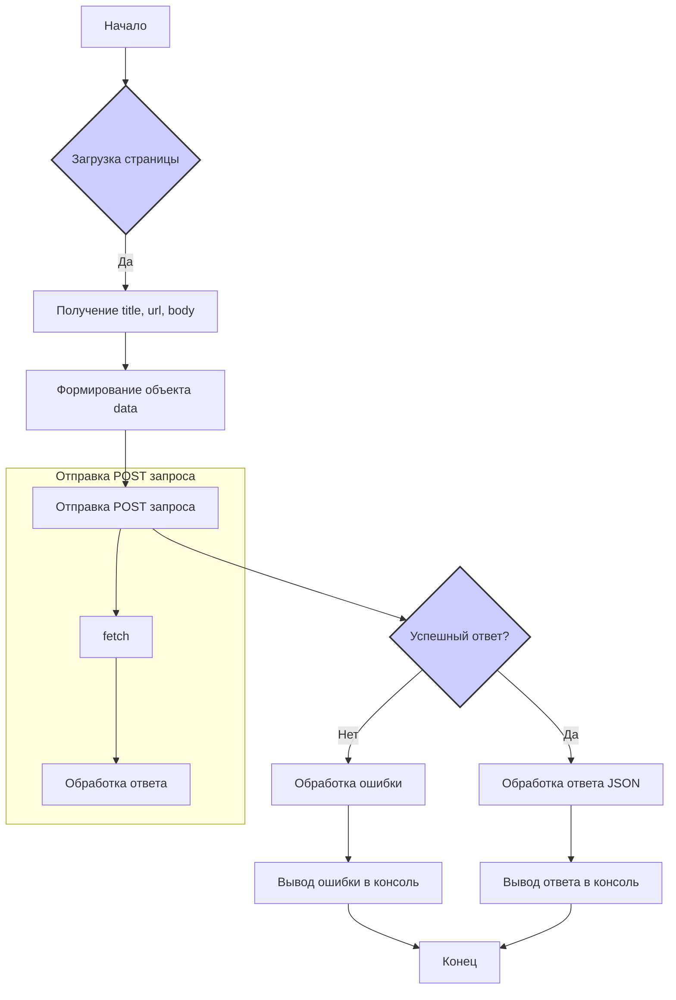

# Анализ кода send_data.js

## <input code>

```javascript
// Создаем обработчик события для загрузки страницы
function onPageLoad() {
    // Собираем информацию о странице
    var title = document.title;
    var url = window.location.href;
    var body = document.body.innerHTML;

    // Формируем объект с данными для отправки
    var data = {
        title: title,
        url: url,
        body: body
    };

    // Отправляем данные на указанный адрес
    fetch('http://127.0.0.1/hypotez.online/api/', {
        method: 'POST',
        headers: {
            'Content-Type': 'application/json'
        },
        body: JSON.stringify(data)
    })
        .then(response => {
            if (!response.ok) {
                throw new Error('Network response was not ok');
            }
            return response.json();
        })
        .then(json => {
            console.log('Response:', json);
        })
        .catch(error => {
            console.error('Error:', error);
        });
}

// Добавляем обработчик события для загрузки страницы
window.addEventListener('load', onPageLoad);
```

## <algorithm>

**Блок-схема:**



**Пример:**

При загрузке страницы с заголовком "Моя страница", URL `https://example.com` и телом "<p>Привет</p>":

1.  Получаем `title = "Моя страница"`, `url = "https://example.com"`, `body = "<p>Привет</p>"`.
2.  Формируем `data = {title: "Моя страница", url: "https://example.com", body: "<p>Привет</p>"}`.
3.  Отправляем POST запрос на `http://127.0.0.1/hypotez.online/api/` с телом `data` в формате JSON.
4.  Сервер обрабатывает запрос и возвращает ответ в формате JSON.
5.  Если ответ успешный, получаем JSON ответ, выводим его в консоль.
6.  Если ошибка, выводим ошибку в консоль.

## <mermaid>

```mermaid
graph LR
    A[send_data.js] --> B(window.addEventListener('load', onPageLoad));
    B --> C{onPageLoad()};
    C --> D[document.title];
    C --> E[window.location.href];
    C --> F[document.body.innerHTML];
    D --> G(title);
    E --> H(url);
    F --> I(body);
    G,H,I --> J{data = {title, url, body}};
    J --> K[fetch('http://127.0.0.1/hypotez.online/api/', ...)];
    K --> L{Обработка ответа};
    L -- success --> M[console.log('Response:', json)];
    L -- error --> N[console.error('Error:', error)];
    subgraph Сервер
        K -- POST --> O[API];
        O --> L;
    end
```

## <explanation>

**Импорты:** Нет импортов из других пакетов, код работает в рамках одного файла.

**Классы:** Нет классов.

**Функции:**

*   **`onPageLoad()`**: Обрабатывает событие загрузки страницы.
    *   Аргументы: Нет.
    *   Возвращаемые значения: Нет.
    *   Назначение: Собрать информацию о загруженной странице (заголовок, URL, содержимое) и отправить её на сервер.

*   **`fetch(...)`**: Асинхронно отправляет HTTP POST запрос.
    *   Аргументы: URL, объект настроек.  `headers` указывают, что отправляется JSON-данные.
    *   Возвращаемые значения: Promise, содержащий ответ сервера.

**Переменные:**

*   `title`, `url`, `body`: Строковые переменные, хранящие информацию о странице.
*   `data`: Объект, содержащий собранные данные для отправки.


**Возможные ошибки и улучшения:**

*   **Отсутствие проверки статуса ответа:** Код проверяет только `response.ok`, но не содержит обработки других возможных ошибок (например, сервер вернул `404`).
*   **Необработанные ошибки:** Возможны ошибки при подключении к серверу или обработке ответа, которые не обрабатываются.
*   **Логирование:** Дополнительное логирование (например, текущего времени) могло бы быть полезным при отладке.
*   **Обработка ошибок сети:** Нужно обрабатывать ошибки сети (`fetch` может вернуть ошибку), а не просто ловить любое исключение.
*   **Переменные с 'var':** Использование `let` или `const` вместо `var` для переменных было бы лучше, чтобы избежать проблем с объявлением переменных.
*   **`console.error`:** `console.error` выводят сообщения об ошибке.


**Взаимосвязь с другими частями проекта:**

Код `send_data.js` отправляет данные о странице на сервер. Предполагается, что на сервере (в `hypotez.online/api/`) есть обработчик, который принимает этот POST запрос и обрабатывает данные.  Без знания `hypotez.online/api/` невозможно определить, как эти данные используются далее.