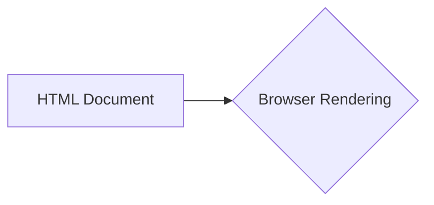

# Анализ кода popup.html

**1. <input code>**

```html
## \file hypotez/src/webdriver/firefox/extentions/test_extention/html/popup.html
# -*- coding: utf-8 -*-\
#! venv/Scripts/python.exe

""" module: src.webdriver.firefox.extentions.test_extention.html """
MODE = 'debug'
<!DOCTYPE html>
<html lang="en">
<head>
    <meta charset="UTF-8">
    <meta name="viewport" content="width=device-width, initial-scale=1.0">
    <title>Hypotez</title>
</head>
<body>
    <h1>Hypotez</h1>
    <p>Привет, Это Давидка. Я обучаю модель</p>
</body>
</html>
```

**2. <algorithm>**

Этот код представляет собой HTML-документ.  Алгоритм его работы – это отображение указанного HTML содержимого в браузере.  Нет логических блоков, функций или классов, подлежащих анализу в рамках алгоритмической блок-схемы.  Данные не перемещаются между компонентами, так как отсутствует взаимодействие с JavaScript или другим кодом.

**3. <mermaid>**



**4. <explanation>**

* **Импорты:**  Нет импортов в традиционном смысле.  `# -*- coding: utf-8 -*-\` и `#! venv/Scripts/python.exe` — это директивы для интерпретатора Python (возможно, для указания кодировки и пути к исполняемому файлу Python), но не импорты модулей. Строка `""" module: src.webdriver.firefox.extentions.test_extention.html """` — это просто комментарий, описывающий местоположение файла в иерархии проекта.  Отсутствует импорт каких-либо библиотек Python.

* **Классы:** Нет определений классов.  Этот файл – чисто HTML-документ.

* **Функции:** Нет определений функций.

* **Переменные:** `MODE = 'debug'` — строковая константа, которая, скорее всего, используется для настройки режима работы (например, для отладки).  В HTML её значение не используется.


* **Возможные ошибки или области для улучшений:**

    * Недостаточная документация.  Непонятно, как этот файл связан с другими частями проекта (например, с JavaScript кодом).  Для работы файла требуется, чтобы браузер был готов отобразить HTML-содержимое.
    * Отсутствие связи с другими частями проекта: Файл представляет собой статичный HTML и не содержит логики, следовательно, не связан с другими частями проекта в контексте вычислений или обработки данных.


**Цепочка взаимосвязей с другими частями проекта:**

Этот HTML-файл, скорее всего, используется как часть расширения для браузера Firefox (по указанному пути).  Для взаимодействия с этим HTML-файлом будет необходим JavaScript код (который не приведён в данном случае). Этот JS код будет взаимодействовать с этим HTML файлом для управления отображением и обработки событий.