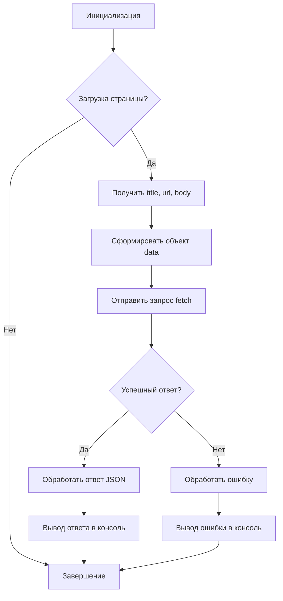

# Анализ кода send_data.js

**1. <input code>**

```javascript
// Создаем обработчик события для загрузки страницы
function onPageLoad() {
    // Собираем информацию о странице
    var title = document.title;
    var url = window.location.href;
    var body = document.body.innerHTML;

    // Формируем объект с данными для отправки
    var data = {
        title: title,
        url: url,
        body: body
    };

    // Отправляем данные на указанный адрес
    fetch('http://127.0.0.1/hypotez.online/api/', {
        method: 'POST',
        headers: {
            'Content-Type': 'application/json'
        },
        body: JSON.stringify(data)
    })
        .then(response => {
            if (!response.ok) {
                throw new Error('Network response was not ok');
            }
            return response.json();
        })
        .then(json => {
            console.log('Response:', json);
        })
        .catch(error => {
            console.error('Error:', error);
        });
}

// Добавляем обработчик события для загрузки страницы
window.addEventListener('load', onPageLoad);
```

**2. <algorithm>**

**Блок-схема:**



**Примеры:**

* **Вход:** Пользователь открывает страницу с названием "Моя страница", URL `https://example.com` и содержимым `<body>Привет, мир!</body>`.
* **Шаги:** Функция `onPageLoad` срабатывает. Извлекаются данные о странице. Формируется объект `data`. Запрос `fetch` отправляется на сервер. Сервер возвращает успешный ответ. Данные парсятся. Выводятся в консоль.
* **Ошибка:** Запрос `fetch` возвращает не успешный код ответа (например, 404). Обработка ошибки срабатывает. Выводятся ошибки в консоль.

**Перемещение данных:**

Информация с HTML страницы (title, URL, body) передается в объект `data`. Этот объект сериализуется в JSON и передается в функцию `fetch`. Функция `fetch` отправляет данные на сервер. Сервер обрабатывает запрос и возвращает JSON-ответ, который обрабатывается и отображается в консоли.


**3. <mermaid>**

```mermaid
graph LR
    A[send_data.js] --> B(window.addEventListener);
    B --> C{onPageLoad};
    C --> D[document.title];
    C --> E[window.location.href];
    C --> F[document.body.innerHTML];
    D -.-> G[title];
    E -.-> H[url];
    F -.-> I[body];
    G -.-> J[data];
    H -.-> J;
    I -.-> J;
    J --> K[fetch];
    K --> L{response.ok};
    L -- Да --> M[response.json()];
    L -- Нет --> N[Ошибка];
    M --> O[console.log];
    N --> P[console.error];
    subgraph HTTP Request
        K --> Q[http://127.0.0.1/hypotez.online/api/];
    end
    O --> C;
    P --> C;
```


**4. <explanation>**

* **Импорты:** В коде отсутствуют импорты. Используются встроенные возможности JavaScript.
* **Классы:** Нет классов.
* **Функции:**
    * `onPageLoad()`: Обработчик события загрузки страницы. Сбор данных (title, URL, body) с текущей страницы. Формирование объекта `data` для отправки. Отправка запроса `fetch` на сервер. Обработка успешного ответа и обработки ошибок.
    * `fetch(...)`: Асинхронная функция для отправки HTTP-запросов.
* **Переменные:**
    * `title`, `url`, `body`: Переменные содержат строки, представляющие заголовок, URL и содержимое HTML-тела текущей страницы соответственно.
    * `data`: Объект JavaScript, содержащий собранную информацию для отправки.
* **Возможные ошибки и улучшения:**
    * Отсутствие проверки на пустоту переменных `title`, `url`, `body`.
    * Отсутствие обработки ошибок при формировании объекта `data` (например, если `document.body` равен null).
    * Отсутствие обработки случаев, когда сервер возвращает не JSON-ответ.
    * Нет проверки на валидность входных данных, полученных от сервера.  (например, `json` может содержать некорректные данные).


**Цепочка взаимосвязей:**

`send_data.js` взаимодействует с HTML-страницей, собирая данные. Затем отправляет эти данные через HTTP-запрос (fetch) на API сервер (127.0.0.1/hypotez.online/api/). Сервер обрабатывает этот запрос, и, если все выполнено корректно, возвращает JSON-ответ.  Этот ответ обрабатывается `send_data.js` и выводится в консоль браузера.  `send_data.js` напрямую не взаимодействует с другими частями проекта, если не учитывать, что серверный API (127.0.0.1/hypotez.online/api/) может быть частью более крупной системы.  Для уточнения, необходимо больше информации о проекте.