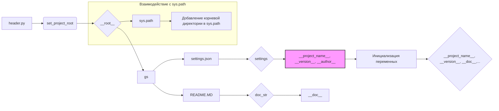

```MD
# <input code>

```python
## \file hypotez/src/webdriver/playwright/header.py
# -*- coding: utf-8 -*-
#! venv/Scripts/python.exe
#! venv/bin/python/python3.12

"""
.. module: src.webdriver.playwright 
	:platform: Windows, Unix
	:synopsis:

"""
MODE = 'dev'

import sys
import json
from packaging.version import Version

from pathlib import Path
def set_project_root(marker_files=('pyproject.toml', 'requirements.txt', '.git')) -> Path:
    """
    Finds the root directory of the project starting from the current file's directory,
    searching upwards and stopping at the first directory containing any of the marker files.

    Args:
        marker_files (tuple): Filenames or directory names to identify the project root.
    
    Returns:
        Path: Path to the root directory if found, otherwise the directory where the script is located.
    """
    __root__:Path
    current_path:Path = Path(__file__).resolve().parent
    __root__ = current_path
    for parent in [current_path] + list(current_path.parents):
        if any((parent / marker).exists() for marker in marker_files):
            __root__ = parent
            break
    if __root__ not in sys.path:
        sys.path.insert(0, str(__root__))
    return __root__


# Get the root directory of the project
__root__ = set_project_root()
"""__root__ (Path): Path to the root directory of the project"""

from src import gs

settings:dict = None
try:
    with open(gs.path.root / 'src' / 'settings.json', 'r') as settings_file:
        settings = json.load(settings_file)
except (FileNotFoundError, json.JSONDecodeError):
    ...

doc_str:str = None
try:
    with open(gs.path.root / 'src' / 'README.MD', 'r') as settings_file:
        doc_str = settings_file.read()
except (FileNotFoundError, json.JSONDecodeError):
    ...


__project_name__ = settings.get("project_name", 'hypotez') if settings  else 'hypotez'
__version__: str = settings.get("version", '')  if settings  else ''
__doc__: str = doc_str if doc_str else ''
__details__: str = ''
__author__: str = settings.get("author", '')  if settings  else ''
__copyright__: str = settings.get("copyrihgnt", '')  if settings  else ''
__cofee__: str = settings.get("cofee", "Treat the developer to a cup of coffee for boosting enthusiasm in development: https://boosty.to/hypo69")  if settings  else "Treat the developer to a cup of coffee for boosting enthusiasm in development: https://boosty.to/hypo69"
```

# <algorithm>

**Алгоритм работы кода:**

1. **Настройка корневой директории проекта:**
    - Функция `set_project_root` ищет корневую директорию проекта, начиная с текущего файла.
    - Она проверяет наличие файлов `pyproject.toml`, `requirements.txt`, `.git` в текущей и родительских директориях.
    - Если корневой каталог найден, он добавляется в `sys.path`.
    - Пример: Если файл `header.py` находится в `hypotez/src/webdriver/playwright`, то `set_project_root` найдет `hypotez` как корень.
2. **Чтение настроек из settings.json:**
    - Извлекается информация о проекте из файла `settings.json` в корневой директории `src`.
    - Пример: Из `settings.json` может быть получено имя проекта, версия и др.
3. **Чтение README.MD:**
    - Извлекается информация о проекте из файла `README.MD` в корневой директории `src`.
    - Пример: `README.MD` может содержать описание проекта.
4. **Инициализация переменных:**
    - Переменные `__project_name__`, `__version__`, `__doc__`, `__details__`, `__author__`, `__copyright__`, `__cofee__` инициализируются с использованием полученных данных.
    - Если `settings` или `doc_str` отсутствуют, используется значение по умолчанию.
    - Пример: если `settings` не найден, `__project_name__` получит значение `'hypotez'`.


# <mermaid>



**Объяснение диаграммы:**

- `header.py` - главный файл, который вызывает `set_project_root` для нахождения корневой директории проекта.
- `gs` - модуль, который предоставляет доступ к корневой директории проекта.
- `settings.json` - файл с настройками проекта.
- `README.MD` - файл с описанием проекта.
- `sys.path` - список директорий, которые интерпретатор Python использует для поиска импортируемых модулей.


# <explanation>

**Импорты:**

- `sys`: модуль для работы со стандартным вводом-выводом и средой выполнения. Используется для добавления корневого каталога проекта в `sys.path`.
- `json`: модуль для работы с файлами JSON. Используется для чтения настроек из `settings.json`.
- `packaging.version`: модуль для работы с версиями пакетов.  Используется для проверки версий пакетов.
- `pathlib`: модуль для работы с файловой системой. Используется для манипулирования путями к файлам.
- `src.gs`: модуль, который предоставляет пути к важным файлам проекта. Это часть проекта, и его импорт показывает связь между модулями.

**Классы:**

Нет классов в данном коде.


**Функции:**

- `set_project_root(marker_files)`: находит корневую директорию проекта.
    - `marker_files`: Кортеж с файлами, по которым определяется корень.
    - Возвращает `Path` к корневой директории.

**Переменные:**

- `MODE`: Строковая константа, хранящая режим работы.
- `__root__`: Путь к корневой директории проекта.
- `settings`: Словарь, хранящий настройки из `settings.json`.
- `doc_str`: Строка, содержащая содержимое `README.MD`.
- `__project_name__`, `__version__`, `__doc__`, `__details__`, `__author__`, `__copyright__`, `__cofee__`: Строковые переменные, содержащие информацию о проекте. Они получены из файла настроек.

**Возможные ошибки и улучшения:**

- **Обработка ошибок:** Обработка `FileNotFoundError` и `json.JSONDecodeError` в блоках `try...except` предотвращает сбой программы при отсутствии или неправильном формате файлов настроек. Но можно добавить более подробную информацию об ошибке.
- **Явное указание типов:** Хотя Python динамически типизирован, явное указание типов (`-> Path`) повышает читабельность кода и помогает статическим анализаторам кода.
- **Документация:**  Хорошая документация для функций, в частности `set_project_root`.
- **Логирование:**  Включение логирования для отслеживания процесса поиска корневой директории может быть полезным для отладки.

**Взаимосвязь с другими частями проекта:**

Код использует `src.gs` для доступа к файлам настроек. Это указывает на то, что этот код является частью более крупного проекта.  Корневой каталог проекта `hypotez` нужен для поиска настроек (`settings.json` и `README.MD`), и, вероятно, других файлов.  Код устанавливает `__root__` в `sys.path`, что позволяет импортировать другие модули из корневой директории.